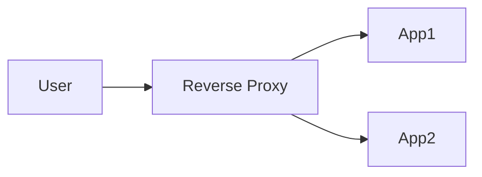

A server that sits in front of application servers to handle SSL termination, routing, caching, and compression (e.g., Nginx, Envoy).

When to use:
- Production web stacks to centralize cross-cutting concerns.

Trade-offs:
- Another component to provision and manage; misconfiguration can become a bottleneck.

Related: /50-system-design-patterns/

## Example
- Example: Nginx handles TLS termination and routes `/api` to backend app servers while caching static assets.

## Diagram

