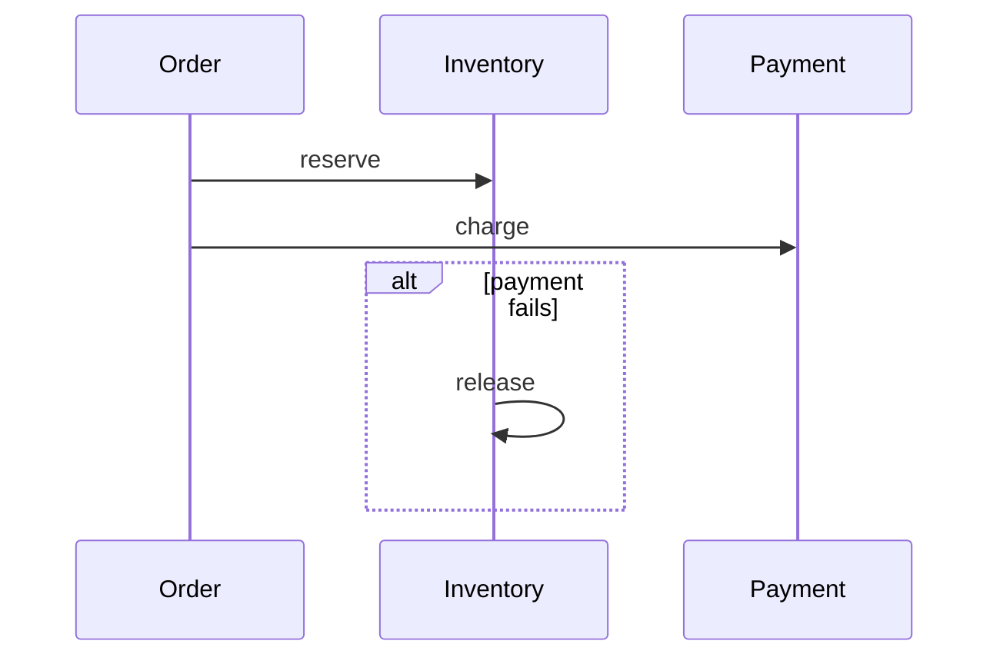

Model distributed transactions as a sequence of local transactions with compensating actions to undo steps on failure.

When to use:
- Long-running business workflows where 2PC is impractical (order processing across services).

Trade-offs:
- Compensation design is complex and temporary inconsistency exists between steps.

Related: /50-system-design-patterns/

## Example
- Example: Order processing: ReserveInventory -> ChargePayment -> Ship; on failure, compensating steps undo previous actions.

## Diagram

