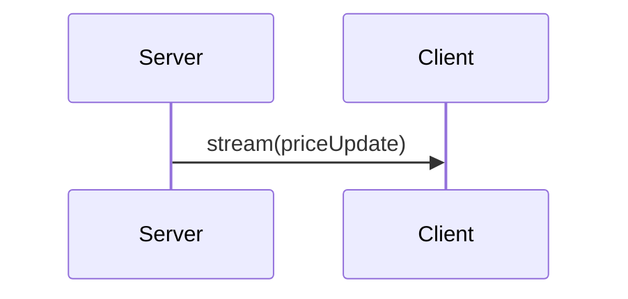

A one-way server push over a long-lived HTTP connection where the server streams events to clients.

When to use:
- Live feeds, dashboards, or notification streams where clients only receive updates.

Trade-offs:
- Unidirectional and limited by browser connection constraints compared to WebSockets.

Related: /50-system-design-patterns/

## Example
- Example: A stock ticker pushes price updates to subscribed clients via SSE for read-only real-time updates.

## Diagram

