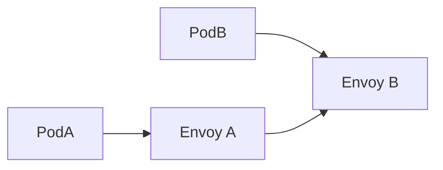

A sidecar proxy per service that provides platform-level networking features: retries, mTLS, tracing, and load balancing.

When to use:
- Large microservice fleets where implementing networking features in every service is impractical.

Trade-offs:
- Significant operational complexity and resource overhead from sidecars.

Related: /50-system-design-patterns/

## Example
- Example: Envoy sidecars alongside services provide mTLS, retries, and telemetry without changing application code.

## Diagram

