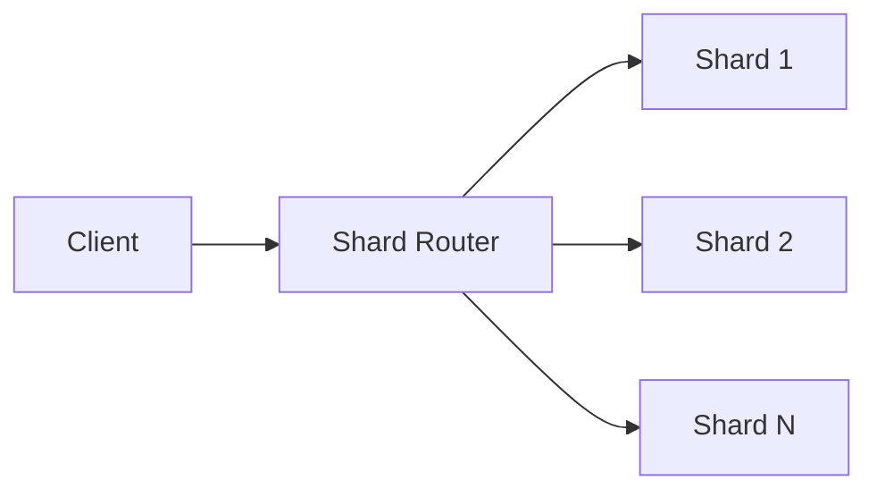

Split data across multiple servers by shard key so each shard stores a subset of rows.

When to use:
- Single-node storage or write throughput becomes a bottleneck (very large tables).

Trade-offs:
- Cross-shard queries are expensive; choosing a poor shard key creates hotspots and resharding is painful.

Related: /50-system-design-patterns/

## Example
- Example: A user table sharded by user_id modulo N so each shard handles a subset of users and their activity.

## Diagram

