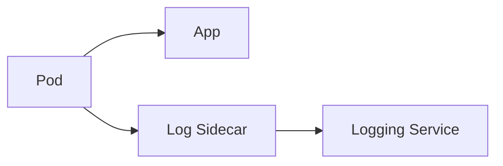

Deploy a helper process alongside the main service to handle cross-cutting concerns like logging, config, or discovery.

When to use:
- Add features without modifying application code (log shipping, config reloaders).

Trade-offs:
- Extra resource consumption and startup ordering concerns.

Related: /50-system-design-patterns/

## Example
- Example: A log-shipper sidecar tails application logs and forwards them to a central logging service.

## Diagram

