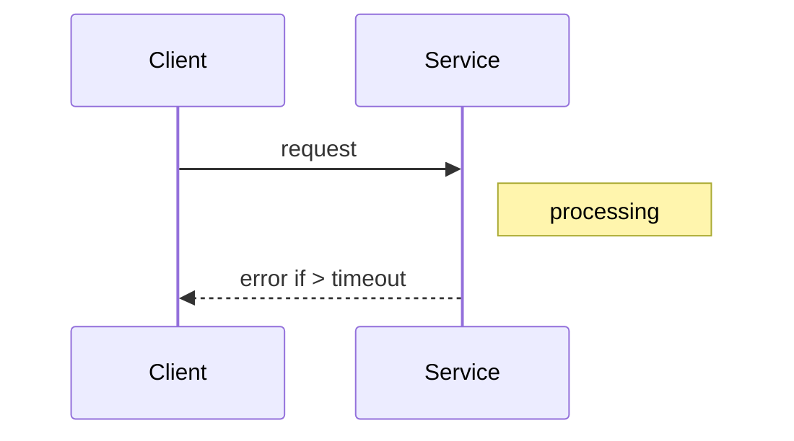

Enforce a maximum duration for external calls so callers don't wait indefinitely.

When to use:
- Any external dependency to fail fast and free resources.

Trade-offs:
- Too-short timeouts can cause false failures; too-long timeouts delay failure detection.

Related: /50-system-design-patterns/

## Example
- Example: HTTP requests to a payment gateway use a 2s timeout so callers fail fast and can apply retries or fallbacks.

## Diagram

