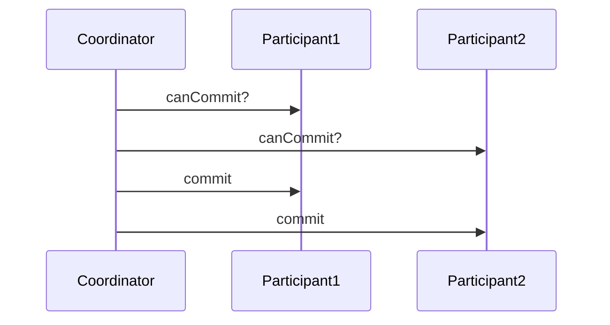

A coordinator asks participants to prepare and then commit or abort so distributed participants achieve atomic commits.

When to use:
- Strong atomicity requirements across multiple systems (financial transfers between banks).

Trade-offs:
- Blocking protocol, slow, and does not scale well to many participants.

Related: /50-system-design-patterns/

## Example
- Example: A coordinator manages a transfer between two banking systems by preparing both sides and then committing atomically.

## Diagram

