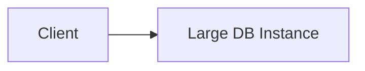

Upgrade to a larger machine (more CPU, RAM, disk) to increase capacity without changing topology.

When to use:
- Quick fixes for databases or tightly-coupled single-node components.

Trade-offs:
- Finite limits, single point of failure, and higher cost at the top end.

Related: /50-system-design-patterns/

## Example
- Example: Upgrade a database server from 8 CPU/32GB to 32 CPU/256GB to temporarily handle higher throughput.

## Diagram

