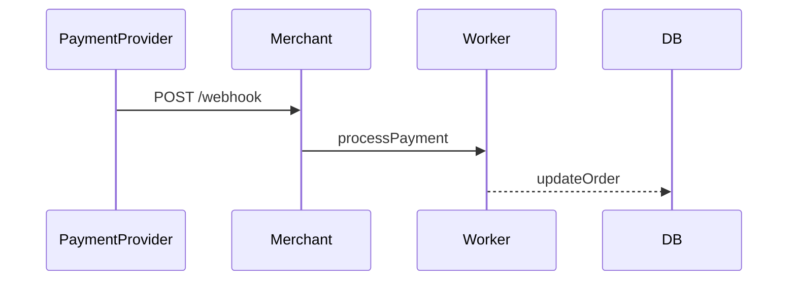

Servers push HTTP requests to client-provided URLs to notify external systems of events.

When to use:
- Third-party integrations where the external system needs immediate notifications (Stripe, GitHub).

Trade-offs:
- Delivery is unreliable unless retried; requires public endpoints and secure verification.

Related: /50-system-design-patterns/

## Example
- Example: A payment gateway POSTs a payment success webhook to a merchant's endpoint which then fulfills the order.

## Diagram

