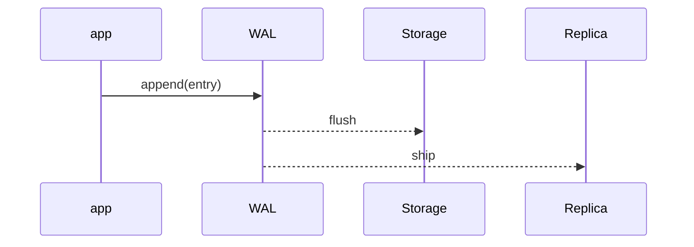

Durably append operations to a sequential log before applying them to primary storage so the system can recover by replaying the log.

When to use:
- Databases and systems requiring crash recovery and reliable replication.

Trade-offs:
- Extra I/O and log management overhead; logs need compaction.

Related: /50-system-design-patterns/

## Example
- Example: PostgreSQL WAL files that are shipped to replicas and used for crash recovery and point-in-time restore.

## Diagram

