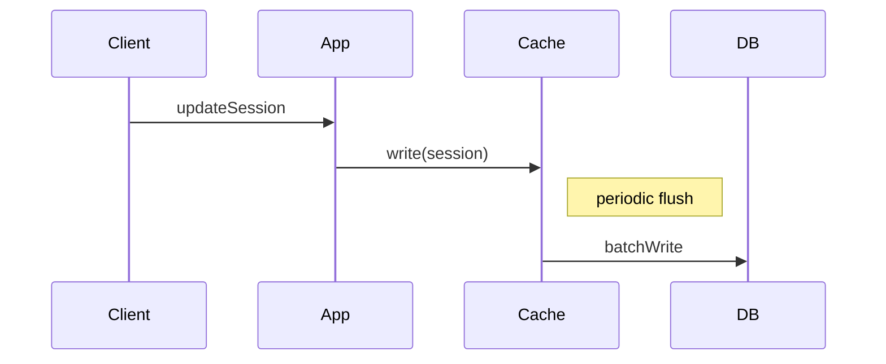

Writes are accepted by the cache first and flushed asynchronously to the backing store in batches.

When to use:
- Write-heavy systems where low-latency writes are important.

Trade-offs:
- Risk of data loss if the cache fails before flushing; debugging is harder due to asynchronous persistence.

Related: /50-system-design-patterns/

## Example
- Example: A session store accepts writes to Redis and flushes them to a durable store in batches.

## Diagram

