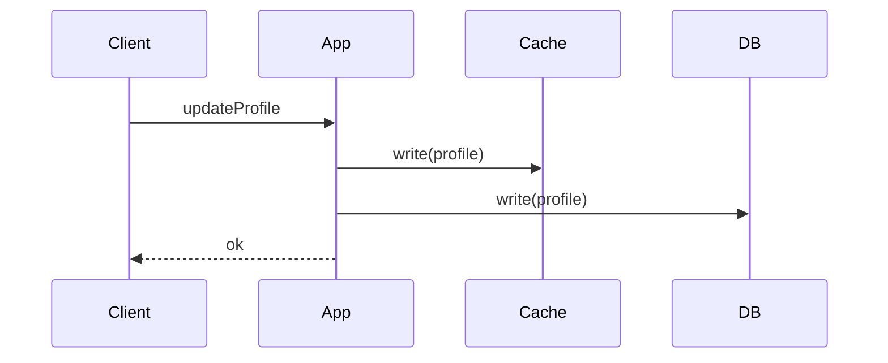

Writes are synchronously applied to both cache and backing store so the cache remains up to date.

When to use:
- Systems requiring strong read-after-write consistency.

Trade-offs:
- Writes are slower and may waste cache space storing rarely-read items.

Related: /50-system-design-patterns/

## Example
- Example: A profile service writes to Redis cache and the user database synchronously so subsequent reads are consistent.

## Diagram

