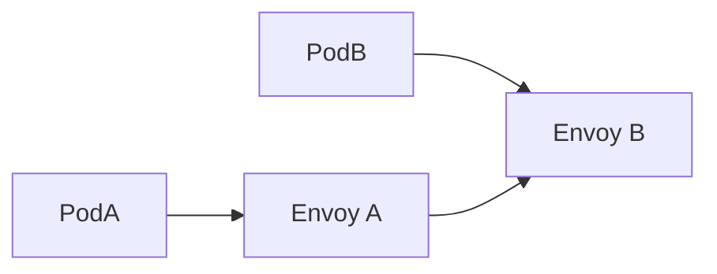
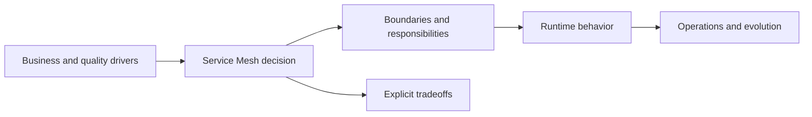
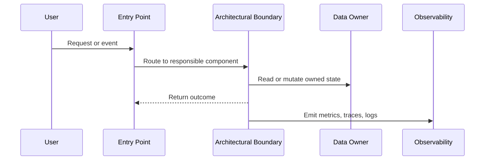

# Service Mesh

## Topic: Overview {#overview}

### Sub-topic: Interview Definition

Service Mesh is an architecture topic used to reason about system structure, ownership, communication, data flow, and operational behavior. In interviews, do not stop at the definition. Explain the constraints that make it attractive and the trade-offs it introduces.

### Sub-topic: Where It Fits

~~~mermaid
flowchart LR
    Users["Users or clients"] --> Entry["Entry point"]
    Entry --> Arch["Service Mesh"]
    Arch --> Data["Data and state"]
    Arch --> Ops["Operations and observability"]
~~~

## Topic: Trade-offs {#trade-offs}

| Decision Area | What To Discuss |
| --- | --- |
| Boundary | What is isolated, shared, or coupled? |
| Data ownership | Which component owns state and consistency? |
| Communication | Is the interaction synchronous, asynchronous, event-based, or streaming? |
| Scalability | What can scale independently and what remains a bottleneck? |
| Operations | What must be monitored, deployed, rolled back, and secured? |

## Topic: Interview {#interview}

### Sub-topic: Strong Answer Structure

1. Define Service Mesh in one sentence.
2. State the constraints that make it useful.
3. Draw the boundary and data-flow diagram.
4. Compare it with an alternative.
5. Explain failure modes, migration path, and operational readiness.

### Sub-topic: When To Use It

Use Service Mesh when its benefits directly match the system constraints. Avoid it when it adds coordination, deployment, data consistency, or operational overhead without a clear payoff.

## Imported System Design Notes

These notes were moved from the old `50-system-design-patterns/service-mesh` bucket during the taxonomy cleanup.

### Service Mesh

A sidecar proxy per service that provides platform-level networking features: retries, mTLS, tracing, and load balancing.

When to use:
- Large microservice fleets where implementing networking features in every service is impractical.

Trade-offs:
- Significant operational complexity and resource overhead from sidecars.

Related: /fundamentals/patterns/

## Example
- Example: Envoy sidecars alongside services provide mTLS, retries, and telemetry without changing application code.

## Diagram

<!-- interview-module:start -->

## Interview Readiness Module

### Quick Summary

| Question | Interview-Ready Answer |
| --- | --- |
| What is it? | Service Mesh is a architecture pattern topic used to make a specific engineering decision explicit. |
| Why interviewers ask | They want to see constraints, tradeoffs, and failure-mode reasoning, not memorized definitions. |
| Core signal | You can explain when it helps, when it hurts, and how it behaves at scale. |
| Production lens | Discuss observability, ownership, rollout, and worst-case behavior. |

### Why This Exists

Service Mesh exists to help teams make structural decisions that remain understandable as the system, organization, and traffic grow.

### Core Mental Model

Architecture is the set of hard-to-change decisions: boundaries, ownership, data flow, deployment, and quality attributes.

### Visual Diagram

### Internal Working

- Start from drivers: scale, reliability, autonomy, latency, cost, and compliance.
- Map boundaries to teams and data ownership.
- Make tradeoffs visible before choosing the style or pattern.

### Architecture Decision Matrix

| Decision Force | What To Ask | Interview Signal |
| --- | --- | --- |
| Scale | What grows first: users, data, tenants, regions, or teams? | You connect structure to growth pressure. |
| Reliability | What fails, how is it isolated, and how is it recovered? | You reason beyond happy-path diagrams. |
| Data ownership | Who owns writes, reads, schemas, and consistency? | You understand coupling through data. |
| Delivery model | How do teams deploy, test, and evolve safely? | You link architecture to organization. |
| Cost | Which component dominates compute, storage, network, or people cost? | You can defend pragmatic tradeoffs. |

### Time & Space Complexity

- Technical complexity: components, contracts, data consistency, and failure isolation.
- Operational complexity: deployments, observability, rollback, and incident ownership.
- Organizational complexity: team boundaries, handoffs, and governance.

### Advantages

- Clarifies boundaries and ownership.
- Makes quality attributes explicit before implementation.
- Helps teams reason about evolution, migration, and operational risk.

### Disadvantages

- Can add coordination, governance, and migration cost.
- May create accidental complexity if adopted before the drivers exist.
- Requires operational maturity to run safely.

### Tradeoffs

| Tradeoff | Upside | Cost |
| --- | --- | --- |
| Simplicity vs capability | Simple designs are easier to reason about | May fail when scale or requirements grow. |
| Speed vs correctness | Faster paths improve latency | More caching, approximation, or async behavior can create stale results. |
| Local optimization vs system behavior | Optimizes the hot path | Can move cost to memory, operations, or consistency. |
| Flexibility vs governance | Enables independent change | Requires contracts, testing, and ownership clarity. |

### Real World Usage

- Netflix-style independent service ownership
- Amazon-style service boundaries and operational accountability
- Banking, healthcare, and SaaS platforms balancing compliance with delivery speed

### Production Considerations

> [!IMPORTANT]
> Production reality: the interview answer should mention what happens when assumptions break. For Service Mesh, discuss hot paths, observability, limits, backpressure, and how teams detect and recover from failures.

- Define the dominant read/write path and protect it with metrics.
- Add guardrails for invalid input, overload, and slow dependencies.
- Document ownership: who changes it, who operates it, and who gets paged.
- Prefer incremental rollout when the change affects correctness or latency.

### Common Mistakes

> [!WARNING]
> Senior signal gotcha: Explaining the definition without connecting it to quality attributes and consequences.

- Skipping constraints and jumping directly to implementation.
- Describing the tool without explaining why it fits this prompt.
- Ignoring worst-case behavior, memory overhead, or operational ownership.
- Forgetting to compare at least one simpler alternative.

### Failure Modes

- Hot keys, skewed traffic, or adversarial inputs overload the assumed fast path.
- Hidden coupling makes a local change cause downstream breakage.
- Missing observability turns correctness or latency issues into guesswork.
- Data growth changes an acceptable O(n), storage, or network cost into a bottleneck.

### Interview Perspective

Interviewers are testing whether you can connect Service Mesh to constraints, tradeoffs, and failure modes. A strong answer starts simple, states assumptions, chooses the right abstraction, and then explains what would change at larger scale.

### Interview Questions

1. What problem does Service Mesh solve better than the simpler alternative?
2. What assumptions make this choice valid?
3. What is the worst-case behavior, and how would you mitigate it?
4. How would you explain this to a junior engineer on your team?
5. What metrics would prove this is working in production?

### Follow-up Questions

1. How does the answer change if traffic increases by 10x?
2. What breaks if data is skewed, stale, or partially unavailable?
3. Which part would you cache, partition, replicate, or simplify?
4. How would you migrate from the naive version to this approach?
5. What would make you reject Service Mesh?

### Related Topics

- CQRS
- Saga
- Event Sourcing
- Outbox
- Service Mesh

### Key Takeaways

- Service Mesh is useful only when its core tradeoff matches the prompt.
- The strongest interview answers connect mechanics to constraints and scale.
- Always discuss worst-case behavior, not only average-case or happy-path behavior.
- Production readiness includes observability, ownership, rollout, and recovery.
- State the decision criteria, the rejected alternatives, and the migration path from the current architecture.

### 3-Minute Revision Sheet

1. Define Service Mesh in one sentence.
2. State the problem it solves and the simpler alternative it replaces.
3. Draw the core diagram and trace one request, operation, or decision through it.
4. Name the most important complexity, consistency, or operational tradeoff.
5. Close with one real-world use case and one failure mode.

### Decision Framework

| Step | Candidate Action |
| --- | --- |
| 1. Clarify | Ask about constraints, scale, data shape, and correctness needs. |
| 2. Choose | Pick the simplest approach that satisfies the dominant constraint. |
| 3. Justify | Explain time, space, cost, reliability, and team ownership tradeoffs. |
| 4. Stress test | Walk through failure, growth, and migration scenarios. |
| 5. Communicate | Present the answer as a recommendation, not a list of facts. |

### Why Use It

Use Service Mesh when it directly improves the dominant constraint: lookup speed, coupling, scalability, reliability, delivery speed, or reasoning clarity.

### Why Not Use It

Avoid Service Mesh when the simpler approach already meets the requirements, when operational overhead exceeds the benefit, or when the team cannot own the added complexity.

### Migration Strategy

1. Start with the simplest working design and capture baseline metrics.
2. Introduce Service Mesh behind a narrow interface or compatibility layer.
3. Migrate one path, tenant, or use case at a time.
4. Compare correctness, latency, cost, and operational load before expanding.
5. Keep rollback criteria explicit until the new approach is proven.

### Cost Impact

- Engineering cost: design, implementation, test coverage, and documentation.
- Runtime cost: compute, memory, storage, network, and coordination overhead.
- Operational cost: dashboards, alerts, on-call playbooks, and incident response.

### Organizational Impact

Service Mesh changes how teams communicate. It may require clearer ownership, better contracts, shared vocabulary, and explicit review of cross-team dependencies.

### Operational Complexity

Operational maturity requires dashboards for the hot path, alerts on saturation and errors, runbooks for known failure modes, and a rollout plan that limits blast radius.

## Quick Revision

- Service Mesh solves a specific pressure; name that pressure first.
- The best answer compares it with at least one simpler alternative.
- Discuss average case, worst case, and what changes at scale.
- Mention production guardrails: metrics, limits, retries, ownership, and rollback.
- End with a crisp recommendation and the assumptions behind it.

**Common interview answer:** "I would use Service Mesh when the constraints make its tradeoff worthwhile. I would start with the simplest version, validate the bottleneck, then add this structure or pattern where it improves the hot path while keeping failure modes observable."

**Most important tradeoffs:** performance vs complexity, correctness vs latency, flexibility vs ownership, and short-term speed vs long-term operability.

**Most important pitfalls:** unclear assumptions, ignoring worst-case behavior, skipping observability, and failing to explain why the simpler option is insufficient.

## Flashcards

1. **Q:** What is the main purpose of Service Mesh? **A:** To solve a specific constraint or reasoning problem more clearly than a naive approach.
2. **Q:** What should you clarify before using it? **A:** Scale, data shape, correctness needs, latency goals, and operational constraints.
3. **Q:** What makes an interview answer senior-level? **A:** It explains tradeoffs, failure modes, migration, and production ownership.
4. **Q:** What is the most common mistake? **A:** Naming the concept without tying it to the prompt's constraints.
5. **Q:** How do you discuss complexity? **A:** Cover time, space, coordination, and operational complexity where relevant.
6. **Q:** What should a diagram show? **A:** Boundaries, data flow, ownership, and the hot path.
7. **Q:** How do you handle follow-ups? **A:** Re-check assumptions and explain how the design changes under new constraints.
8. **Q:** What production signal matters most? **A:** Metrics on the hot path: latency, errors, saturation, and correctness drift.
9. **Q:** When should you avoid it? **A:** When it adds more complexity than the requirements justify.
10. **Q:** How should you conclude? **A:** Give a recommendation, list assumptions, and name the next thing you would validate.

<!-- interview-module:end -->
