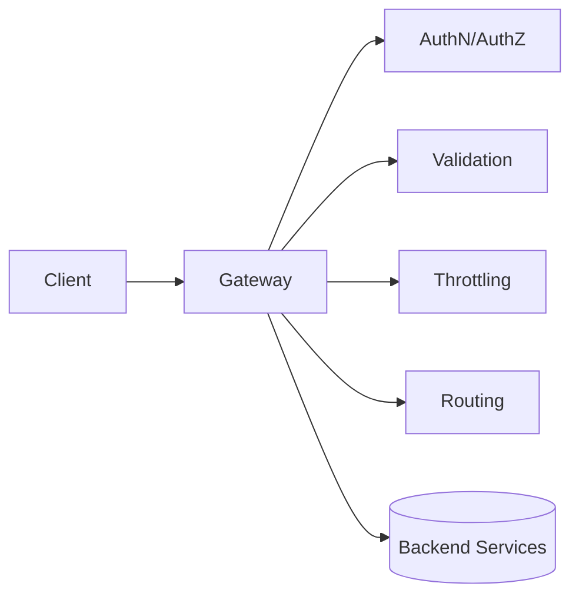

# API Gateway System

The API gateway is the system's policy edge: it centralizes auth, routing, throttling, request shaping, and observability so backend services can stay focused on business logic.

```text
Figure Name: Figure 1 - API Gateway System Design
Alt Text: API gateway architecture with auth, policy, routing, transformation, and tracing to backend services.
Create complete gateway architecture with plugin chain and failure handling under high traffic.
```

## Core Design



## Responsibilities

| Concern | What The Gateway Owns |
| --- | --- |
| Identity | Authentication and authorization |
| Safety | Validation and request limits |
| Routing | Path-based or header-based dispatch |
| Observability | Logs, metrics, traces, correlation IDs |
| Shape | Headers, response transforms, versioning |

## Failure Modes

- If the gateway is down, clients may lose access to all backend services.
- If throttling is too strict, the gateway can become a bottleneck itself.
- If auth checks are inconsistent, the gateway can expose invalid routes.
- If tracing is missing, debugging distributed failures becomes much harder.

## Interview Framing

1. Start with the difference between edge policy and backend business logic.
2. Explain which concerns should stop at the gateway and which should continue downstream.
3. Mention fallback behavior, timeout budgets, and circuit breaking.
4. Close with observability and safe rollout strategy.

