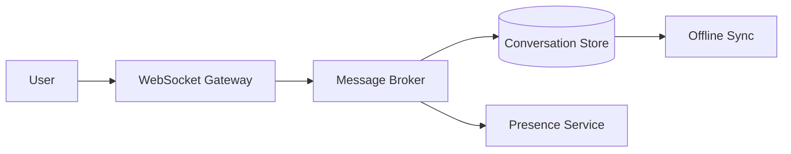

# Chat / Messaging System

Chat systems combine real-time transport, ordered delivery, presence, and offline synchronization into one user-facing experience.

```text
Figure Name: Figure 1 - Chat System Architecture
Alt Text: Real-time chat architecture with websocket gateway, message broker, presence, and storage.
Create end-to-end architecture for chat with online/offline message flow and delivery acknowledgments.
```

## Core Design



## Core Design

| Concern | What To Decide |
| --- | --- |
| Transport | WebSocket, long polling, or hybrid fallback |
| Ordering | Conversation-level or best-effort ordering |
| Presence | Online state and last-seen semantics |
| Sync | Offline queue, retries, and replay |

## Design Notes

- Use message acknowledgments to avoid silent loss.
- Store conversation history durably before fan-out.
- Keep presence updates lightweight because they can be high-volume.

## Interview Framing

1. Explain the difference between live transport and durable storage.
2. Describe how ordering and acknowledgments work together.
3. Mention what happens when a user reconnects after being offline.
4. Close with fan-out cost and delivery guarantees.

