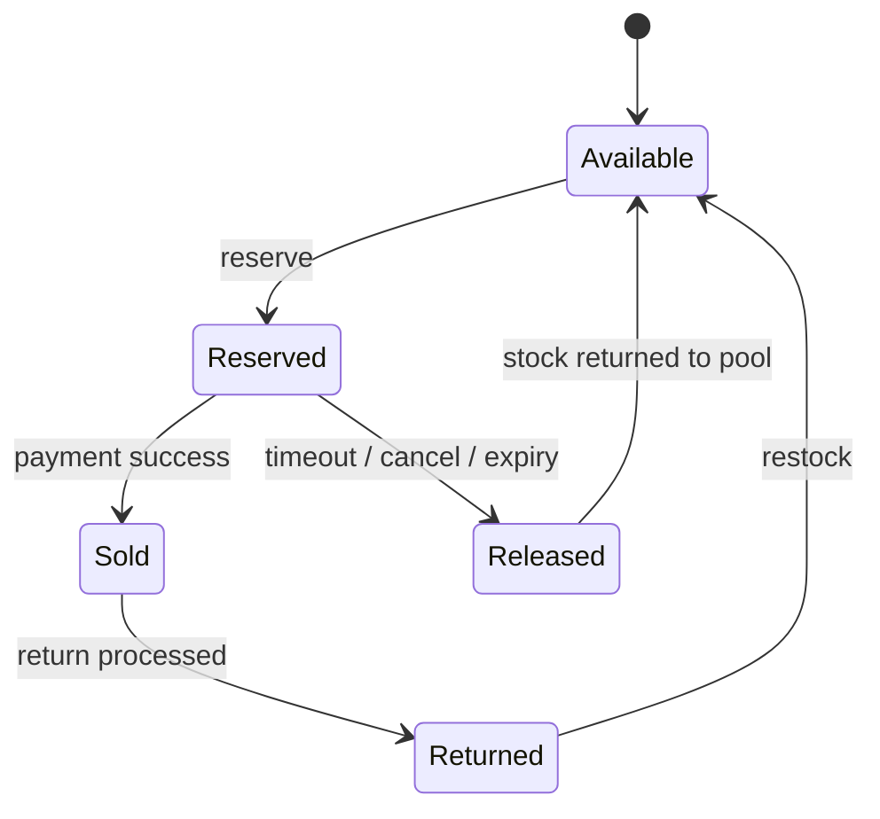
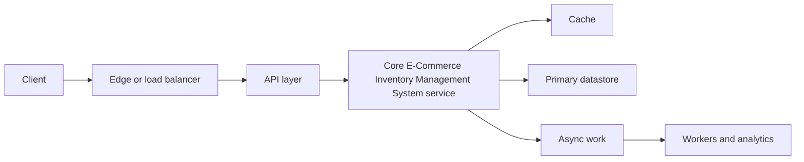
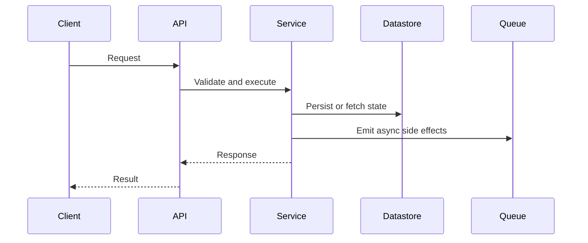

# E-Commerce Inventory Management System

This case study shows how to design inventory for a large e-commerce platform that must sell exact stock, prevent overselling, and stay available during flash sales.

The two diagrams in this folder cover the full system and the overselling deep dive:

- [High-level design](./high-level-design.png)
- [Overselling deep dive](./deep-dive-overselling.png)

## 1. Problem Statement

The system must answer a simple but hard question: how do we let millions of users buy the same SKU without ever selling more units than we physically have?

At small scale, a simple database update is enough. At real-world scale, we need reservations, expiry, inventory commits, auditability, and support for multiple warehouses.

## 2. Functional Requirements

- View real-time inventory by SKU and location
- Reserve inventory when an item is added to cart or checkout starts
- Commit inventory after payment succeeds
- Release expired reservations automatically
- Support multi-warehouse allocation
- Handle returns and restocking
- Produce accurate inventory data for reporting
- Audit every inventory state change

## 3. Non-Functional Requirements

- No overselling
- High availability, ideally 99.99%
- Very low latency for inventory lookups
- High throughput during flash sales
- Strong consistency for stock updates
- Eventual consistency for downstream projections and analytics
- Horizontal scalability
- Fault tolerance and recovery from partial failures

## 4. Core Entities

- Product: the sellable SKU
- Inventory: quantity by SKU and warehouse
- Reservation: temporary hold with TTL
- Order: payment and fulfillment intent
- Warehouse: physical stock location
- Stock movement: immutable event for every change
- Return: stock added back after a return

## 5. High-Level Design

```text
Create a detailed architecture poster for "E-Commerce Inventory Management System". Include API gateway, cart/checkout, inventory reservation service, warehouse allocation, Redis for atomic holds, inventory ledger DB, event bus, and analytics/audit consumers. Emphasize overselling prevention with reservation TTL and commit/release flow. Style: enterprise system diagram, clear labels, white background, blue/green/orange accents, 16:9.
```

The high-level flow is:

1. The customer calls the API gateway from web or mobile.
2. Product, cart, and order services coordinate the buying journey.
3. The inventory service owns stock state and reservation logic.
4. A reservation engine performs atomic holds.
5. Allocation logic chooses one or more warehouses.
6. A projection service serves read-optimized inventory views.
7. Kafka or another event bus propagates inventory events to downstream systems.
8. Audit, analytics, and warehouse sync systems consume the same events.

### Main APIs

```text
GET  /inventory/sku/{sku}
GET  /inventory/sku/{sku}/locations
POST /inventory/reserve
POST /inventory/release
POST /inventory/commit
POST /orders
GET  /orders/{orderId}
POST /returns
GET  /returns/{returnId}
```

## 6. Inventory State Model

Inventory should move through a small number of explicit states:



The important idea is that reservation is not a sale. A reservation is only a temporary hold that becomes a sale after payment succeeds.

## 7. Deep Dive: Preventing Overselling

```text
Create a deep-dive sequence diagram for "Preventing Overselling" in e-commerce. Show customer, checkout service, inventory reservation service, Redis/atomic store, payment service, and background expiry worker. Include steps: reserve, TTL hold, payment success commit, payment failure release, expiration release. Highlight race-condition prevention and idempotency. Style: technical sequence diagram, crisp labels, white background, blue and orange accents, 16:9.
```

The overselling problem happens when multiple users read the same available stock and then all try to buy it at the same time.

### Naive approach that fails

If two users read `stock = 1` and both decrement later, the database may end up at `-1`. That is exactly the failure the deep-dive diagram demonstrates.

### Correct flow

1. The user clicks Buy Now.
2. The checkout service asks inventory to reserve the stock.
3. Inventory performs an atomic check-and-reserve operation.
4. If enough stock exists, the system creates a reservation record with a TTL.
5. The order proceeds to payment.
6. If payment succeeds, the reservation is committed to sold.
7. If payment fails or times out, the reservation is released.
8. A background worker expires stale holds and returns the stock to available.

### Reservation rules

- A reservation must be atomic.
- A reservation must have a timeout.
- A reservation must be uniquely identified.
- A commit must only succeed for an active reservation.
- A release must be idempotent.

## 8. Key Algorithms

### Reserve inventory

1. Read the current available quantity for the SKU or SKU-location pair.
2. If quantity is insufficient, reject immediately.
3. Atomically decrement available stock.
4. Create a reservation record with expiry metadata.
5. Publish an inventory-reserved event.

### Commit inventory

1. Verify that the reservation still exists and is active.
2. Mark the reservation as sold/committed.
3. Publish an inventory-committed event.
4. Keep the inventory ledger immutable so the sale can be audited later.

### Release inventory

1. Verify that the reservation is still releasable.
2. Mark the reservation as released or expired.
3. Atomically add the quantity back to available stock.
4. Publish an inventory-released event.

## 9. Data Stores

- Redis cluster for low-latency atomic stock operations and reservation tracking
- Inventory ledger database for immutable source-of-truth events
- Warehouse database for stock by warehouse and bin level
- Read cache for denormalized inventory views
- Kafka or an event bus for inventory change propagation
- Data warehouse for reporting and analytics
- Audit database for compliance logs

The practical split is:

- Redis answers the hot path.
- The ledger is the source of truth.
- Read caches and projections optimize user-facing reads.
- Warehouse systems consume events asynchronously.

## 10. Why This Design Works

- Redis gives atomicity and speed for the reservation path.
- Kafka decouples inventory writes from downstream consumers.
- The ledger provides an audit trail and supports reconciliation.
- TTL-based reservations prevent dead stock from being held forever.
- Multi-warehouse allocation improves availability and shipping efficiency.

## 11. Trade-Offs

- Strong consistency on the write path vs eventual consistency for read models
- Redis speed vs ledger durability
- Reservation TTL safety vs user checkout friction
- Multi-warehouse allocation complexity vs better fulfillment efficiency
- More services and moving parts vs clearer ownership and scaling

## 12. Failure Handling

- If payment succeeds but commit fails, retry the commit with idempotency keys.
- If a reservation expires while payment is in flight, treat commit as invalid and reconcile.
- If Redis and the ledger drift, run a reconciliation job to detect and repair mismatches.
- If a warehouse sync fails, replay inventory events from Kafka.

## 13. Interview Summary

If you need to explain this design quickly in an interview, use this sequence:

1. Define the problem: sell exact stock without overselling.
2. Introduce reservations with TTL.
3. Put atomic operations on the hot path.
4. Use a ledger for auditability and recovery.
5. Use events and projections for scale.
6. Close with reconciliation and failure handling.

## 14. Assumptions

- Each SKU may exist in multiple warehouses.
- Payment success is the final signal to commit stock.
- Returns are less frequent than buys and can be processed asynchronously.
- Clock skew exists, so expiry logic must be tolerant and centrally managed.
- Flash sales are expected and should not require manual intervention.

---

This folder is intended to be read top to bottom as a complete interview walkthrough, with the diagrams providing the visual architecture and the README carrying the explanation.

<!-- interview-module:start -->

## Interview Readiness Module

### Quick Summary

| Question | Interview-Ready Answer |
| --- | --- |
| What is it? | E-Commerce Inventory Management System is a system design problem topic used to make a specific engineering decision explicit. |
| Why interviewers ask | They want to see constraints, tradeoffs, and failure-mode reasoning, not memorized definitions. |
| Core signal | You can explain when it helps, when it hurts, and how it behaves at scale. |
| Production lens | Discuss observability, ownership, rollout, and worst-case behavior. |

### Why This Exists

E-Commerce Inventory Management System exists to test whether you can turn ambiguous product behavior into requirements, APIs, state, capacity, bottlenecks, and tradeoffs.

### Core Mental Model

Separate the user-facing path from storage, async processing, consistency boundaries, and operational controls.

### Visual Diagram





### Internal Working

- Lock requirements before drawing components.
- Define APIs and data model from access patterns.
- Scale the bottleneck path first, then add resilience and observability.

### Requirements and Capacity Frame

| Area | What To Clarify | Why It Matters |
| --- | --- | --- |
| Functional requirements | Core user actions and APIs | Prevents overbuilding unrelated features. |
| Non-functional requirements | Latency, availability, durability, consistency | Drives architecture and storage choices. |
| Scale | QPS, storage, fanout, peak traffic | Reveals bottlenecks and partitioning needs. |
| Data model | Entities, indexes, access patterns | Keeps reads and writes explainable. |
| Deep dives | Hot paths, failures, multi-region behavior | Shows senior-level design maturity. |


### Time & Space Complexity

- Capacity: QPS, storage growth, fanout, and hot-key behavior.
- Latency: network hops, cache hit rate, and datastore query shape.
- Operational complexity: deployments, migrations, incident response, and regional failover.

### Advantages

- Turns an ambiguous prompt into requirements, APIs, and data flows.
- Surfaces bottlenecks before implementation details.
- Creates room for capacity, reliability, and multi-region discussion.

### Disadvantages

- Can become box-drawing if requirements are vague.
- May over-index on scale while ignoring correctness and product constraints.
- Adds operational surface area when every component needs ownership.

### Tradeoffs

| Tradeoff | Upside | Cost |
| --- | --- | --- |
| Simplicity vs capability | Simple designs are easier to reason about | May fail when scale or requirements grow. |
| Speed vs correctness | Faster paths improve latency | More caching, approximation, or async behavior can create stale results. |
| Local optimization vs system behavior | Optimizes the hot path | Can move cost to memory, operations, or consistency. |
| Flexibility vs governance | Enables independent change | Requires contracts, testing, and ownership clarity. |

### Real World Usage

- Consumer platforms with read/write imbalance
- Internal platforms with strict SLOs
- Multi-region products with compliance and latency constraints

### Production Considerations

> [!IMPORTANT]
> Production reality: the interview answer should mention what happens when assumptions break. For E-Commerce Inventory Management System, discuss hot paths, observability, limits, backpressure, and how teams detect and recover from failures.

- Define the dominant read/write path and protect it with metrics.
- Add guardrails for invalid input, overload, and slow dependencies.
- Document ownership: who changes it, who operates it, and who gets paged.
- Prefer incremental rollout when the change affects correctness or latency.

### Common Mistakes

> [!WARNING]
> Senior signal gotcha: Drawing boxes before agreeing on scale, consistency, and the dominant access pattern.

- Skipping constraints and jumping directly to implementation.
- Describing the tool without explaining why it fits this prompt.
- Ignoring worst-case behavior, memory overhead, or operational ownership.
- Forgetting to compare at least one simpler alternative.

### Failure Modes

- Hot keys, skewed traffic, or adversarial inputs overload the assumed fast path.
- Hidden coupling makes a local change cause downstream breakage.
- Missing observability turns correctness or latency issues into guesswork.
- Data growth changes an acceptable O(n), storage, or network cost into a bottleneck.

### Interview Perspective

Interviewers are testing whether you can connect E-Commerce Inventory Management System to constraints, tradeoffs, and failure modes. A strong answer starts simple, states assumptions, chooses the right abstraction, and then explains what would change at larger scale.

### Interview Questions

1. What problem does E-Commerce Inventory Management System solve better than the simpler alternative?
2. What assumptions make this choice valid?
3. What is the worst-case behavior, and how would you mitigate it?
4. How would you explain this to a junior engineer on your team?
5. What metrics would prove this is working in production?

### Follow-up Questions

1. How does the answer change if traffic increases by 10x?
2. What breaks if data is skewed, stale, or partially unavailable?
3. Which part would you cache, partition, replicate, or simplify?
4. How would you migrate from the naive version to this approach?
5. What would make you reject E-Commerce Inventory Management System?

### Related Topics

- Scalability
- Caching
- Databases
- Load Balancing
- Rate Limiting

### Key Takeaways

- E-Commerce Inventory Management System is useful only when its core tradeoff matches the prompt.
- The strongest interview answers connect mechanics to constraints and scale.
- Always discuss worst-case behavior, not only average-case or happy-path behavior.
- Production readiness includes observability, ownership, rollout, and recovery.
- Show how the design changes when traffic, data volume, or correctness requirements shift.

### 3-Minute Revision Sheet

1. Define E-Commerce Inventory Management System in one sentence.
2. State the problem it solves and the simpler alternative it replaces.
3. Draw the core diagram and trace one request, operation, or decision through it.
4. Name the most important complexity, consistency, or operational tradeoff.
5. Close with one real-world use case and one failure mode.

### Decision Framework

| Step | Candidate Action |
| --- | --- |
| 1. Clarify | Ask about constraints, scale, data shape, and correctness needs. |
| 2. Choose | Pick the simplest approach that satisfies the dominant constraint. |
| 3. Justify | Explain time, space, cost, reliability, and team ownership tradeoffs. |
| 4. Stress test | Walk through failure, growth, and migration scenarios. |
| 5. Communicate | Present the answer as a recommendation, not a list of facts. |

### Why Use It

Use E-Commerce Inventory Management System when it directly improves the dominant constraint: lookup speed, coupling, scalability, reliability, delivery speed, or reasoning clarity.

### Why Not Use It

Avoid E-Commerce Inventory Management System when the simpler approach already meets the requirements, when operational overhead exceeds the benefit, or when the team cannot own the added complexity.

### Migration Strategy

1. Start with the simplest working design and capture baseline metrics.
2. Introduce E-Commerce Inventory Management System behind a narrow interface or compatibility layer.
3. Migrate one path, tenant, or use case at a time.
4. Compare correctness, latency, cost, and operational load before expanding.
5. Keep rollback criteria explicit until the new approach is proven.

### Cost Impact

- Engineering cost: design, implementation, test coverage, and documentation.
- Runtime cost: compute, memory, storage, network, and coordination overhead.
- Operational cost: dashboards, alerts, on-call playbooks, and incident response.

### Organizational Impact

E-Commerce Inventory Management System changes how teams communicate. It may require clearer ownership, better contracts, shared vocabulary, and explicit review of cross-team dependencies.

### Operational Complexity

Operational maturity requires dashboards for the hot path, alerts on saturation and errors, runbooks for known failure modes, and a rollout plan that limits blast radius.

## Quick Revision

- E-Commerce Inventory Management System solves a specific pressure; name that pressure first.
- The best answer compares it with at least one simpler alternative.
- Discuss average case, worst case, and what changes at scale.
- Mention production guardrails: metrics, limits, retries, ownership, and rollback.
- End with a crisp recommendation and the assumptions behind it.

**Common interview answer:** "I would use E-Commerce Inventory Management System when the constraints make its tradeoff worthwhile. I would start with the simplest version, validate the bottleneck, then add this structure or pattern where it improves the hot path while keeping failure modes observable."

**Most important tradeoffs:** performance vs complexity, correctness vs latency, flexibility vs ownership, and short-term speed vs long-term operability.

**Most important pitfalls:** unclear assumptions, ignoring worst-case behavior, skipping observability, and failing to explain why the simpler option is insufficient.

## Flashcards

1. **Q:** What is the main purpose of E-Commerce Inventory Management System? **A:** To solve a specific constraint or reasoning problem more clearly than a naive approach.
2. **Q:** What should you clarify before using it? **A:** Scale, data shape, correctness needs, latency goals, and operational constraints.
3. **Q:** What makes an interview answer senior-level? **A:** It explains tradeoffs, failure modes, migration, and production ownership.
4. **Q:** What is the most common mistake? **A:** Naming the concept without tying it to the prompt's constraints.
5. **Q:** How do you discuss complexity? **A:** Cover time, space, coordination, and operational complexity where relevant.
6. **Q:** What should a diagram show? **A:** Boundaries, data flow, ownership, and the hot path.
7. **Q:** How do you handle follow-ups? **A:** Re-check assumptions and explain how the design changes under new constraints.
8. **Q:** What production signal matters most? **A:** Metrics on the hot path: latency, errors, saturation, and correctness drift.
9. **Q:** When should you avoid it? **A:** When it adds more complexity than the requirements justify.
10. **Q:** How should you conclude? **A:** Give a recommendation, list assumptions, and name the next thing you would validate.

<!-- interview-module:end -->
