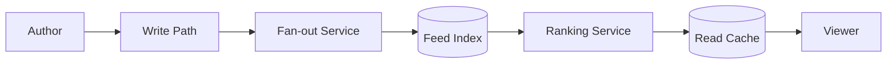

# News Feed System

The news feed problem is fundamentally about choosing where work happens: on write, on read, or in a hybrid ranking pipeline.

```text
Figure Name: Figure 1 - News Feed Fan-Out Architecture
Alt Text: News feed system showing write path, fan-out service, ranking pipeline, and read cache.
Create architecture comparing fan-out-on-write and fan-out-on-read with trade-off labels.
```

## Core Design



## Core Design

| Choice | Benefit | Cost |
| --- | --- | --- |
| Fan-out on write | Fast reads | Expensive writes for popular accounts |
| Fan-out on read | Simple writes | Slow reads and expensive joins |
| Hybrid ranking | Flexible and scalable | More pipeline complexity |

## Design Angles

- Decide whether the feed is personalized, chronological, or ranked.
- Explain how celebrity or high-fan-out accounts are treated.
- Show where caching, deduplication, and pagination live.

## Interview Framing

1. Start by separating the write path from the read path.
2. Explain why one fan-out model is not enough for all accounts.
3. Mention ranking signals and cache invalidation.
4. Close with freshness, latency, and cost trade-offs.

