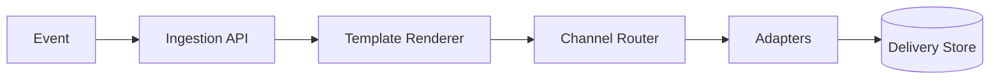

# Notification Service

Notification systems are delivery pipelines: they ingest events, decide the channel, handle retries, and respect user preferences without sending duplicates.

```text
Figure Name: Figure 1 - Notification Pipeline
Alt Text: Notification service pipeline with channel router, retry queues, dedup store, and provider adapters.
Create architecture showing event intake, template render, channel routing, retries, and delivery status tracking.
```

## Core Design



## Core Design

| Concern | What It Needs |
| --- | --- |
| Event ingestion | Durable intake and validation |
| Template rendering | Personalization and localization |
| Channel routing | Email, SMS, push, or in-app choice |
| Deduplication | Avoid duplicate notifications |
| Retry policy | Backoff, DLQ, and provider failover |

## Design Notes

- Respect user preferences and quiet hours.
- Make provider adapters isolated so one channel outage does not block others.
- Store delivery state so support and analytics can explain what happened.

## Interview Framing

1. Explain the difference between notification generation and delivery.
2. Describe how retries stay safe and idempotent.
3. Mention deduplication and suppression rules.
4. Close with per-channel failure handling.

