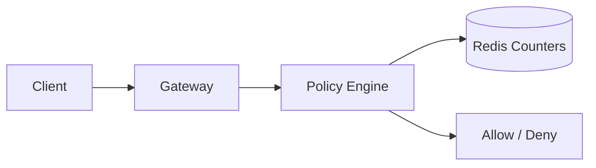

# Rate Limiter System

Rate limiting protects shared infrastructure by controlling request bursts, enforcing fairness, and isolating tenants or endpoints from abuse.

```text
Figure Name: Figure 1 - Global Rate Limiter Service
Alt Text: Distributed rate limiter with Redis counters, policy engine, and per-tenant decision path.
Create architecture for global and per-tenant limits with fallback behavior when limiter backend fails.
```

## Core Design



## Core Design

| Concern | What It Solves |
| --- | --- |
| Gateway-integrated checks | Reject abusive traffic early |
| Redis atomic counters | Fast distributed decision making |
| Hierarchical limits | Tenant, user, and endpoint isolation |
| Metrics and analytics | Detect abuse and tune policies |

## Practical Strategies

- Token bucket works well for burst tolerance.
- Leaky bucket helps smooth steady-state traffic.
- Sliding window improves fairness but costs more state.

## Interview Framing

1. Explain which layer owns the decision.
2. Describe the counter strategy and its failure mode.
3. Mention how to handle distributed consistency and clock drift.
4. End with what happens when the limiter backend is unavailable.

