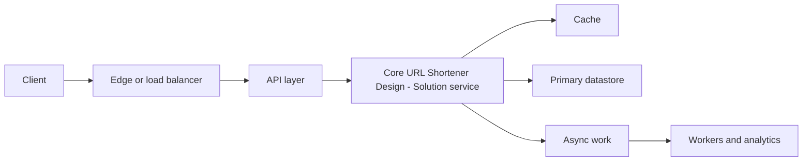
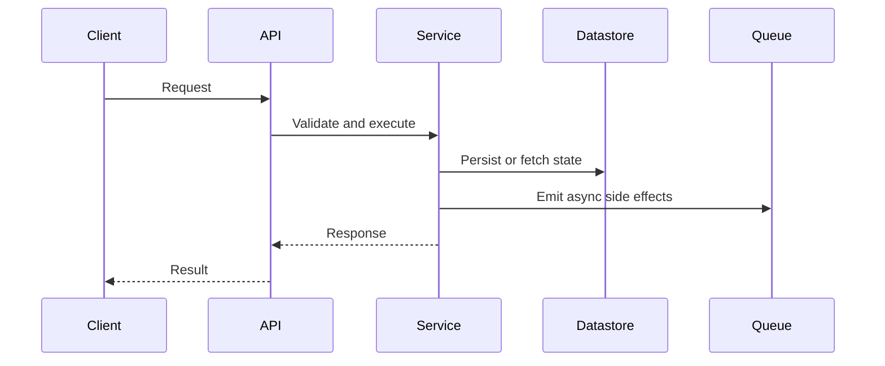

Design a URL shortening service like bit.ly.

## Overview

Split the service into a low-volume write path for creating short URLs and a high-volume read path for redirects. Keep redirect latency low by caching hot mappings and sending analytics events asynchronously.

### Primary Goal

Resolve short codes to long URLs with very low latency and high availability.

### Scale Focus

Redirect traffic dominates writes, so optimize the read path first.

### Source of Truth

The database owns URL mappings; cache and edge layers accelerate access.

### Async Work

Analytics, abuse checks, and reporting should not block redirects.

## High Level Design

The system has two main paths. The create path validates and stores mappings. The redirect path checks cache first, falls back to the database, and emits analytics asynchronously.

### Components

- Client
- CDN / Edge
- Load Balancer
- API Servers
- Redis Cache
- Mapping DB
- Event Stream
- Analytics Store

### Notes

- Use CDN or edge caching for highly popular short links.
- Keep API servers stateless behind the load balancer.
- Use cache-aside for redirect lookups.
- Emit click events to a stream after returning the redirect.

## Detailed Design

### 1. Write Path (Shorten URL)

This is the flow when a user creates a short URL.

#### Participants

- User
- Load Balancer
- API Servers
- Database (Write)
- Cache

#### Flow Steps

| Step | From | To | End | Label |
| --- | --- | --- | --- | --- |
| 1 | 1 | 2 | 3 | POST /api/shorten { long_url } |
| 2 | 2 | 3 | 4 | Forward request |
| 3 | 3 | 4 | 5 | Generate short code and check uniqueness |
| 4 | 3 | 4 | 5 | Write mapping (short_code, long_url) |
| 5 | 4 | 3 | 5 | Success |
| 6 | 4 | 5 | 6 | Invalidate cache for short_code |
| 7 | 2 | 1 | 3 | Return short URL |

#### Step Table

| Step | Description |
| --- | --- |
| 1 | User sends a request to shorten a long URL. |
| 2 | Load balancer forwards the request to an API server. |
| 3 | API generates a short code and checks uniqueness in cache or DB. |
| 4 | Mapping is stored in the database. |
| 5 | DB write succeeds. |
| 6 | Cache entry for the short code is invalidated to avoid stale reads. |
| 7 | API returns the short URL to the user. |

#### Key Points

- Short code should be unique.
- Use Base62 encoding for compact short codes.
- Cache is updated lazily on read.
- DB is the source of truth.

#### Tech Choices

- Language: Go / Java / Python
- DB: DynamoDB / Cassandra / PostgreSQL
- Cache: Redis
- ID Generation: Snowflake / Redis INCR / UUID + Base62

### 2. Read Path (Redirect URL)

This is the low-latency path used when a short URL is visited.

### 3. Key Components

API servers, code generator, mapping database, Redis cache, rate limiter, and async analytics pipeline.

### 4. Data Model

Store short code mappings by primary key and index ownership, expiration, and analytics metadata separately.

## Trade-offs

| Choice | Benefit | Cost |
| --- | --- | --- |
| Short custom aliases | Human-friendly and memorable links. | Requires reservation checks, abuse prevention, and collision handling. |
| Random code generation | Harder to enumerate. | Needs collision retries and careful entropy sizing. |
| Base62 from unique IDs | Compact, deterministic, and collision-free. | Sequential IDs can be predictable unless obscured. |
| 301 redirects | Better browser and CDN caching. | Harder to change destination later. |
| Async analytics | Keeps redirect latency low. | Counters become eventually consistent. |

## Code (Optional)

A minimal create endpoint validates input, generates a code, stores the mapping, and returns the public short URL.

```python
def create_short_url(long_url, custom_alias=None):
    validate_url(long_url)
    code = custom_alias or base62(generate_unique_id())

    if mapping_store.exists(code):
        raise AliasAlreadyTaken(code)

    mapping_store.put({
        "code": code,
        "long_url": long_url,
        "status": "active"
    })
    cache.delete(code)
    return f"https://sho.rt/{code}"
```

<!-- interview-module:start -->

## Interview Readiness Module

### Quick Summary

| Question | Interview-Ready Answer |
| --- | --- |
| What is it? | URL Shortener Design - Solution is a system design problem topic used to make a specific engineering decision explicit. |
| Why interviewers ask | They want to see constraints, tradeoffs, and failure-mode reasoning, not memorized definitions. |
| Core signal | You can explain when it helps, when it hurts, and how it behaves at scale. |
| Production lens | Discuss observability, ownership, rollout, and worst-case behavior. |

### Why This Exists

URL Shortener Design - Solution exists to test whether you can turn ambiguous product behavior into requirements, APIs, state, capacity, bottlenecks, and tradeoffs.

### Core Mental Model

Separate the user-facing path from storage, async processing, consistency boundaries, and operational controls.

### Visual Diagram





### Internal Working

- Lock requirements before drawing components.
- Define APIs and data model from access patterns.
- Scale the bottleneck path first, then add resilience and observability.

### Requirements and Capacity Frame

| Area | What To Clarify | Why It Matters |
| --- | --- | --- |
| Functional requirements | Core user actions and APIs | Prevents overbuilding unrelated features. |
| Non-functional requirements | Latency, availability, durability, consistency | Drives architecture and storage choices. |
| Scale | QPS, storage, fanout, peak traffic | Reveals bottlenecks and partitioning needs. |
| Data model | Entities, indexes, access patterns | Keeps reads and writes explainable. |
| Deep dives | Hot paths, failures, multi-region behavior | Shows senior-level design maturity. |


### Time & Space Complexity

- Capacity: QPS, storage growth, fanout, and hot-key behavior.
- Latency: network hops, cache hit rate, and datastore query shape.
- Operational complexity: deployments, migrations, incident response, and regional failover.

### Advantages

- Turns an ambiguous prompt into requirements, APIs, and data flows.
- Surfaces bottlenecks before implementation details.
- Creates room for capacity, reliability, and multi-region discussion.

### Disadvantages

- Can become box-drawing if requirements are vague.
- May over-index on scale while ignoring correctness and product constraints.
- Adds operational surface area when every component needs ownership.

### Tradeoffs

| Tradeoff | Upside | Cost |
| --- | --- | --- |
| Simplicity vs capability | Simple designs are easier to reason about | May fail when scale or requirements grow. |
| Speed vs correctness | Faster paths improve latency | More caching, approximation, or async behavior can create stale results. |
| Local optimization vs system behavior | Optimizes the hot path | Can move cost to memory, operations, or consistency. |
| Flexibility vs governance | Enables independent change | Requires contracts, testing, and ownership clarity. |

### Real World Usage

- Consumer platforms with read/write imbalance
- Internal platforms with strict SLOs
- Multi-region products with compliance and latency constraints

### Production Considerations

> [!IMPORTANT]
> Production reality: the interview answer should mention what happens when assumptions break. For URL Shortener Design - Solution, discuss hot paths, observability, limits, backpressure, and how teams detect and recover from failures.

- Define the dominant read/write path and protect it with metrics.
- Add guardrails for invalid input, overload, and slow dependencies.
- Document ownership: who changes it, who operates it, and who gets paged.
- Prefer incremental rollout when the change affects correctness or latency.

### Common Mistakes

> [!WARNING]
> Senior signal gotcha: Drawing boxes before agreeing on scale, consistency, and the dominant access pattern.

- Skipping constraints and jumping directly to implementation.
- Describing the tool without explaining why it fits this prompt.
- Ignoring worst-case behavior, memory overhead, or operational ownership.
- Forgetting to compare at least one simpler alternative.

### Failure Modes

- Hot keys, skewed traffic, or adversarial inputs overload the assumed fast path.
- Hidden coupling makes a local change cause downstream breakage.
- Missing observability turns correctness or latency issues into guesswork.
- Data growth changes an acceptable O(n), storage, or network cost into a bottleneck.

### Interview Perspective

Interviewers are testing whether you can connect URL Shortener Design - Solution to constraints, tradeoffs, and failure modes. A strong answer starts simple, states assumptions, chooses the right abstraction, and then explains what would change at larger scale.

### Interview Questions

1. What problem does URL Shortener Design - Solution solve better than the simpler alternative?
2. What assumptions make this choice valid?
3. What is the worst-case behavior, and how would you mitigate it?
4. How would you explain this to a junior engineer on your team?
5. What metrics would prove this is working in production?

### Follow-up Questions

1. How does the answer change if traffic increases by 10x?
2. What breaks if data is skewed, stale, or partially unavailable?
3. Which part would you cache, partition, replicate, or simplify?
4. How would you migrate from the naive version to this approach?
5. What would make you reject URL Shortener Design - Solution?

### Related Topics

- Scalability
- Caching
- Databases
- Load Balancing
- Rate Limiting

### Key Takeaways

- URL Shortener Design - Solution is useful only when its core tradeoff matches the prompt.
- The strongest interview answers connect mechanics to constraints and scale.
- Always discuss worst-case behavior, not only average-case or happy-path behavior.
- Production readiness includes observability, ownership, rollout, and recovery.
- Show how the design changes when traffic, data volume, or correctness requirements shift.

### 3-Minute Revision Sheet

1. Define URL Shortener Design - Solution in one sentence.
2. State the problem it solves and the simpler alternative it replaces.
3. Draw the core diagram and trace one request, operation, or decision through it.
4. Name the most important complexity, consistency, or operational tradeoff.
5. Close with one real-world use case and one failure mode.

### Decision Framework

| Step | Candidate Action |
| --- | --- |
| 1. Clarify | Ask about constraints, scale, data shape, and correctness needs. |
| 2. Choose | Pick the simplest approach that satisfies the dominant constraint. |
| 3. Justify | Explain time, space, cost, reliability, and team ownership tradeoffs. |
| 4. Stress test | Walk through failure, growth, and migration scenarios. |
| 5. Communicate | Present the answer as a recommendation, not a list of facts. |

### Why Use It

Use URL Shortener Design - Solution when it directly improves the dominant constraint: lookup speed, coupling, scalability, reliability, delivery speed, or reasoning clarity.

### Why Not Use It

Avoid URL Shortener Design - Solution when the simpler approach already meets the requirements, when operational overhead exceeds the benefit, or when the team cannot own the added complexity.

### Migration Strategy

1. Start with the simplest working design and capture baseline metrics.
2. Introduce URL Shortener Design - Solution behind a narrow interface or compatibility layer.
3. Migrate one path, tenant, or use case at a time.
4. Compare correctness, latency, cost, and operational load before expanding.
5. Keep rollback criteria explicit until the new approach is proven.

### Cost Impact

- Engineering cost: design, implementation, test coverage, and documentation.
- Runtime cost: compute, memory, storage, network, and coordination overhead.
- Operational cost: dashboards, alerts, on-call playbooks, and incident response.

### Organizational Impact

URL Shortener Design - Solution changes how teams communicate. It may require clearer ownership, better contracts, shared vocabulary, and explicit review of cross-team dependencies.

### Operational Complexity

Operational maturity requires dashboards for the hot path, alerts on saturation and errors, runbooks for known failure modes, and a rollout plan that limits blast radius.

## Quick Revision

- URL Shortener Design - Solution solves a specific pressure; name that pressure first.
- The best answer compares it with at least one simpler alternative.
- Discuss average case, worst case, and what changes at scale.
- Mention production guardrails: metrics, limits, retries, ownership, and rollback.
- End with a crisp recommendation and the assumptions behind it.

**Common interview answer:** "I would use URL Shortener Design - Solution when the constraints make its tradeoff worthwhile. I would start with the simplest version, validate the bottleneck, then add this structure or pattern where it improves the hot path while keeping failure modes observable."

**Most important tradeoffs:** performance vs complexity, correctness vs latency, flexibility vs ownership, and short-term speed vs long-term operability.

**Most important pitfalls:** unclear assumptions, ignoring worst-case behavior, skipping observability, and failing to explain why the simpler option is insufficient.

## Flashcards

1. **Q:** What is the main purpose of URL Shortener Design - Solution? **A:** To solve a specific constraint or reasoning problem more clearly than a naive approach.
2. **Q:** What should you clarify before using it? **A:** Scale, data shape, correctness needs, latency goals, and operational constraints.
3. **Q:** What makes an interview answer senior-level? **A:** It explains tradeoffs, failure modes, migration, and production ownership.
4. **Q:** What is the most common mistake? **A:** Naming the concept without tying it to the prompt's constraints.
5. **Q:** How do you discuss complexity? **A:** Cover time, space, coordination, and operational complexity where relevant.
6. **Q:** What should a diagram show? **A:** Boundaries, data flow, ownership, and the hot path.
7. **Q:** How do you handle follow-ups? **A:** Re-check assumptions and explain how the design changes under new constraints.
8. **Q:** What production signal matters most? **A:** Metrics on the hot path: latency, errors, saturation, and correctness drift.
9. **Q:** When should you avoid it? **A:** When it adds more complexity than the requirements justify.
10. **Q:** How should you conclude? **A:** Give a recommendation, list assumptions, and name the next thing you would validate.

<!-- interview-module:end -->
