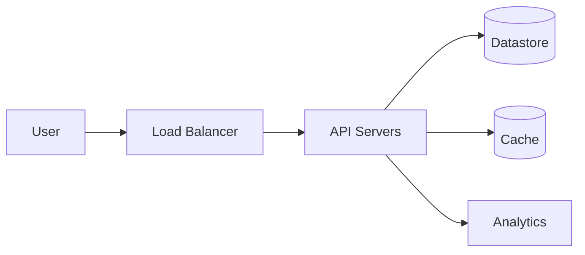
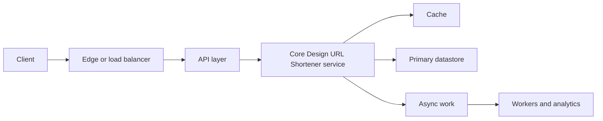
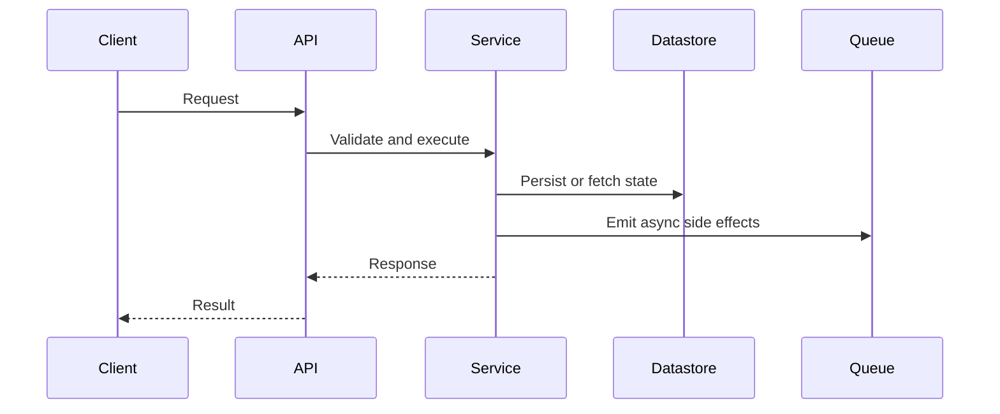

# Design URL Shortener

Design a URL shortening service like bit.ly.

## Requirements

- Shorten long URLs.
- Redirect short URLs to the original long URL.
- Support custom aliases when available.
- Provide high availability and low latency.
- Track basic analytics such as click count.
- Scale to billions of URLs.

## Estimation

- QPS: 50K
- Write: 100/s
- Read: 40K/s
- Storage: 100B URLs, average 100 bytes each.

## High Level Design

## Detailed Design

Separate the write path that creates codes from the read path that resolves redirects. Keep redirects fast with cache-aside and an asynchronously updated analytics pipeline.

## API Design

Expose create, redirect, delete, and stats endpoints. The redirect endpoint should stay minimal and avoid blocking on analytics writes.

## Data Model

Use the short code as the primary lookup key and maintain indexes for user ownership, expiration, and operational cleanup.

## Trade-offs

Discuss custom aliases, Base62 ID generation, collision handling, 301 vs 302 redirects, cache invalidation, and abuse prevention.

[Open the full solution](./)

<!-- interview-module:start -->

## Interview Readiness Module

### Quick Summary

| Question | Interview-Ready Answer |
| --- | --- |
| What is it? | Design URL Shortener is a system design problem topic used to make a specific engineering decision explicit. |
| Why interviewers ask | They want to see constraints, tradeoffs, and failure-mode reasoning, not memorized definitions. |
| Core signal | You can explain when it helps, when it hurts, and how it behaves at scale. |
| Production lens | Discuss observability, ownership, rollout, and worst-case behavior. |

### Why This Exists

Design URL Shortener exists to test whether you can turn ambiguous product behavior into requirements, APIs, state, capacity, bottlenecks, and tradeoffs.

### Core Mental Model

Separate the user-facing path from storage, async processing, consistency boundaries, and operational controls.

### Visual Diagram

### Internal Working

- Lock requirements before drawing components.
- Define APIs and data model from access patterns.
- Scale the bottleneck path first, then add resilience and observability.

### Requirements and Capacity Frame

| Area | What To Clarify | Why It Matters |
| --- | --- | --- |
| Functional requirements | Core user actions and APIs | Prevents overbuilding unrelated features. |
| Non-functional requirements | Latency, availability, durability, consistency | Drives architecture and storage choices. |
| Scale | QPS, storage, fanout, peak traffic | Reveals bottlenecks and partitioning needs. |
| Data model | Entities, indexes, access patterns | Keeps reads and writes explainable. |
| Deep dives | Hot paths, failures, multi-region behavior | Shows senior-level design maturity. |

### Time & Space Complexity

- Capacity: QPS, storage growth, fanout, and hot-key behavior.
- Latency: network hops, cache hit rate, and datastore query shape.
- Operational complexity: deployments, migrations, incident response, and regional failover.

### Advantages

- Turns an ambiguous prompt into requirements, APIs, and data flows.
- Surfaces bottlenecks before implementation details.
- Creates room for capacity, reliability, and multi-region discussion.

### Disadvantages

- Can become box-drawing if requirements are vague.
- May over-index on scale while ignoring correctness and product constraints.
- Adds operational surface area when every component needs ownership.

### Tradeoffs

| Tradeoff | Upside | Cost |
| --- | --- | --- |
| Simplicity vs capability | Simple designs are easier to reason about | May fail when scale or requirements grow. |
| Speed vs correctness | Faster paths improve latency | More caching, approximation, or async behavior can create stale results. |
| Local optimization vs system behavior | Optimizes the hot path | Can move cost to memory, operations, or consistency. |
| Flexibility vs governance | Enables independent change | Requires contracts, testing, and ownership clarity. |

### Real World Usage

- Consumer platforms with read/write imbalance
- Internal platforms with strict SLOs
- Multi-region products with compliance and latency constraints

### Production Considerations

> [!IMPORTANT]
> Production reality: the interview answer should mention what happens when assumptions break. For Design URL Shortener, discuss hot paths, observability, limits, backpressure, and how teams detect and recover from failures.

- Define the dominant read/write path and protect it with metrics.
- Add guardrails for invalid input, overload, and slow dependencies.
- Document ownership: who changes it, who operates it, and who gets paged.
- Prefer incremental rollout when the change affects correctness or latency.

### Common Mistakes

> [!WARNING]
> Senior signal gotcha: Drawing boxes before agreeing on scale, consistency, and the dominant access pattern.

- Skipping constraints and jumping directly to implementation.
- Describing the tool without explaining why it fits this prompt.
- Ignoring worst-case behavior, memory overhead, or operational ownership.
- Forgetting to compare at least one simpler alternative.

### Failure Modes

- Hot keys, skewed traffic, or adversarial inputs overload the assumed fast path.
- Hidden coupling makes a local change cause downstream breakage.
- Missing observability turns correctness or latency issues into guesswork.
- Data growth changes an acceptable O(n), storage, or network cost into a bottleneck.

### Interview Perspective

Interviewers are testing whether you can connect Design URL Shortener to constraints, tradeoffs, and failure modes. A strong answer starts simple, states assumptions, chooses the right abstraction, and then explains what would change at larger scale.

### Interview Questions

1. What problem does Design URL Shortener solve better than the simpler alternative?
2. What assumptions make this choice valid?
3. What is the worst-case behavior, and how would you mitigate it?
4. How would you explain this to a junior engineer on your team?
5. What metrics would prove this is working in production?

### Follow-up Questions

1. How does the answer change if traffic increases by 10x?
2. What breaks if data is skewed, stale, or partially unavailable?
3. Which part would you cache, partition, replicate, or simplify?
4. How would you migrate from the naive version to this approach?
5. What would make you reject Design URL Shortener?

### Related Topics

- Scalability
- Caching
- Databases
- Load Balancing
- Rate Limiting

### Key Takeaways

- Design URL Shortener is useful only when its core tradeoff matches the prompt.
- The strongest interview answers connect mechanics to constraints and scale.
- Always discuss worst-case behavior, not only average-case or happy-path behavior.
- Production readiness includes observability, ownership, rollout, and recovery.
- Show how the design changes when traffic, data volume, or correctness requirements shift.

### 3-Minute Revision Sheet

1. Define Design URL Shortener in one sentence.
2. State the problem it solves and the simpler alternative it replaces.
3. Draw the core diagram and trace one request, operation, or decision through it.
4. Name the most important complexity, consistency, or operational tradeoff.
5. Close with one real-world use case and one failure mode.

### Decision Framework

| Step | Candidate Action |
| --- | --- |
| 1. Clarify | Ask about constraints, scale, data shape, and correctness needs. |
| 2. Choose | Pick the simplest approach that satisfies the dominant constraint. |
| 3. Justify | Explain time, space, cost, reliability, and team ownership tradeoffs. |
| 4. Stress test | Walk through failure, growth, and migration scenarios. |
| 5. Communicate | Present the answer as a recommendation, not a list of facts. |

### Why Use It

Use Design URL Shortener when it directly improves the dominant constraint: lookup speed, coupling, scalability, reliability, delivery speed, or reasoning clarity.

### Why Not Use It

Avoid Design URL Shortener when the simpler approach already meets the requirements, when operational overhead exceeds the benefit, or when the team cannot own the added complexity.

### Migration Strategy

1. Start with the simplest working design and capture baseline metrics.
2. Introduce Design URL Shortener behind a narrow interface or compatibility layer.
3. Migrate one path, tenant, or use case at a time.
4. Compare correctness, latency, cost, and operational load before expanding.
5. Keep rollback criteria explicit until the new approach is proven.

### Cost Impact

- Engineering cost: design, implementation, test coverage, and documentation.
- Runtime cost: compute, memory, storage, network, and coordination overhead.
- Operational cost: dashboards, alerts, on-call playbooks, and incident response.

### Organizational Impact

Design URL Shortener changes how teams communicate. It may require clearer ownership, better contracts, shared vocabulary, and explicit review of cross-team dependencies.

### Operational Complexity

Operational maturity requires dashboards for the hot path, alerts on saturation and errors, runbooks for known failure modes, and a rollout plan that limits blast radius.

## Quick Revision

- Design URL Shortener solves a specific pressure; name that pressure first.
- The best answer compares it with at least one simpler alternative.
- Discuss average case, worst case, and what changes at scale.
- Mention production guardrails: metrics, limits, retries, ownership, and rollback.
- End with a crisp recommendation and the assumptions behind it.

**Common interview answer:** "I would use Design URL Shortener when the constraints make its tradeoff worthwhile. I would start with the simplest version, validate the bottleneck, then add this structure or pattern where it improves the hot path while keeping failure modes observable."

**Most important tradeoffs:** performance vs complexity, correctness vs latency, flexibility vs ownership, and short-term speed vs long-term operability.

**Most important pitfalls:** unclear assumptions, ignoring worst-case behavior, skipping observability, and failing to explain why the simpler option is insufficient.

## Flashcards

1. **Q:** What is the main purpose of Design URL Shortener? **A:** To solve a specific constraint or reasoning problem more clearly than a naive approach.
2. **Q:** What should you clarify before using it? **A:** Scale, data shape, correctness needs, latency goals, and operational constraints.
3. **Q:** What makes an interview answer senior-level? **A:** It explains tradeoffs, failure modes, migration, and production ownership.
4. **Q:** What is the most common mistake? **A:** Naming the concept without tying it to the prompt's constraints.
5. **Q:** How do you discuss complexity? **A:** Cover time, space, coordination, and operational complexity where relevant.
6. **Q:** What should a diagram show? **A:** Boundaries, data flow, ownership, and the hot path.
7. **Q:** How do you handle follow-ups? **A:** Re-check assumptions and explain how the design changes under new constraints.
8. **Q:** What production signal matters most? **A:** Metrics on the hot path: latency, errors, saturation, and correctness drift.
9. **Q:** When should you avoid it? **A:** When it adds more complexity than the requirements justify.
10. **Q:** How should you conclude? **A:** Give a recommendation, list assumptions, and name the next thing you would validate.

<!-- interview-module:end -->
