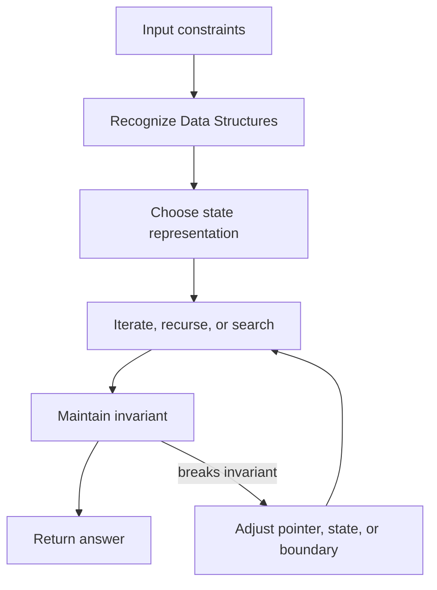

# Data Structures

## Track Overview

Data structures are the tools behind coding patterns. Study them by operations, invariants, and complexity.

~~~mermaid
flowchart LR
    A["Clarify"] --> B["Recognize"]
    B --> C["Template"]
    C --> D["Code"]
    D --> E["Test"]
~~~

## Topics

| Topic | What To Study |
| --- | --- |
| [Arrays]({{ '/coding-round/data-structures/arrays/' | relative_url }}) | Recognition, template, mistakes, interview questions, and practice. |
| [Linked Lists]({{ '/coding-round/data-structures/linked-lists/' | relative_url }}) | Recognition, template, mistakes, interview questions, and practice. |
| [Stacks]({{ '/coding-round/data-structures/stacks/' | relative_url }}) | Recognition, template, mistakes, interview questions, and practice. |
| [Queues]({{ '/coding-round/data-structures/queues/' | relative_url }}) | Recognition, template, mistakes, interview questions, and practice. |
| [Hash Tables]({{ '/coding-round/data-structures/hash-tables/' | relative_url }}) | Recognition, template, mistakes, interview questions, and practice. |
| [Trees]({{ '/coding-round/data-structures/trees/' | relative_url }}) | Recognition, template, mistakes, interview questions, and practice. |
| [BST]({{ '/coding-round/data-structures/bst/' | relative_url }}) | Recognition, template, mistakes, interview questions, and practice. |
| [Heaps]({{ '/coding-round/data-structures/heaps/' | relative_url }}) | Recognition, template, mistakes, interview questions, and practice. |
| [Graphs]({{ '/coding-round/data-structures/graphs/' | relative_url }}) | Recognition, template, mistakes, interview questions, and practice. |
| [Trie]({{ '/coding-round/data-structures/trie/' | relative_url }}) | Recognition, template, mistakes, interview questions, and practice. |
| [Segment Trees]({{ '/coding-round/data-structures/segment-trees/' | relative_url }}) | Recognition, template, mistakes, interview questions, and practice. |
| [Fenwick Trees]({{ '/coding-round/data-structures/fenwick-trees/' | relative_url }}) | Recognition, template, mistakes, interview questions, and practice. |
| [Disjoint Set]({{ '/coding-round/data-structures/disjoint-set/' | relative_url }}) | Recognition, template, mistakes, interview questions, and practice. |

<!-- interview-module:start -->

## Interview Readiness Module

### Quick Summary

| Question | Interview-Ready Answer |
| --- | --- |
| What is it? | Data Structures is a data structure topic used to make a specific engineering decision explicit. |
| Why interviewers ask | They want to see constraints, tradeoffs, and failure-mode reasoning, not memorized definitions. |
| Core signal | You can explain when it helps, when it hurts, and how it behaves at scale. |
| Production lens | Discuss observability, ownership, rollout, and worst-case behavior. |

### Why This Exists

Data Structures exists because interview problems often reduce to choosing the right representation for lookup, ordering, mutation, and memory locality. The important question is not only how to use it, but what cost model it creates under load.

### Core Mental Model

Track the data layout, the operation you need most often, and the invariant that keeps each operation cheap.

### Visual Diagram



### Internal Working

- Identify the backing storage and pointer/reference behavior.
- Name the operations that are constant, logarithmic, or linear.
- Explain resizing, rebalancing, collision handling, or traversal cost when relevant.

### Pattern Recognition Signals

| Signal | What It Usually Means | Candidate Move |
| --- | --- | --- |
| Repeated lookup | Use a structure that removes scanning | Introduce a map, set, index, heap, or cache. |
| Ordered traversal | Preserve sequence or sorted boundaries | Use pointers, binary search, stack, queue, or tree traversal. |
| Overlapping work | The brute force revisits states | Add memoization, prefix state, or dynamic programming. |
| Changing window or frontier | Only part of the input is active | Maintain an invariant while expanding and shrinking. |


### Time & Space Complexity

- Best case: driven by the direct operation the structure optimizes.
- Average case: depends on distribution, branching, or amortization.
- Worst case: appears when invariants break, input is adversarial, or resizing/rebalancing occurs.

### Advantages

- Creates a repeatable way to reduce brute-force work.
- Makes complexity analysis easier to justify.
- Improves communication during live coding because the invariant is explicit.

### Disadvantages

- Can be over-applied when a simpler scan or direct implementation is enough.
- May hide memory overhead or worst-case input behavior.
- Requires careful explanation of invariants and edge cases.

### Tradeoffs

| Tradeoff | Upside | Cost |
| --- | --- | --- |
| Simplicity vs capability | Simple designs are easier to reason about | May fail when scale or requirements grow. |
| Speed vs correctness | Faster paths improve latency | More caching, approximation, or async behavior can create stale results. |
| Local optimization vs system behavior | Optimizes the hot path | Can move cost to memory, operations, or consistency. |
| Flexibility vs governance | Enables independent change | Requires contracts, testing, and ownership clarity. |

### Real World Usage

- Database indexes and in-memory lookup paths
- Caches, queues, schedulers, and search systems
- Compilers, runtimes, and storage engines

### Production Considerations

> [!IMPORTANT]
> Production reality: the interview answer should mention what happens when the input stops being friendly. For Data Structures, discuss data size, skew, memory allocation, cache locality, adversarial cases, and language runtime behavior.

- Protect the hot path from accidental O(n^2), pathological hashing, or unbounded memory growth.
- Prefer clear invariants and measurable complexity over clever code that is hard to debug.
- Check language details: integer overflow, recursion depth, map ordering, mutability, and allocation behavior.
- Test empty inputs, duplicates, huge inputs, and inputs designed to break the assumed fast path.

### Common Mistakes

> [!WARNING]
> Senior signal gotcha: Using the structure because it is familiar instead of because its invariant matches the prompt.

- Skipping constraints and jumping directly to implementation.
- Describing the tool without explaining why it fits this prompt.
- Ignoring worst-case behavior, memory overhead, or operational ownership.
- Forgetting to compare at least one simpler alternative.

### Failure Modes

- Hot keys, skewed traffic, or adversarial inputs overload the assumed fast path.
- Hidden coupling makes a local change cause downstream breakage.
- Missing observability turns correctness or latency issues into guesswork.
- Data growth changes an acceptable O(n), storage, or network cost into a bottleneck.

### Interview Perspective

Interviewers are testing whether you can connect Data Structures to constraints, tradeoffs, and failure modes. A strong answer starts simple, states assumptions, chooses the right abstraction, and then explains what would change at larger scale.

### Interview Questions

1. What problem does Data Structures solve better than the simpler alternative?
2. What assumptions make this choice valid?
3. What is the worst-case behavior, and how would you mitigate it?
4. How would you explain this to a junior engineer on your team?
5. What metrics would prove this is working in production?

### Follow-up Questions

1. How does the answer change if traffic increases by 10x?
2. What breaks if data is skewed, stale, or partially unavailable?
3. Which part would you cache, partition, replicate, or simplify?
4. How would you migrate from the naive version to this approach?
5. What would make you reject Data Structures?

### Related Topics

- Time and Space Complexity
- Hash Tables
- Arrays
- Trees and Graphs
- Coding Patterns

### Key Takeaways

- Data Structures is useful only when its core tradeoff matches the prompt.
- The strongest interview answers connect mechanics to constraints and scale.
- Always discuss worst-case behavior, not only average-case or happy-path behavior.
- Production readiness includes observability, ownership, rollout, and recovery.
- Call out memory overhead, cache locality, adversarial inputs, and language implementation details.

### 3-Minute Revision Sheet

1. Define Data Structures in one sentence.
2. State the problem it solves and the simpler alternative it replaces.
3. Draw the core diagram and trace one request, operation, or decision through it.
4. Name the most important complexity, consistency, or operational tradeoff.
5. Close with one real-world use case and one failure mode.

### Decision Framework

| Step | Candidate Action |
| --- | --- |
| 1. Clarify | Ask about constraints, scale, data shape, and correctness needs. |
| 2. Choose | Pick the simplest approach that satisfies the dominant constraint. |
| 3. Justify | Explain time, space, cost, reliability, and team ownership tradeoffs. |
| 4. Stress test | Walk through failure, growth, and migration scenarios. |
| 5. Communicate | Present the answer as a recommendation, not a list of facts. |

### Why Use It

Use Data Structures when it directly improves the dominant constraint: lookup speed, coupling, scalability, reliability, delivery speed, or reasoning clarity.

### Why Not Use It

Avoid Data Structures when the simpler approach already meets the requirements, when operational overhead exceeds the benefit, or when the team cannot own the added complexity.

### Migration Strategy

1. Start with the brute-force solution and name the repeated work.
2. Introduce Data Structures only where it removes that repeated work or clarifies the invariant.
3. Keep the old and optimized answers comparable with the same test cases.
4. Validate time, space, and edge cases before presenting the final version.
5. Explain the tradeoff as an interview decision, not just a code change.

### Cost Impact

- CPU cost: comparisons, hashing, recursion, heap operations, or repeated scans.
- Memory cost: auxiliary maps, sets, arrays, recursion stack, object headers, and allocator pressure.
- Runtime cost: cache locality, garbage collection, boxing/unboxing, and language-specific container overhead.

### Organizational Impact

Data Structures improves team communication when engineers share the same pattern vocabulary. In code review, it helps reviewers verify the invariant, edge cases, and complexity proof quickly.

### Operational Complexity

For production code, operational risk comes from worst-case input shape, memory growth, concurrency assumptions, and observability around latency or resource spikes.

## Quick Revision

- Data Structures solves a specific pressure; name that pressure first.
- The best answer compares it with at least one simpler alternative.
- Discuss average case, worst case, and what changes at scale.
- Mention production guardrails: input limits, memory bounds, runtime behavior, and adversarial cases.
- End with a crisp recommendation and the assumptions behind it.

**Common interview answer:** "I would use Data Structures when the constraints make its tradeoff worthwhile. I would start with the simplest version, validate the bottleneck, then add this structure or pattern where it improves the hot path while keeping failure modes observable."

**Most important tradeoffs:** performance vs complexity, correctness vs latency, flexibility vs ownership, and short-term speed vs long-term operability.

**Most important pitfalls:** unclear assumptions, ignoring worst-case behavior, skipping observability, and failing to explain why the simpler option is insufficient.

## Flashcards

1. **Q:** What is the main purpose of Data Structures? **A:** To solve a specific constraint or reasoning problem more clearly than a naive approach.
2. **Q:** What should you clarify before using it? **A:** Scale, data shape, correctness needs, latency goals, and operational constraints.
3. **Q:** What makes an interview answer senior-level? **A:** It explains tradeoffs, failure modes, migration, and production ownership.
4. **Q:** What is the most common mistake? **A:** Naming the concept without tying it to the prompt's constraints.
5. **Q:** How do you discuss complexity? **A:** Cover time, space, coordination, and operational complexity where relevant.
6. **Q:** What should a diagram show? **A:** Boundaries, data flow, ownership, and the hot path.
7. **Q:** How do you handle follow-ups? **A:** Re-check assumptions and explain how the design changes under new constraints.
8. **Q:** What production signal matters most? **A:** Metrics on the hot path: latency, errors, saturation, and correctness drift.
9. **Q:** When should you avoid it? **A:** When it adds more complexity than the requirements justify.
10. **Q:** How should you conclude? **A:** Give a recommendation, list assumptions, and name the next thing you would validate.

<!-- interview-module:end -->


### Example implementation (placeholder)

```python
# TODO: add working example
def solution(input):
    return input
```


### Quiz

1. Question: What is the main trade-off?
<!-- Answers: 1) Explain trade-off -->
