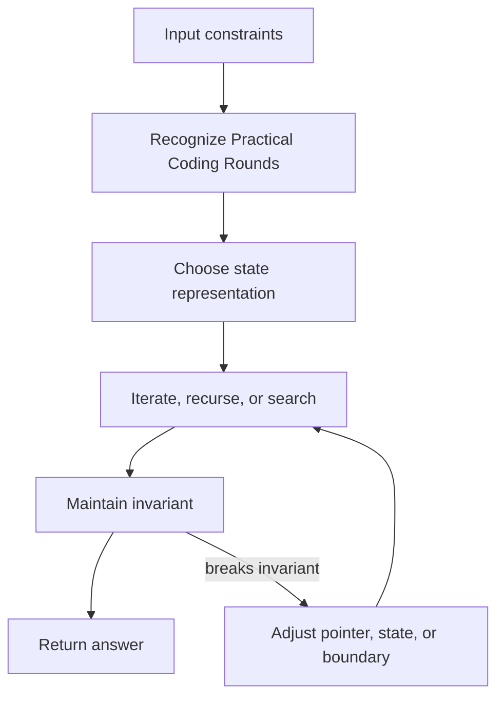

## Topic: Formats

### Sub-topic: Common Tasks

- Implement an LRU cache.
- Build a rate limiter.
- Parse logs or expressions.
- Design an in-memory scheduler.
- Implement a small service API.

### Sub-topic: What Makes Practical Coding Different

Practical rounds test implementation judgment more than algorithm tricks. The interviewer is looking for clean data models, readable operations, input validation, error handling, and reasonable extensibility.

### Sub-topic: Example Task Breakdown

For an in-memory rate limiter:

- Define the key: user ID, IP, API key, or endpoint.
- Define the policy: fixed window, sliding window, token bucket.
- Define storage: map from key to counters or timestamps.
- Define cleanup: remove old timestamps or expired windows.
- Define behavior: allow, reject, or retry-after.

## Topic: Design

### Sub-topic: Key Habit

Separate data model, operations, validation, and error handling.

### Sub-topic: Implementation Structure

```text
Class or module
  - state/data structures
  - public operations
  - validation helpers
  - internal mutation helpers
  - tests or examples
```

### Sub-topic: LRU Cache Example

An LRU cache needs O(1) lookup and O(1) recency update. Use a hash map for key lookup and a doubly linked list for recency ordering. State the invariant: the head is most recent and the tail is least recent.

## Topic: Quality

### Sub-topic: What Matters

Readable code, explicit invariants, small helpers, and clear test cases.

### Sub-topic: Evaluation Checklist

| Area | Good Signal |
| --- | --- |
| API | Clear method names and return values |
| State | Minimal, coherent, and encapsulated |
| Errors | Invalid input handled deliberately |
| Complexity | Operations meet expected cost |
| Tests | Normal and boundary cases covered |

### Sub-topic: Interview Tip

If requirements are likely to evolve, say where extension points belong. Example: "I will start with fixed window rate limiting, but I would hide the policy behind an interface so token bucket can be added without changing callers."

<!-- interview-module:start -->

## Interview Readiness Module

### Quick Summary

| Question | Interview-Ready Answer |
| --- | --- |
| What is it? | Practical Coding Rounds is a coding pattern topic used to make a specific engineering decision explicit. |
| Why interviewers ask | They want to see constraints, tradeoffs, and failure-mode reasoning, not memorized definitions. |
| Core signal | You can explain when it helps, when it hurts, and how it behaves at scale. |
| Production lens | Discuss observability, ownership, rollout, and worst-case behavior. |

### Why This Exists

Practical Coding Rounds exists to turn a family of prompts into a repeatable solving strategy. In interviews, pattern recognition saves time, but only if you can justify the invariant and prove the complexity.

### Core Mental Model

Convert the prompt into state, transitions, stopping conditions, and an invariant you can defend while coding.

### Visual Diagram



### Internal Working

- Clarify constraints and brute force first.
- Choose the state that removes repeated work.
- Maintain the invariant at every loop, recursion, or data-structure operation.

### Pattern Recognition Signals

| Signal | What It Usually Means | Candidate Move |
| --- | --- | --- |
| Repeated lookup | Use a structure that removes scanning | Introduce a map, set, index, heap, or cache. |
| Ordered traversal | Preserve sequence or sorted boundaries | Use pointers, binary search, stack, queue, or tree traversal. |
| Overlapping work | The brute force revisits states | Add memoization, prefix state, or dynamic programming. |
| Changing window or frontier | Only part of the input is active | Maintain an invariant while expanding and shrinking. |


### Time & Space Complexity

- Time follows the number of states, edges, windows, or comparisons visited.
- Space follows auxiliary structures, recursion depth, memo tables, or output size.
- Optimization is valid only when it preserves the invariant.

### Advantages

- Creates a repeatable way to reduce brute-force work.
- Makes complexity analysis easier to justify.
- Improves communication during live coding because the invariant is explicit.

### Disadvantages

- Can be over-applied when a simpler scan or direct implementation is enough.
- May hide memory overhead or worst-case input behavior.
- Requires careful explanation of invariants and edge cases.

### Tradeoffs

| Tradeoff | Upside | Cost |
| --- | --- | --- |
| Simplicity vs capability | Simple designs are easier to reason about | May fail when scale or requirements grow. |
| Speed vs correctness | Faster paths improve latency | More caching, approximation, or async behavior can create stale results. |
| Local optimization vs system behavior | Optimizes the hot path | Can move cost to memory, operations, or consistency. |
| Flexibility vs governance | Enables independent change | Requires contracts, testing, and ownership clarity. |

### Real World Usage

- Ranking, routing, scheduling, matching, and search
- Stream processing and deduplication
- Compilers, recommendation systems, and data pipelines

### Production Considerations

> [!IMPORTANT]
> Production reality: the interview answer should mention what happens when the input stops being friendly. For Practical Coding Rounds, discuss data size, skew, memory allocation, cache locality, adversarial cases, and language runtime behavior.

- Protect the hot path from accidental O(n^2), pathological hashing, or unbounded memory growth.
- Prefer clear invariants and measurable complexity over clever code that is hard to debug.
- Check language details: integer overflow, recursion depth, map ordering, mutability, and allocation behavior.
- Test empty inputs, duplicates, huge inputs, and inputs designed to break the assumed fast path.

### Common Mistakes

> [!WARNING]
> Senior signal gotcha: Jumping to the optimized pattern without explaining why brute force repeats work.

- Skipping constraints and jumping directly to implementation.
- Describing the tool without explaining why it fits this prompt.
- Ignoring worst-case behavior, memory overhead, or operational ownership.
- Forgetting to compare at least one simpler alternative.

### Failure Modes

- Hot keys, skewed traffic, or adversarial inputs overload the assumed fast path.
- Hidden coupling makes a local change cause downstream breakage.
- Missing observability turns correctness or latency issues into guesswork.
- Data growth changes an acceptable O(n), storage, or network cost into a bottleneck.

### Interview Perspective

Interviewers are testing whether you can connect Practical Coding Rounds to constraints, tradeoffs, and failure modes. A strong answer starts simple, states assumptions, chooses the right abstraction, and then explains what would change at larger scale.

### Interview Questions

1. What problem does Practical Coding Rounds solve better than the simpler alternative?
2. What assumptions make this choice valid?
3. What is the worst-case behavior, and how would you mitigate it?
4. How would you explain this to a junior engineer on your team?
5. What metrics would prove this is working in production?

### Follow-up Questions

1. How does the answer change if traffic increases by 10x?
2. What breaks if data is skewed, stale, or partially unavailable?
3. Which part would you cache, partition, replicate, or simplify?
4. How would you migrate from the naive version to this approach?
5. What would make you reject Practical Coding Rounds?

### Related Topics

- Problem Solving Framework
- Complexity Analysis
- Mock Interviews
- Edge Cases and Testing
- Data Structures

### Key Takeaways

- Practical Coding Rounds is useful only when its core tradeoff matches the prompt.
- The strongest interview answers connect mechanics to constraints and scale.
- Always discuss worst-case behavior, not only average-case or happy-path behavior.
- Production readiness includes observability, ownership, rollout, and recovery.
- Explain constraints, prove the invariant, and name the failure case that would invalidate the chosen approach.

### 3-Minute Revision Sheet

1. Define Practical Coding Rounds in one sentence.
2. State the problem it solves and the simpler alternative it replaces.
3. Draw the core diagram and trace one request, operation, or decision through it.
4. Name the most important complexity, consistency, or operational tradeoff.
5. Close with one real-world use case and one failure mode.

### Decision Framework

| Step | Candidate Action |
| --- | --- |
| 1. Clarify | Ask about constraints, scale, data shape, and correctness needs. |
| 2. Choose | Pick the simplest approach that satisfies the dominant constraint. |
| 3. Justify | Explain time, space, cost, reliability, and team ownership tradeoffs. |
| 4. Stress test | Walk through failure, growth, and migration scenarios. |
| 5. Communicate | Present the answer as a recommendation, not a list of facts. |

### Why Use It

Use Practical Coding Rounds when it directly improves the dominant constraint: lookup speed, coupling, scalability, reliability, delivery speed, or reasoning clarity.

### Why Not Use It

Avoid Practical Coding Rounds when the simpler approach already meets the requirements, when operational overhead exceeds the benefit, or when the team cannot own the added complexity.

### Migration Strategy

1. Start with the brute-force solution and name the repeated work.
2. Introduce Practical Coding Rounds only where it removes that repeated work or clarifies the invariant.
3. Keep the old and optimized answers comparable with the same test cases.
4. Validate time, space, and edge cases before presenting the final version.
5. Explain the tradeoff as an interview decision, not just a code change.

### Cost Impact

- CPU cost: comparisons, hashing, recursion, heap operations, or repeated scans.
- Memory cost: auxiliary maps, sets, arrays, recursion stack, object headers, and allocator pressure.
- Runtime cost: cache locality, garbage collection, boxing/unboxing, and language-specific container overhead.

### Organizational Impact

Practical Coding Rounds improves team communication when engineers share the same pattern vocabulary. In code review, it helps reviewers verify the invariant, edge cases, and complexity proof quickly.

### Operational Complexity

For production code, operational risk comes from worst-case input shape, memory growth, concurrency assumptions, and observability around latency or resource spikes.

## Quick Revision

- Practical Coding Rounds solves a specific pressure; name that pressure first.
- The best answer compares it with at least one simpler alternative.
- Discuss average case, worst case, and what changes at scale.
- Mention production guardrails: input limits, memory bounds, runtime behavior, and adversarial cases.
- End with a crisp recommendation and the assumptions behind it.

**Common interview answer:** "I would use Practical Coding Rounds when the constraints make its tradeoff worthwhile. I would start with the simplest version, validate the bottleneck, then add this structure or pattern where it improves the hot path while keeping failure modes observable."

**Most important tradeoffs:** performance vs complexity, correctness vs latency, flexibility vs ownership, and short-term speed vs long-term operability.

**Most important pitfalls:** unclear assumptions, ignoring worst-case behavior, skipping observability, and failing to explain why the simpler option is insufficient.

## Flashcards

1. **Q:** What is the main purpose of Practical Coding Rounds? **A:** To solve a specific constraint or reasoning problem more clearly than a naive approach.
2. **Q:** What should you clarify before using it? **A:** Scale, data shape, correctness needs, latency goals, and operational constraints.
3. **Q:** What makes an interview answer senior-level? **A:** It explains tradeoffs, failure modes, migration, and production ownership.
4. **Q:** What is the most common mistake? **A:** Naming the concept without tying it to the prompt's constraints.
5. **Q:** How do you discuss complexity? **A:** Cover time, space, coordination, and operational complexity where relevant.
6. **Q:** What should a diagram show? **A:** Boundaries, data flow, ownership, and the hot path.
7. **Q:** How do you handle follow-ups? **A:** Re-check assumptions and explain how the design changes under new constraints.
8. **Q:** What production signal matters most? **A:** Metrics on the hot path: latency, errors, saturation, and correctness drift.
9. **Q:** When should you avoid it? **A:** When it adds more complexity than the requirements justify.
10. **Q:** How should you conclude? **A:** Give a recommendation, list assumptions, and name the next thing you would validate.

<!-- interview-module:end -->
