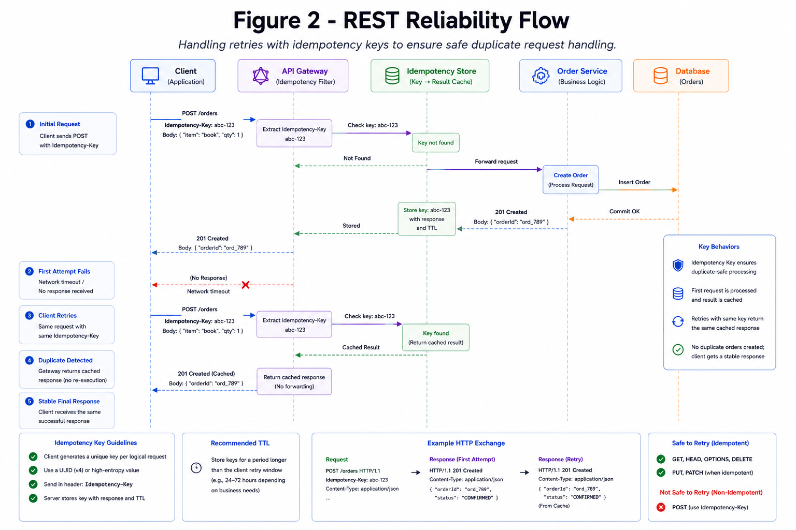

# REST API Design

REST is resource-oriented HTTP communication with predictable semantics, cache friendliness, and broad client support.

*Figure 1: REST design showing resources, HTTP verbs, status codes, and idempotency behavior.*

## 1. Resource Modeling

Model stable business nouns, not backend procedures.

- Use `/users/{id}/orders` instead of `/getUserOrders`.
- Keep resource identifiers opaque and stable.
- Use query parameters for filtering, sorting, and pagination.
- Avoid deeply nested URLs once relationships become many-to-many.

## 2. HTTP Semantics

| Method | Intent | Idempotent | Typical Use |
| --- | --- | --- | --- |
| GET | Read resource | Yes | Fetch item or collection |
| POST | Create or command | No | Create order, submit job |
| PUT | Replace resource | Yes | Replace full profile |
| PATCH | Partial update | Usually | Update selected fields |
| DELETE | Remove resource | Yes | Delete or deactivate resource |

## 3. Reliability Practices

- Use idempotency keys for retried mutations.
- Set explicit timeout budgets per endpoint.
- Return retryable errors separately from validation errors.
- Include correlation IDs in every response.
- Use pagination to protect list endpoints.

*Figure 2: Request retry flow with idempotency keys and safe duplicate handling.*

## 4. Versioning and Compatibility

Prefer additive changes when possible.

- Add optional fields before making them required.
- Keep old response fields until clients migrate.
- Use URI versions for major breaking changes or header versions for product/API programs that need finer routing.
- Publish deprecation windows and usage metrics.

## 5. Caching and Performance

REST works well with HTTP caching when reads are stable.

- Use `Cache-Control`, `ETag`, and `Last-Modified` for cacheable resources.
- Keep personalized responses private.
- Separate hot public reads from authenticated mutation paths.
- Avoid over-fetching by supporting field masks only where needed.

## 6. Interview Framing

1. Define resources and access patterns.
2. Choose methods and status codes from semantics.
3. Explain pagination, idempotency, and retry behavior.
4. Cover auth, rate limiting, and observability.
5. Mention versioning and backward compatibility.
