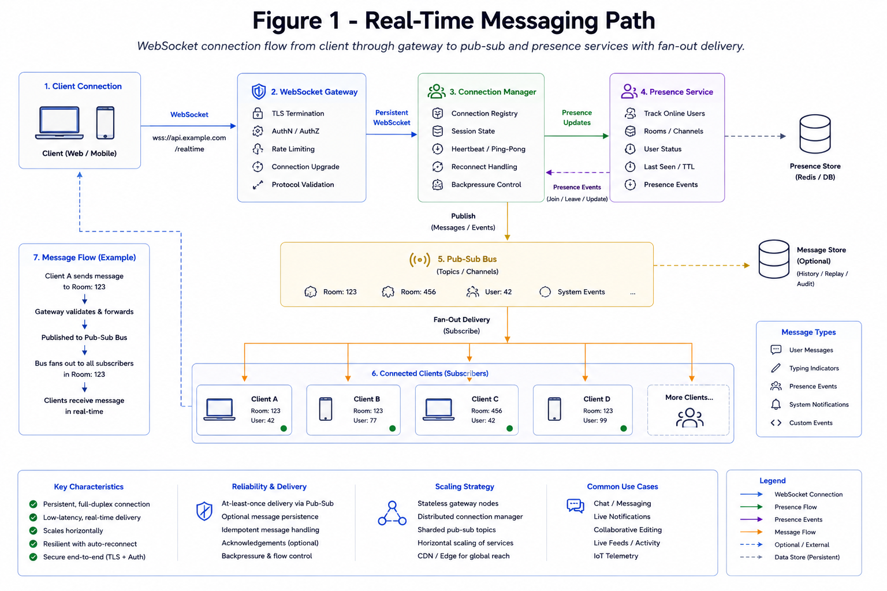

# WebSockets and Real-Time

WebSockets keep persistent full-duplex connections for low-latency push communication, such as chat, multiplayer presence, live dashboards, and collaboration.

*Figure 1: Persistent websocket connection flow through gateway to pub-sub and presence services.*

## Topic: Core Concerns

### Sub-topic: Key Idea

- Connection scaling and sharding
- Heartbeats and idle timeout
- Ordering guarantees per channel
- Offline delivery and reconnect replay
- Backpressure for slow consumers

## Topic: Connection Architecture

### Sub-topic: System Shape

A common design uses stateless gateway nodes plus shared state stores.

- Gateway terminates WebSocket connections.
- Presence service tracks user-to-connection mapping.
- Pub/sub broadcasts messages to gateway nodes.
- Durable storage keeps messages that must survive reconnects.

## Topic: Delivery Semantics

### Sub-topic: Options and Selection

| Need | Design Choice |
| --- | --- |
| Best-effort presence | In-memory state plus heartbeat expiry |
| At-least-once messages | Message IDs and client acknowledgements |
| Ordered channel messages | Per-room sequence number |
| Reconnect replay | Store last acknowledged offset |

## Topic: Scaling Strategy

### Sub-topic: Scaling Decision

- Partition connections by user ID, tenant, or room.
- Keep routing metadata in a fast shared store.
- Use sticky sessions only when the load balancer and failover plan support it.
- Separate fan-out paths from request/response APIs.

## Topic: Failure Modes

### Sub-topic: Failure Awareness

- Gateway crash drops connections; clients must reconnect with jitter.
- Slow consumers can build unbounded buffers.
- Network partitions can create stale presence.
- Large rooms can overload fan-out workers.

## Topic: Interview Framing

### Sub-topic: Answer Structure

Clarify whether the system needs best-effort updates or durable delivery. Then explain connection management, fan-out, ordering, replay, and how clients recover after disconnects.
