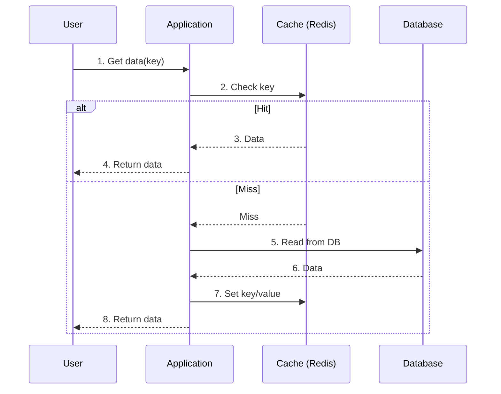

## Topic: What is Cache Aside?

### Sub-topic: Definition

In Cache Aside, the application is responsible for managing the cache. It first checks the cache. If the key is missing, it reads from the database, stores the result in cache, and returns data to the caller.

> Most commonly used pattern due to its simplicity and flexibility.

## Topic: Flow Overview

### Sub-topic: Request Flow

1. Check cache for the requested key.
2. On cache miss, read from the database.
3. Store the database result in cache.
4. Return data to the application.
5. Future requests are served from cache until expiry or invalidation.

## Topic: Sequence Diagram

### Sub-topic: Request Flow



> On cache hit, data is returned immediately. On miss, DB is queried and cache is updated.

## Topic: Read Flow

### Sub-topic: Request Flow

```python
def get_user(user_id):
    key = f"user:{user_id}"
    cached = redis.get(key)
    if cached:
        return cached

    user = database.get_user(user_id)
    redis.setex(key, ttl=300, value=user)
    return user
```

## Topic: Write Flow

### Sub-topic: Request Flow

For writes, update the database first and then invalidate the cache entry. The next read repopulates the cache with fresh data.

```python
def update_user(user_id, patch):
    database.update_user(user_id, patch)
    redis.delete(f"user:{user_id}")
```

## Topic: Pros and Cons

### Sub-topic: Decision Criteria

| Pros | Cons |
| --- | --- |
| Simple to implement | First request after miss is slower |
| Works with any database | Data can become stale |
| Cache failures can degrade gracefully | Duplicate cache-fill logic can spread |
| Good for read-heavy data | Hot keys may cause stampedes |

## Topic: When to Use

### Sub-topic: Key Idea

- Read-heavy workloads
- Data can tolerate brief staleness
- Cache is an optimization, not the source of truth
- Application needs explicit control over cache behavior

## Topic: Gotchas

### Sub-topic: Failure Awareness

- Add TTL jitter to avoid synchronized expiry.
- Use request coalescing for hot keys.
- Protect the database when cache is unavailable.
- Keep cached objects small and bounded.
- Monitor hit ratio, miss latency, and eviction rate.

<!-- interview-module:start -->

## Quick Summary

| Item | Interview-Ready Answer |
| --- | --- |
| Core idea | Cache Aside Pattern helps candidates discuss component responsibility, integration contracts, bottlenecks, scaling limits, and failure behavior with clarity. |
| What to emphasize | Start with the problem it solves, then explain trade-offs, constraints, and production impact. |
| Senior signal | Connect the concept to scale, reliability, operability, cost, and team ownership. |
| Common trap | Giving a definition without explaining when the approach works, when it fails, and how to validate it. |

## Key Takeaways

- Define Cache Aside Pattern in one or two crisp sentences before expanding.
- Anchor the answer in constraints: scale, latency, consistency, correctness, cost, and maintainability.
- Compare at least one alternative and explain why it is weaker or stronger for the given scenario.
- Mention operational concerns such as monitoring, rollback, testing, ownership, and failure handling.
- Close with a practical rule of thumb that helps the interviewer see judgment, not memorization.

## Visual Diagrams

~~~mermaid
flowchart LR
    A["Clarify the prompt"] --> B["Define Cache Aside Pattern"]
    B --> C["Identify constraints"]
    C --> D["Choose an approach"]
    D --> E["Discuss trade-offs"]
    E --> F["Cover production concerns"]
    F --> G["Answer follow-ups"]
~~~

~~~mermaid
flowchart TD
    Problem["Problem or requirement"] --> Concept["Cache Aside Pattern"]
    Concept --> Benefits["Benefits"]
    Concept --> Tradeoffs["Trade-offs"]
    Concept --> FailureModes["Failure modes"]
    Concept --> Operations["Operational checks"]
    Benefits --> Decision["Interview recommendation"]
    Tradeoffs --> Decision
    FailureModes --> Decision
    Operations --> Decision
~~~

## Mental Models

| Mental Model | How To Use It In Interviews |
| --- | --- |
| Problem first | Explain what problem Cache Aside Pattern solves before naming tools or patterns. |
| Constraints shape design | A solution changes when throughput, latency, consistency, team size, or compliance changes. |
| Trade-off triangle | Balance correctness, complexity, and cost rather than claiming one perfect answer. |
| Failure-first thinking | Ask what breaks, how it is detected, and how the system recovers. |
| Evolution path | Describe a simple baseline, then evolve it as scale and requirements increase. |

Model the component by responsibilities, inputs, outputs, state, dependencies, and what happens when it fails.

## Real World Examples

| Scenario | How Cache Aside Pattern Shows Up |
| --- | --- |
| Startup MVP | Choose the simplest implementation that validates the product without hiding future migration paths. |
| High-scale platform | Focus on bottlenecks, partitioning, caching, queues, rate limits, and operational dashboards. |
| Enterprise environment | Discuss compliance, auditability, access control, data retention, and change management. |
| Incident review | Tie the concept to detection, mitigation, rollback, and prevention. |

Use it when explaining why a system needs this component, how it scales, and how it interacts with neighboring services.

## Interview Perspective

| Interviewer Probe | Strong Candidate Response |
| --- | --- |
| Why this approach? | State the requirement that makes it appropriate and name the trade-off it accepts. |
| What can go wrong? | Cover overload, stale data, race conditions, partial failure, poor observability, or unclear ownership. |
| How would you scale it? | Move from single-node assumptions to partitioning, replication, caching, async processing, or sharding. |
| How would you validate it? | Use tests, metrics, load tests, shadow traffic, canaries, and post-launch review. |

A strong answer is structured as: **definition -> constraints -> design choice -> trade-offs -> failure modes -> production plan**.

## Common Mistakes

- Jumping into implementation before clarifying goals and constraints.
- Treating the topic as a memorized definition instead of a decision tool.
- Ignoring edge cases, failure modes, and degraded behavior.
- Over-engineering the first version without explaining why complexity is justified.
- Forgetting security, observability, data retention, cost, or team ownership.
- Failing to compare alternatives when the interviewer asks for trade-offs.

## Follow-up Questions

1. When would you choose this approach over a simpler alternative?
2. What constraints would make this design break down?
3. How would you measure whether the solution is working?
4. What would you change for 10x traffic, 10x data volume, or stricter latency?
5. How would you explain the trade-off to a product manager or engineering leader?
6. What is the rollback plan if the approach causes production issues?
7. Which parts should be automated, monitored, or tested first?

## Production Insights

| Concern | Production Guidance |
| --- | --- |
| Observability | Track golden signals, business metrics, saturation, errors, and user-visible impact. |
| Reliability | Define SLOs, fallback behavior, retry limits, backpressure, and disaster recovery strategy. |
| Security | Validate inputs, enforce least privilege, protect sensitive data, and audit access. |
| Cost | Estimate compute, storage, bandwidth, operational overhead, and migration cost. |
| Maintainability | Keep ownership clear, document assumptions, and design for incremental change. |

Production components require health checks, metrics, backpressure, configuration, versioning, and clear ownership.

## Cheat Sheet

| Question | Quick Answer |
| --- | --- |
| What is it? | A concept or technique used to solve a specific engineering or interview problem. |
| Why does it matter? | It gives structure to decisions and helps explain trade-offs under constraints. |
| What should I mention? | Requirements, alternatives, complexity, failure modes, and production readiness. |
| What should I avoid? | Vague definitions, one-size-fits-all claims, and ignoring operational reality. |
| How do I sound senior? | Discuss when the approach should not be used and how it evolves over time. |

## Flashcards

| Front | Back |
| --- | --- |
| What problem does Cache Aside Pattern solve? | It helps structure a decision around requirements, constraints, trade-offs, and production impact. |
| What is the first interview step? | Clarify the prompt, success criteria, scale, and constraints before designing. |
| What makes an answer senior-level? | Clear trade-offs, realistic failure handling, operational awareness, and pragmatic sequencing. |
| What is a common failure mode? | Applying the concept mechanically without checking whether the constraints justify it. |
| How should you conclude? | Summarize the recommendation, key trade-off, and validation plan. |

## Related Topics

- [Interview Readiness]({{ '/interview/' | relative_url }})
- [System Design Patterns]({{ '/50-system-design-patterns/' | relative_url }})
- [Software Architecture]({{ '/architecture/' | relative_url }})
- [Coding Round]({{ '/coding-round/' | relative_url }})
- [Data Structures]({{ '/data-structures/' | relative_url }})

## Practice Questions

1. Explain Cache Aside Pattern to an interviewer in 90 seconds.
2. Draw a diagram showing where this concept fits in a real system.
3. Compare this approach with one alternative and defend your choice.
4. Identify two bottlenecks and two failure modes.
5. Describe how you would test, monitor, and roll out this solution.
6. Re-answer the same question for a small startup and for a large enterprise.

Draw the component in a larger system and explain how traffic, data, and failures move through it.

## Revision Notes

- Start with the problem, not the terminology.
- Use a diagram to make the flow, ownership, or trade-off visible.
- Name constraints explicitly: scale, latency, consistency, correctness, cost, and operability.
- Discuss at least one alternative and one failure mode.
- End with validation: metrics, tests, rollout plan, and rollback strategy.
- Final interview move: summarize the recommendation in one sentence and state the key trade-off.

<!-- interview-module:end -->
