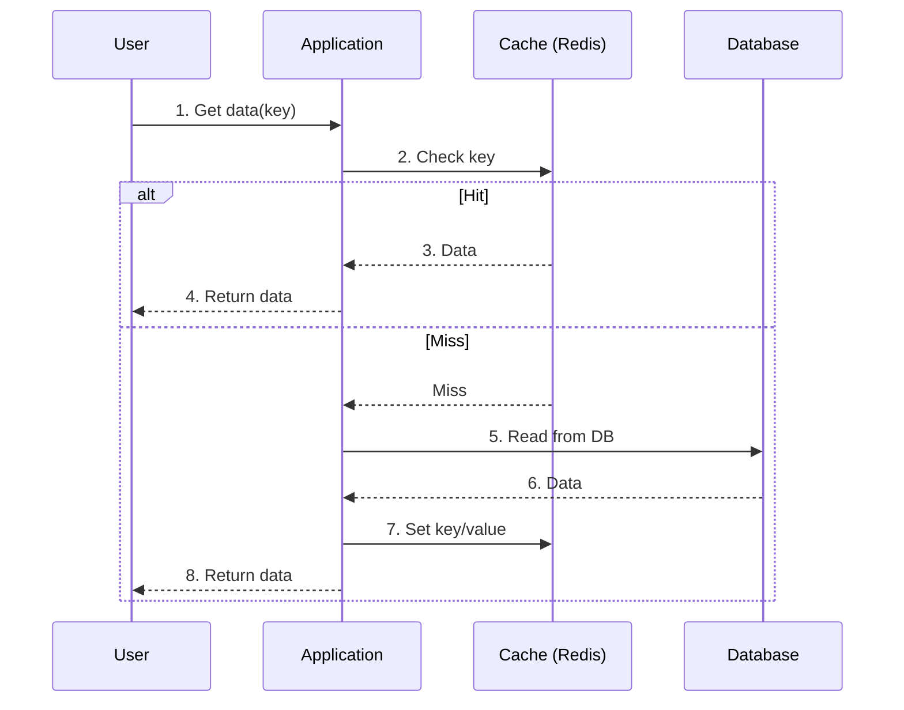

## What is Cache Aside?

In Cache Aside, the application is responsible for managing the cache. It first checks the cache. If the key is missing, it reads from the database, stores the result in cache, and returns data to the caller.

> Most commonly used pattern due to its simplicity and flexibility.

## Flow Overview

1. Check cache for the requested key.
2. On cache miss, read from the database.
3. Store the database result in cache.
4. Return data to the application.
5. Future requests are served from cache until expiry or invalidation.

## Sequence Diagram



> On cache hit, data is returned immediately. On miss, DB is queried and cache is updated.

## Read Flow

```python
def get_user(user_id):
    key = f"user:{user_id}"
    cached = redis.get(key)
    if cached:
        return cached

    user = database.get_user(user_id)
    redis.setex(key, ttl=300, value=user)
    return user
```

## Write Flow

For writes, update the database first and then invalidate the cache entry. The next read repopulates the cache with fresh data.

```python
def update_user(user_id, patch):
    database.update_user(user_id, patch)
    redis.delete(f"user:{user_id}")
```

## Pros and Cons

| Pros | Cons |
| --- | --- |
| Simple to implement | First request after miss is slower |
| Works with any database | Data can become stale |
| Cache failures can degrade gracefully | Duplicate cache-fill logic can spread |
| Good for read-heavy data | Hot keys may cause stampedes |

## When to Use

- Read-heavy workloads
- Data can tolerate brief staleness
- Cache is an optimization, not the source of truth
- Application needs explicit control over cache behavior

## Gotchas

- Add TTL jitter to avoid synchronized expiry.
- Use request coalescing for hot keys.
- Protect the database when cache is unavailable.
- Keep cached objects small and bounded.
- Monitor hit ratio, miss latency, and eviction rate.

