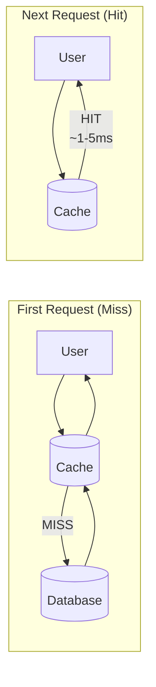
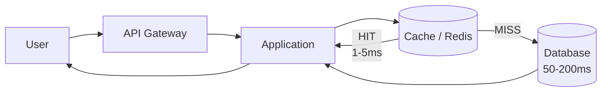

# Caching

Improve latency and reduce database load by storing frequently accessed data closer to users.

## Hero Diagram

How Caching Works

## Quick Summary

Caching stores frequently accessed data in a fast storage layer so future requests can be served quickly.

### Benefits

- Reduces latency
- Reduces database load
- Improves scalability
- Decreases bandwidth cost

### Trade-offs

- Risk of stale data
- Cache invalidation complexity
- Extra memory cost
- Cache stampede risk

## Why Caching?

Caching helps us optimize for speed and scale.

### Without Cache

- ~200ms average response time
- High database load
- Reads are expensive

### With Cache

- ~5ms average response time
- Low database load
- Reads are cheap

### When It Helps

- Data is read more often than it is written
- Slightly stale data is acceptable
- The same data is requested repeatedly
- Use caching to make the common case fast

## Core Mental Model

Think of caching like a library.

### Library Analogy

- A book is requested often
- Keep it near the librarian desk
- Avoid walking to the storage room
- Fast access for everyone

### In System Design

| Real World | System Design |
| --- | --- |
| Storage Room | Database |
| Librarian Desk | Cache |
| Book | Data |

## Architecture Overview

Most production systems use cache-aside for application-level caching.

### Request Flow

### Key Metrics

| Metric | Target |
| --- | --- |
| Cache Hit Ratio | 90-99% |
| Latency (Hit) | 1-5 ms |
| Latency (Miss) | 50-200 ms |
| Throughput | High |
| Cost | Low |

## Types of Caching

Caching can happen at multiple layers.

### Common Layers

- Browser or mobile client cache
- CDN and edge cache
- Reverse proxy cache
- Application cache such as Redis or Memcached
- Database page cache

## Cache Patterns

Choose the caching pattern based on read/write behavior and consistency needs.

### Core Patterns

| Pattern | How It Works | Best For |
| --- | --- | --- |
| Cache-aside | App reads cache, falls back to DB, then fills cache | Common read-heavy services |
| Read-through | Cache service fetches source on miss | Centralized cache logic |
| Write-through | Write cache and DB synchronously | Fresh cache after writes |
| Write-back | Write cache first, persist later | Fast writes with durability trade-off |

## Eviction Policies

Eviction decides what leaves the cache when memory is full.

### Common Policies

- LRU: least recently used
- LFU: least frequently used
- FIFO: first in, first out
- TTL expiration

## Trade-offs

Caching improves speed, but it introduces consistency and operational risks.

### Common Trade-offs

| Benefit | Cost |
| --- | --- |
| Lower latency | Stale reads |
| Lower database load | Invalidation complexity |
| Higher throughput | Extra infrastructure |
| Lower repeated compute | Cache stampede risk |

## Real World Examples

### Examples

- User profiles cached by user ID
- Product pages cached at CDN edge
- Feed ranking results cached briefly
- Feature flags cached by service

## Interview Perspective

### Framing

- Define what data is cached and for how long
- Explain invalidation strategy
- Explain consistency impact
- Explain behavior when cache is unavailable
- Mention hit ratio, miss penalty, and p99 goals

## Common Interview Questions

### Questions

- What happens if the cache is down?
- How do you prevent cache stampede?
- How do you invalidate stale data?
- What should and should not be cached?

## Cheat Sheet

### Rules of Thumb

- Cache read-heavy and expensive data
- Add TTL jitter to avoid synchronized expiration
- Use request coalescing for hot keys
- Treat the database as the source of truth unless using a deliberate write-back design
