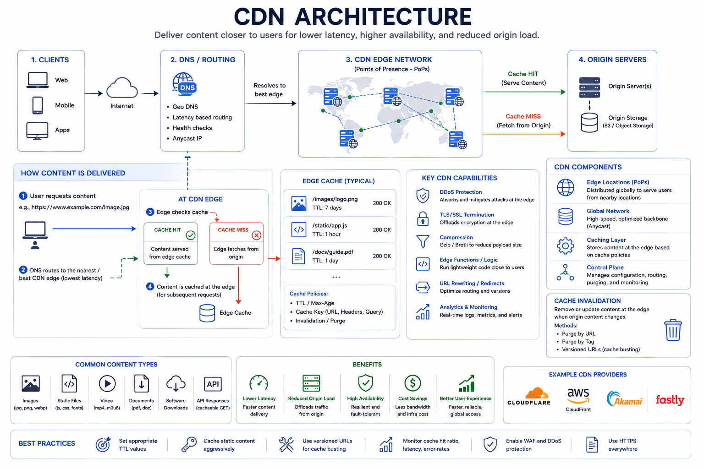

# CDN and Edge Computing

CDNs move content closer to users by caching at edge locations, reducing latency and origin load.

## Topic: Edge Distribution Architecture

### Sub-topic: Cacheability Boundaries

Define cacheability by content type and personalization level first. This determines whether responses can be safely shared across users.

## Topic: CDN Basics

### Sub-topic: Implementation Detail

- User requests content.
- Edge node serves cached response if available.
- On miss, edge fetches from origin and caches it.

Benefits:

- Lower latency
- Reduced origin bandwidth and CPU load
- Better resilience under traffic spikes

## Topic: What to Cache at Edge

### Sub-topic: Cache Eligibility Checklist

| Content Type | Usually Cacheable | Caveat |
| --- | --- | --- |
| Static assets | Yes | Use versioned filenames |
| Public API responses | Often | Correct cache headers required |
| Personalized responses | Usually no | Vary keys and privacy controls |
| Video chunks | Yes | Segment and TTL tuning |

- Static assets (images, CSS, JS)
- Public API responses with safe cache-control headers
- Video and large media files
- Generated pages when personalization is limited

## Topic: Cache-Control Patterns

### Sub-topic: Options and Selection

- `Cache-Control: public, max-age=...`
- `s-maxage` for shared caches
- `stale-while-revalidate`
- `ETag` and `Last-Modified` validation

Correct headers are as important as CDN choice.

## Topic: Purge and Invalidation

### Sub-topic: Invalidation Strategy

Prefer deterministic versioning for static assets. Use purge operations for dynamic content and emergency invalidation.

- TTL expiry
- Path-based purge
- Tag-based purge
- Versioned asset names (content hashing)

Prefer versioned static assets to avoid broad cache purges.

## Topic: Edge Compute Use Cases

### Sub-topic: Key Idea

- Redirects and URL rewrites
- Header normalization
- Bot filtering and basic security checks
- Geo-based routing
- Lightweight personalization

Avoid heavy business logic at edge unless platform constraints are clear.

## Topic: Failure Modes

### Sub-topic: Failure Awareness

- Stale content due to missing invalidation
- Cache poisoning from incorrect keys
- Origin overload during cache misses
- Region-specific edge outages

Mitigations:

- Strong cache-key policy
- Origin shielding
- Tiered caching
- Rate limits and WAF integration

## Topic: Interview Framing

### Sub-topic: Answer Structure

1. State which responses are edge-cacheable.
2. Define cache keys and TTL policy.
3. Explain purge strategy.
4. Explain fallback when edge miss or edge outage occurs.
5. Mention metrics: edge hit ratio, origin offload, latency by region.

