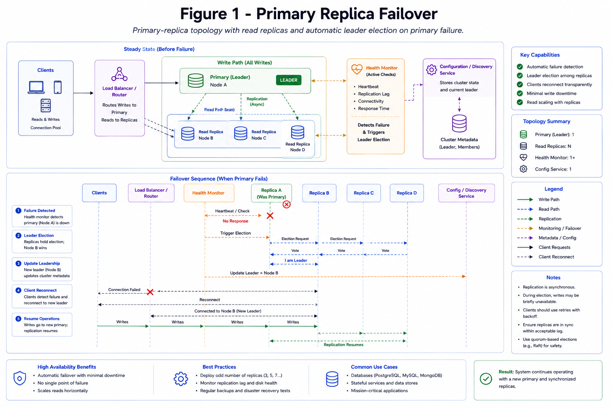

# Replication and Failover

Replication copies data across nodes so systems can survive failures and scale reads. Failover promotes a healthy replica when the current primary cannot serve traffic.

*Figure 1: Primary-replica topology with read replicas and automatic leader election on primary failure.*

## Topic: Replication Models

### Sub-topic: System Shape

| Model | How It Works | Trade-Off |
| --- | --- | --- |
| Primary-replica | Writes go to one primary, replicas copy changes | Simple, primary can bottleneck |
| Multi-primary | Multiple nodes accept writes | Conflict resolution required |
| Leaderless quorum | Reads/writes contact multiple replicas | Tunable consistency, more coordination |

## Topic: Core Trade-Off

### Sub-topic: Decision Criteria

- Async replication: better latency, possible replica lag.
- Sync replication: stronger consistency, write latency cost.
- Semi-sync replication: waits for at least one replica acknowledgement.

## Topic: Read Scaling

### Sub-topic: Scaling Decision

Replicas can serve read traffic, but the app must understand staleness.

- Send read-after-write flows to primary or session-consistent replica.
- Use replicas for dashboards, search, analytics, and non-critical reads.
- Monitor replica lag and remove lagging replicas from read pools.

## Topic: Failover Flow

### Sub-topic: Request Flow

1. Detect primary failure with health checks or consensus.
2. Freeze or fence the old primary to prevent split brain.
3. Promote the best replica.
4. Repoint clients and update topology metadata.
5. Rebuild missing replicas after recovery.

## Topic: Failure Modes

### Sub-topic: Failure Awareness

- Split brain from two primaries accepting writes.
- Data loss if async replicas lag before promotion.
- Read anomalies from stale replicas.
- Slow failover due to DNS/client cache behavior.

## Topic: Interview Framing

### Sub-topic: Answer Structure

State whether the workload needs read scale, durability, low write latency, or strict freshness. Then choose replication mode, explain failover, and describe how the system detects lag and split brain.
