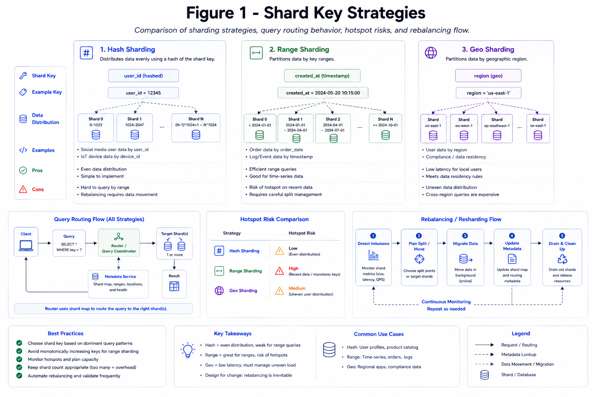
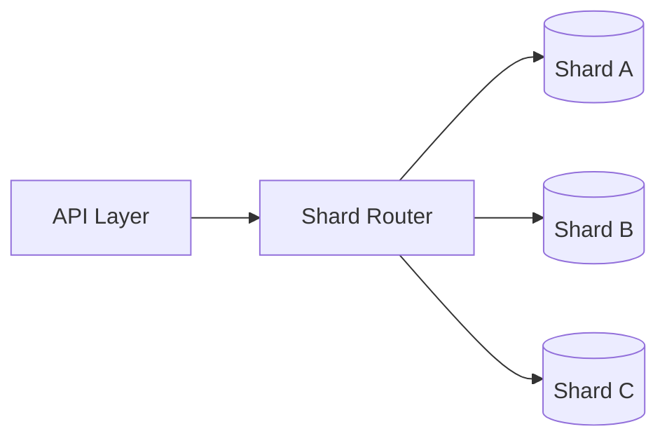

# Sharding Strategies

Sharding partitions data across nodes to scale storage, write throughput, and read fan-out when a single database node is no longer enough.

## Topic: Partitioning For Scale

### Sub-topic: Trigger Conditions

Sharding should follow evidence: single-node saturation, sustained write pressure, or tenant growth patterns that exceed vertical scaling limits.

*Figure 1: Hash, range, and geo sharding examples with query routing and hotspot risk annotations.*

## Topic: Key Points

### Sub-topic: Key Idea

| Concern | Why It Matters |
| --- | --- |
| Shard key quality | Hot keys create uneven load and painful hotspots |
| Resharding | Rebalancing is much harder after data growth begins |
| Cross-shard queries | Distributed joins and transactions are expensive |

## Topic: Common Sharding Models

### Sub-topic: Routing and Rebalancing

Plan for online rebalancing early. If the routing layer is opaque or ad-hoc, operational complexity grows quickly as data volume increases.

## Topic: Operational Safeguards

### Sub-topic: Hotspot and Migration Controls

- Track per-shard QPS and storage drift.
- Detect hot partitions from key skew metrics.
- Prefer progressive migration and dual-read verification during resharding.
- Keep cross-shard joins out of critical request paths.

- Hash sharding spreads data evenly but can make range queries harder.
- Range sharding is useful for ordered queries but can create hotspots.
- Geo sharding improves locality but can complicate global consistency.

## Topic: Interview Framing

### Sub-topic: Answer Structure

1. Explain why a single-node database is no longer enough.
2. Describe the shard key and what workload it optimizes.
3. Mention how you would route requests and rebalance data.
4. Call out how cross-shard operations are handled or avoided.

