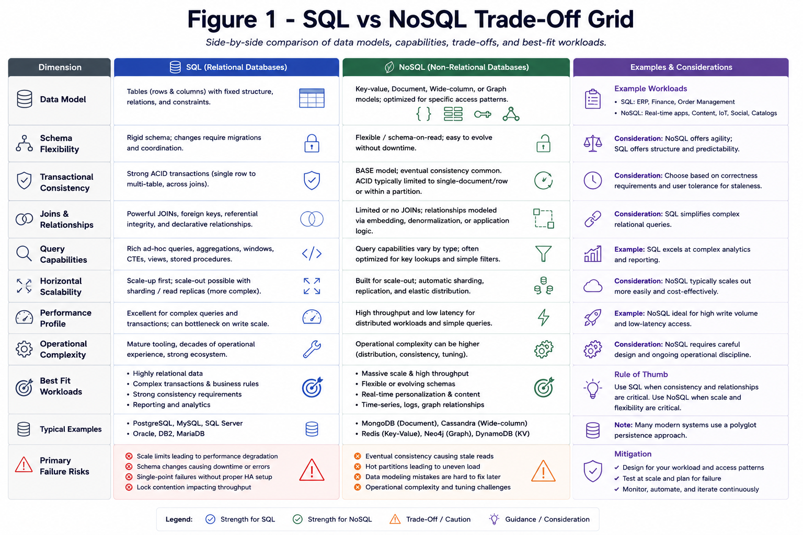

# SQL vs NoSQL

Choose by access patterns, consistency needs, and operational constraints, not trends. The right answer depends on what the system must guarantee, not which database is fashionable.

*Figure 1: Comparison matrix for transactional consistency, schema flexibility, joins, and horizontal scale.*

## Topic: Practical Heuristics

### Sub-topic: Key Idea

| Situation | Better Fit | Why |
| --- | --- | --- |
| Strong transactional workflows | SQL first | Joins, constraints, and ACID semantics matter |
| Massive key/value or document scale | NoSQL | Easier horizontal scale and flexible modeling |
| Mixed workloads | Polyglot persistence | Different data shapes deserve different stores |

## Topic: What To Ask

### Sub-topic: Definition

- Do we need joins, foreign keys, and strict transactions?
- Is the schema stable or still evolving quickly?
- Is horizontal scale more important than relational modeling?
- Do read and write patterns differ enough to justify multiple stores?

## Topic: Interview Framing

### Sub-topic: Answer Structure

1. Start from access patterns, not database labels.
2. Explain the consequence of weaker consistency if you pick NoSQL.
3. Call out migration or multi-store complexity if you pick both.
4. End with the operational cost of your choice.

