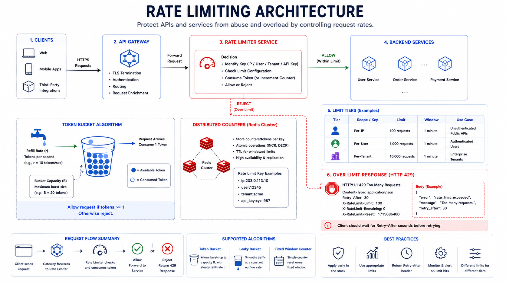

# Rate Limiting

Rate limiting protects services from abuse, overload, and noisy neighbors by controlling request volume.

## 1. Why Rate Limit

- Prevent denial-of-service and brute-force behavior
- Protect expensive dependencies
- Enforce fair usage across clients
- Stabilize system under bursty demand

## 2. Common Algorithms

*Figure 1: Distributed Rate Limiting Architecture*

## Fixed window counter

- Count requests in fixed intervals.
- Simple but bursty at window boundaries.

## Sliding window log

- Track timestamped requests.
- Accurate but memory heavy.

## Sliding window counter

- Approximate sliding behavior with lower overhead.

## Token bucket

- Tokens refill at fixed rate; requests consume tokens.
- Supports controlled bursts.

## Leaky bucket

- Smooths request outflow at steady pace.

Token bucket is often a practical default.

## 3. Scope and Keys

Limits can be applied per:

- API key
- User ID
- IP address
- Tenant
- Endpoint

Use hierarchical limits for better control (global + per-tenant + per-user).

## 4. Distributed Rate Limiting

In multi-instance systems, counters must be shared.

Typical approach:

- Redis + Lua scripts for atomic counter updates
- Low-latency in-memory local fallback where strictness is relaxed

## 5. Response Contract

When rejecting requests:

- Return HTTP 429
- Include `Retry-After`
- Include limit headers if needed

Example headers:

- `X-RateLimit-Limit`
- `X-RateLimit-Remaining`
- `X-RateLimit-Reset`

## 6. Failure Modes

- Clock skew affecting windows
- Redis outage causing open/closed failure debate
- Overly strict limits harming valid users
- No differentiation between read and write endpoints

Choose fail-open vs fail-closed based on endpoint criticality.

## 7. Interview Framing

1. Define what is being protected.
2. Choose algorithm and explain why.
3. Define key scope and limit tiers.
4. Explain distributed counter consistency.
5. Explain behavior on limiter dependency failure.

