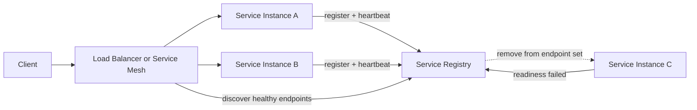

# Service Discovery and Health Checks

In dynamic distributed systems, service instances appear and disappear frequently. Discovery and health checks ensure clients route traffic only to healthy instances.

## 1. Service Discovery Models

## Client-side discovery

- Client queries registry (or receives endpoints) and load-balances locally.

Pros:

- Fine-grained control

Cons:

- More client complexity

## Server-side discovery

- Client sends request to load balancer/proxy.
- Proxy discovers healthy backends.

Pros:

- Simpler clients
- Centralized policy

Cons:

- More responsibility on proxy layer

## 2. Service Registry

Registry stores active instances and metadata:

- Service name
- Host/port
- Version/zone
- Health status
- TTL/heartbeat

Instances register at startup and heartbeat periodically.

| Registry Choice | Good Fit | Watch Out |
| --- | --- | --- |
| DNS-based discovery | Simple service-to-service lookup | Slow propagation and limited health semantics |
| Consul/etcd/ZooKeeper | Explicit membership and metadata | Registry availability becomes critical |
| Kubernetes service discovery | Container orchestration environments | Cluster-specific behavior and DNS caching |
| Service mesh control plane | Rich policy and telemetry | Operational complexity |

## 3. Health Check Types

- Liveness: process is alive
- Readiness: instance is ready for traffic
- Startup: app is initialized and warmed up

Avoid expensive dependency checks in high-frequency liveness probes.

## 4. Heartbeats and Timeouts

- Short heartbeat intervals detect failure quickly.
- Too aggressive intervals can create churn.
- Tune expiration and grace windows to reduce false positives.

Use separate timers for heartbeat expiry, readiness drain, and client endpoint cache TTL. If all three are too short, a partial network issue can eject healthy instances and amplify an incident.

## 5. Service Mesh and Sidecars

Service meshes can provide:

- Built-in discovery
- mTLS
- Retry and timeout policies
- Traffic shaping and canary support
- Rich telemetry

Trade-off: operational complexity.

## 6. Failure Scenarios

- Registry partition or outage
- Stale endpoints in client caches
- Cascading retries when unhealthy instances are still routed
- Probe misconfiguration causing healthy instances to be ejected
- Split-brain endpoint views across regions

Mitigations:

- Local endpoint cache with TTL
- Retry budget and circuit breakers
- Conservative readiness transitions
- Registry high availability deployment
- Zone-aware routing and gradual endpoint draining

## 7. Interview Framing

1. Explain discovery model choice.
2. Explain registration and heartbeat flow.
3. Explain liveness/readiness behavior.
4. Explain stale-endpoint and registry-failure handling.
5. Mention metrics: success rate, endpoint churn, probe failure ratio.

