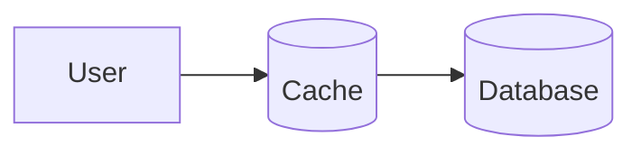
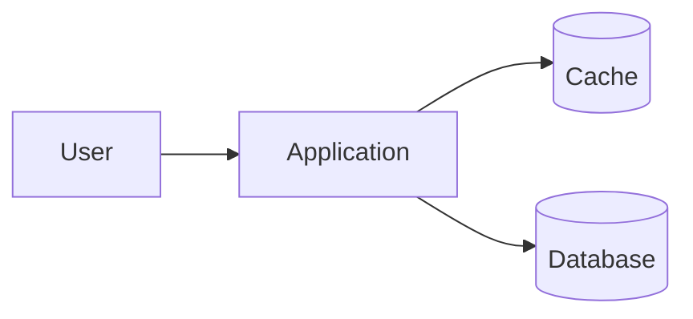
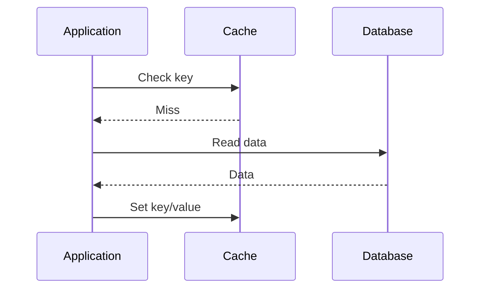
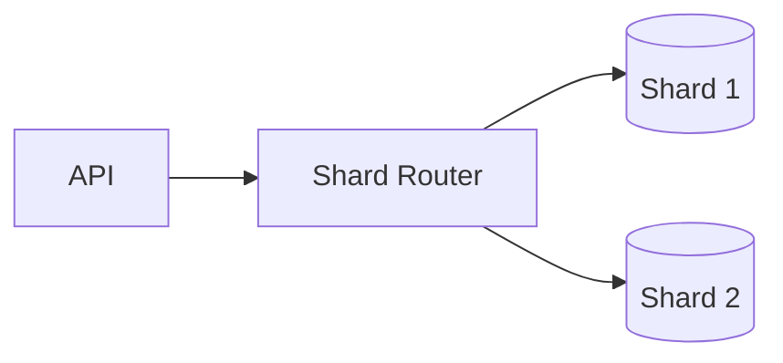

# Enhanced Page Authoring Guide

## Markdown-first app pages

New and migrated pages use one of four semantic kinds: `home`, `track`, `topic`, or `case-study`. Use `renderer: app` while the legacy renderers remain available during migration.

Minimal topic front matter:

```yaml
---
title: Queue
kind: topic
renderer: app
track: data-structures
description: First-in-first-out state for traversal and buffering.
difficulty: beginner
tags: [linear-data-structure, fifo]
---
```

Author content with H2/H3 headings, paragraphs, lists, tables, GFM alerts, fenced code, Mermaid, and images. H2 headings generate the section tabs and H2/H3 headings generate the right-rail table of contents. Do not repeat the title as an H1 and do not use structural HTML in Markdown.

Track pages use the same contract with `kind: track`. Child cards, counts, descriptions, reading time, breadcrumbs, recent pages, and related pages come from the generated in-memory catalog.

Run these checks before committing:

```powershell
ruby scripts/validate_content.rb
bundle exec jekyll build --trace
```

The sections below document the legacy enhanced renderers and remain relevant until their migration is complete.

Use this guide when upgrading ordinary Markdown pages into the richer theme formats used by the guide. Keep content in the page Markdown. Generated files under `_data/solutions/` and `_data/concepts/` are build artifacts and should not be edited by hand.

## General Rules

- Use `layout: default` for all enhanced pages.
- Put page identity in frontmatter and page content in Markdown.
- Keep section names exact for generated pages. The parser uses headings, not custom HTML.
- Prefer Markdown tables, lists, fenced code blocks, Mermaid, and images.
- Run `bundle exec jekyll build` after changes so generated YAML refreshes.
- If generated YAML is wrong, fix the source Markdown structure first.

## Solution Pages

Use for complete system design walkthroughs such as URL shortener, chat, news feed, rate limiter, and e-commerce.

Required frontmatter:

```yaml
---
layout: default
title: "URL Shortener Design - Solution"
page_type: solution
solution_id: url_shortener
subtitle: "Design a URL shortening service like bit.ly."
difficulty: Medium
active_tab: overview
---
```

Frontmatter fields:

- `page_type: solution` enables the solution renderer.
- `solution_id` is the generated data key. Use lowercase snake case.
- `active_tab` should normally be `overview`.
- `difficulty` is displayed as a badge.
- `subtitle` appears under the title.

Required section order:

````markdown
# URL Shortener Design - Solution

Design a URL shortening service like bit.ly.

## Overview

Short intro paragraph.

### Primary Goal

One card worth of content.

### Scale Focus

One card worth of content.

## High Level Design

Short description.

### Components

- Client
- Load Balancer
- API Servers
- Cache
- Database

### Notes

- Keep API servers stateless.
- Use cache-aside for hot reads.

## Detailed Design

### 1. Write Path (Shorten URL)

This is the flow when a user creates a short URL.

#### Participants

- User
- Load Balancer
- API Servers
- Database
- Cache

#### Flow Steps

| Step | From | To | End | Label |
| --- | --- | --- | --- | --- |
| 1 | 1 | 2 | 3 | POST /api/shorten |
| 2 | 2 | 3 | 4 | Forward request |

#### Step Table

| Step | Description |
| --- | --- |
| 1 | User sends the request. |
| 2 | Load balancer forwards it. |

#### Key Points

- Keep writes idempotent.
- Store durable mapping before returning success.

#### Tech Choices

- DB: DynamoDB / Cassandra / PostgreSQL
- Cache: Redis

### 2. Read Path (Redirect URL)

Describe the read path.

### 3. Key Components

Describe the main components.

### 4. Data Model

Describe the storage model.

## Trade-offs

| Choice | Benefit | Cost |
| --- | --- | --- |
| Random short codes | Harder to enumerate | Needs collision retries |

## Code (Optional)

Short description.

```python
def create_short_url(long_url):
    return store_mapping(long_url)
```
````

Solution parser contract:

- `## Overview` becomes the Overview tab.
- `###` subsections inside Overview become overview cards.
- `## High Level Design` becomes the HLD tab.
- `### Components` must be a bullet list.
- `### Notes` must be a bullet list.
- `## Detailed Design` becomes the detailed tab.
- Each `###` inside Detailed Design becomes a detailed subsection.
- The first detailed subsection can render the sequence diagram when it contains `Participants`, `Flow Steps`, `Step Table`, `Key Points`, and `Tech Choices`.
- `Flow Steps` table headers must be exactly `Step`, `From`, `To`, `End`, `Label`.
- `Step Table` headers must be exactly `Step`, `Description`.
- `## Trade-offs` must use table headers `Choice`, `Benefit`, `Cost`.
- `## Code (Optional)` or `## Code` can contain one fenced code block.

## Concept Pages

Use for topic explainers that should render with the rich concept layout, hero diagram, quick summary, cards, right rail, and generated section navigation.

Required frontmatter:

```yaml
---
layout: default
title: "Caching"
page_type: concept
concept_id: caching
subtitle: "Improve latency and reduce database load by storing frequently accessed data closer to users."
difficulty: Beginner
read_time: "8 min read"
concept_label: Core Concept
---
```

Frontmatter fields:

- `page_type: concept` enables the concept renderer.
- `concept_id` is the generated data key. Use lowercase snake case.
- `difficulty`, `read_time`, and `concept_label` render as badges.
- `subtitle` appears in the concept hero.

Recommended structure:

````markdown
# Caching

Improve latency and reduce database load.

## Hero Diagram

How Caching Works



## Quick Summary

Caching stores frequently accessed data in a fast storage layer.

### Benefits

- Reduces latency
- Reduces database load

### Trade-offs

- Stale data risk
- Cache invalidation complexity

## Why Caching?

Caching helps when read traffic dominates.

### When It Helps

- Data is read more than written
- Slightly stale data is acceptable

## Architecture Overview

Most systems use cache-aside.

### Request Flow



### Key Metrics

| Metric | Target |
| --- | --- |
| Hit Ratio | 90-99% |
| Latency | 1-5 ms |
````

Concept parser contract:

- `## Hero Diagram` is optional but recommended.
- The first prose line in `Hero Diagram` becomes the diagram title.
- The first fenced block in `Hero Diagram` becomes the hero diagram.
- `## Quick Summary` is optional but recommended.
- `### Benefits` and `### Trade-offs` must be bullet lists.
- Every other `##` becomes a numbered concept section.
- Every `###` inside a section becomes a card.
- Cards can contain prose, bullet lists, Markdown tables, or fenced diagrams.
- Mermaid diagrams should use fenced `mermaid` blocks.

## Deep-Dive Pages

Use deep-dive pages for component families and their focused subtopics. There are three supported shapes:

- `page_type: deep-dive-index` renders a deep-dive overview with hero, stats, overview, subtopic cards, and right rail.
- `page_type: deep-dive-post` renders a focused subtopic with compact header, tabs, Markdown body, pager, and right rail.
- `page_type: deep-dive` remains available for regular long-form Markdown pages such as database topics.

Use folder-based paths for deep dives:

```text
components/
  index.md
  caching/
    index.md
    cache-aside-pattern/
      index.md
  load-balancers/
    index.md
  api-and-communication/
    index.md
    rest/
      index.md
  databases/
    index.md
    sharding/
      index.md
fundamentals/
  index.md
  scalability/
    index.md
  cap-theorem/
    index.md
  patterns/
    index.md
    cqrs/
      index.md
```

Do not create new deep-dive topic files like `caching.md` or `sharding.md`. Put the page content in the topic folder's `index.md` so subtopics can live underneath it.

### Deep-Dive Index

Use this for pages like `/components/caching/`.

Frontmatter:

```yaml
---
layout: default
title: "Caching"
page_type: deep-dive-index
deep_dive_id: caching
deep_title: "Deep Dive: Caching"
subtitle: "Comprehensive guide to caching in system design."
hero_icon: "◇"
badges:
  - Fundamental
  - Core Concept
  - "~25 min read"
stats:
  - value: "8"
    label: "Sub Topics"
  - value: "25+"
    label: "Diagrams"
overview: "Caching stores frequently accessed data in a fast storage layer so future requests can be served quickly."
key_takeaways:
  - Speeds up reads
  - Reduces DB load
subtopics:
  - title: "Cache Patterns"
    description: "Explore popular caching patterns with sequence diagrams."
    read_time: "8 min read"
    url: "/components/caching/cache-aside-pattern/"
    icon: "P"
    color: "amber"
related_concepts:
  - title: "CDN"
    url: "/components/cdn/"
---
```

Rules:

- `subtopics` drives the card list.
- `related_concepts` drives the right rail card.
- Use full site-relative URLs such as `/components/caching/cache-aside-pattern/`.
- Keep the Markdown body as source notes or fallback content; the index renderer uses frontmatter fields.

### Deep-Dive Post

Use this for pages like `/components/caching/cache-aside-pattern/`.

Frontmatter:

```yaml
---
layout: default
title: "Cache Aside Pattern"
page_type: deep-dive-post
subtitle: "The most widely used caching pattern in system design."
difficulty: Intermediate
read_time: "8 min read"
post_tabs:
  - label: Overview
    href: "#what-is-cache-aside"
  - label: Flow
    href: "#flow-overview"
toc:
  - label: "What is Cache Aside?"
    href: "#what-is-cache-aside"
  - label: "Flow Overview"
    href: "#flow-overview"
previous_topic:
  title: "Read Through"
  url: "/components/caching/"
next_topic:
  title: "Write Through"
  url: "/components/caching/"
---
```

Markdown body:

````markdown
## What is Cache Aside?

In Cache Aside, the application is responsible for managing the cache.

> Most commonly used pattern due to its simplicity and flexibility.

## Flow Overview

1. Check cache for the requested key.
2. On cache miss, read from the database.
3. Store the database result in cache.

## Sequence Diagram


````

Rules:

- `post_tabs` should point to headings in the Markdown body.
- `toc` drives the right rail.
- The Markdown body is rendered directly; do not add custom HTML for tabs, TOC, cards, or rails.
- Use fenced `mermaid` blocks for diagrams.
- Use Markdown tables for trade-offs and code fences for implementation snippets.

### Plain Deep-Dive

Use this for regular long-form pages that only need the compact deep-dive content styling. Prefer the folder-based `deep-dive-index` and `deep-dive-post` shapes under `/components/` for new pages.

Frontmatter:

```yaml
---
layout: default
title: "Sharding Strategies"
page_type: deep-dive
---
```

Recommended structure:

````markdown
# Sharding Strategies

Sharding splits data across multiple database nodes so the system can scale writes, storage, and read throughput.

## 1. Why Shard?

- Dataset no longer fits comfortably on one node
- Write throughput exceeds a single primary
- Tenants or regions need isolation

## 2. Shard Key Choices

| Strategy | Best For | Risk |
| --- | --- | --- |
| User ID | User-owned data | Hot users |
| Region | Locality | Uneven growth |

## 3. Architecture




````

Deep-dive authoring rules:

- Deep-dive pages are not generated into `_data`.
- Normal Markdown is rendered directly.
- Use numbered `##` sections for scanability.
- Use Mermaid for flows and architecture when possible.
- Use local images under the nearest `assets/` directory.
- Avoid custom HTML unless the theme already has a reusable class for it, such as `section-tabs` or `doc-callout`.

## Build And Verify

After editing:

```powershell
bundle exec jekyll build
```

Check generated files only as diagnostics:

```powershell
Get-Content _data/solutions/url_shortener.yml
Get-Content _data/concepts/caching.yml
```

Do not edit those generated files directly. Rebuild after changing Markdown.
