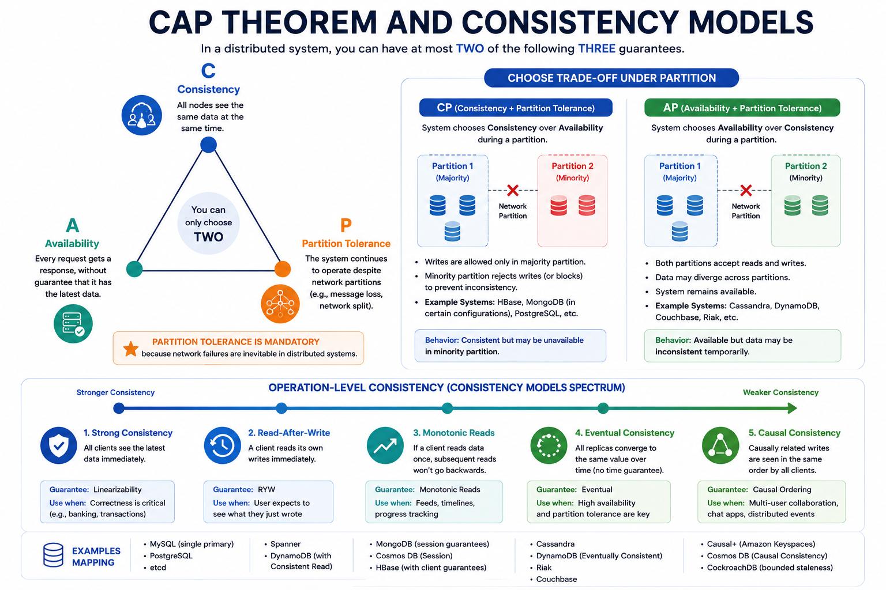

# CAP Theorem and Consistency Models

CAP theorem states that in a distributed system facing a network partition, you can choose at most one of:

- Consistency (all nodes see the same latest data)
- Availability (every request gets a response)

Partition tolerance is mandatory in real distributed systems, so trade-offs are usually between consistency and availability during partition events.

## 1. CAP in Practice

- CP systems prioritize correctness and may reject requests during partition.
- AP systems prioritize responses and may return stale/conflicting data.

Most production systems are not globally CP or AP; they choose per operation.

## 2. Consistency Spectrum

- Strong consistency: reads reflect latest successful write.
- Read-after-write: a client sees its own writes.
- Monotonic reads: once a client sees version N, it never sees older data.
- Eventual consistency: replicas converge over time.
- Causal consistency: preserves causally related operation order.

*Figure 1: CAP Trade-Off and Consistency Spectrum*

## 3. Typical Operation-Level Choices

- Payments and inventory decrements: strong consistency preferred.
- Social counters, feeds, recommendations: eventual consistency often acceptable.
- User profile updates: often read-after-write is enough.

## 4. Quorum Basics

For replicated data with N replicas:

- W = write quorum
- R = read quorum

If $R + W > N$, reads overlap writes and can improve freshness guarantees.

Common setting: N=3, W=2, R=2.

## 5. Conflict Handling in Eventually Consistent Systems

- Last-write-wins (simple, may lose updates)
- Version vectors/vector clocks
- CRDTs for mergeable data types
- Application-level merge strategies

## 6. Staleness and User Experience

Consistency decisions should be tied to user impact.

- Wrong inventory count can cause overselling.
- Slightly stale like counts are often acceptable.
- Delayed notification delivery may be fine if eventual delivery is guaranteed.

## 7. Interview Framing

1. Identify which operations demand strict correctness.
2. Assign consistency level per operation.
3. Explain partition behavior explicitly.
4. Describe reconciliation strategy for conflicts.
5. Mention observability for replica lag and stale-read rates.

## 8. Common Mistakes

- Claiming a system is fully consistent and always available across partitions.
- Ignoring read/write path differences.
- Not defining what happens during partition or region isolation.

