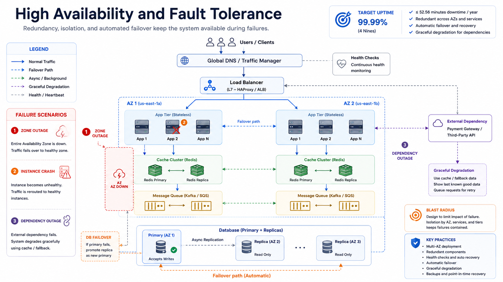

# High Availability and Fault Tolerance

High availability means the system remains usable despite failures. Fault tolerance means the system can continue operating when components fail.

## Topic: Availability Goals

### Sub-topic: Availability Targets

Availability is commonly expressed as a percentage:

| Target | Approximate Downtime |
| --- | --- |
| 99.9% | 43.8 minutes/month |
| 99.99% | 4.38 minutes/month |
| 99.999% | 26.3 seconds/month |

Higher targets require stronger redundancy, faster detection, and safer failover.

### Sub-topic: SLO, SLA, and Error Budget

- SLA: contractual reliability commitment.
- SLO: internal reliability objective.
- Error budget: allowable failure within the SLO window.

Error budgets help balance feature velocity and reliability work.

## Topic: Failure Modeling

### Sub-topic: Failure Domains

Design to isolate failures at multiple levels:

- Process crash.
- Host failure.
- Zone outage.
- Region outage.
- Dependency outage, such as database, cache, queue, or third-party API.

The broader the failure domain, the stronger your recovery plan must be.

### Sub-topic: Blast Radius

Limit how far a failure can spread.

- Separate critical and non-critical workloads.
- Use bulkheads for resource isolation.
- Apply per-tenant limits to protect shared systems.
- Keep regional failures from becoming global failures.

## Topic: Resilience Patterns

### Sub-topic: Redundancy and Failover

- Run multiple service instances across zones.
- Use health checks and automatic failover.
- Keep stateless service nodes behind load balancers.
- Replicate data and define leader failover behavior.

*Figure 1: High Availability and Fault Tolerance Design*

### Sub-topic: Timeouts, Retries, and Circuit Breakers

- Put timeouts on every remote call.
- Retry only safe operations.
- Use exponential backoff with jitter.
- Add circuit breakers to stop hammering unhealthy dependencies.

### Sub-topic: Graceful Degradation

Serve reduced functionality instead of total failure.

- Hide expensive recommendations.
- Serve cached or stale-but-safe data.
- Disable non-critical writes.
- Queue work for later processing.

## Topic: Data Reliability

### Sub-topic: Idempotency and Recovery

- Use idempotency keys for retried writes.
- Make consumers safe to reprocess messages.
- Use dead-letter queues for poison messages.
- Run reconciliation jobs to repair drift between systems.

### Sub-topic: Replication Limits

Replication improves durability and failover options, but it does not automatically guarantee availability.

- Async replication can lose recent writes during failover.
- Sync replication can hurt write latency.
- Cross-region replication needs conflict and lag handling.

## Topic: Incident Response

### Sub-topic: Example Cache Failure

If a cache tier fails:

1. Tighten timeout protection and fallback behavior.
2. Shed non-critical traffic.
3. Temporarily reduce expensive features.
4. Protect the database with strict rate limits.
5. Restore cache and warm hotspots safely.

### Sub-topic: Operational Signals

- Error rate by dependency.
- Failover time.
- Retry volume.
- Queue lag.
- Saturation by zone and region.
- User-visible success rate.

## Topic: Interview Framing

### Sub-topic: Answer Structure

1. State target uptime and latency SLO.
2. Define failure domains and blast radius.
3. Explain failover and degradation behavior.
4. Cover retry and idempotency semantics.
5. Explain detection, alerting, and recovery playbook.

### Sub-topic: Common Mistakes

- No timeouts between services.
- Infinite retries creating retry storms.
- Assuming replication alone guarantees availability.
- Missing runbooks and unreliable failover drills.
