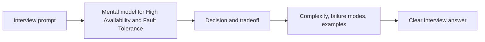

# High Availability and Fault Tolerance

High availability means the system remains usable despite failures. Fault tolerance means the system can continue operating when components fail.

## Topic: Availability Goals

### Sub-topic: Availability Targets

Availability is commonly expressed as a percentage:

| Target | Approximate Downtime |
| --- | --- |
| 99.9% | 43.8 minutes/month |
| 99.99% | 4.38 minutes/month |
| 99.999% | 26.3 seconds/month |

Higher targets require stronger redundancy, faster detection, and safer failover.

### Sub-topic: SLO, SLA, and Error Budget

- SLA: contractual reliability commitment.
- SLO: internal reliability objective.
- Error budget: allowable failure within the SLO window.

Error budgets help balance feature velocity and reliability work.

## Topic: Failure Modeling

### Sub-topic: Failure Domains

Design to isolate failures at multiple levels:

- Process crash.
- Host failure.
- Zone outage.
- Region outage.
- Dependency outage, such as database, cache, queue, or third-party API.

The broader the failure domain, the stronger your recovery plan must be.

### Sub-topic: Blast Radius

Limit how far a failure can spread.

- Separate critical and non-critical workloads.
- Use bulkheads for resource isolation.
- Apply per-tenant limits to protect shared systems.
- Keep regional failures from becoming global failures.

## Topic: Resilience Patterns

### Sub-topic: Redundancy and Failover

- Run multiple service instances across zones.
- Use health checks and automatic failover.
- Keep stateless service nodes behind load balancers.
- Replicate data and define leader failover behavior.

*Figure 1: High Availability and Fault Tolerance Design*

### Sub-topic: Timeouts, Retries, and Circuit Breakers

- Put timeouts on every remote call.
- Retry only safe operations.
- Use exponential backoff with jitter.
- Add circuit breakers to stop hammering unhealthy dependencies.

### Sub-topic: Graceful Degradation

Serve reduced functionality instead of total failure.

- Hide expensive recommendations.
- Serve cached or stale-but-safe data.
- Disable non-critical writes.
- Queue work for later processing.

## Topic: Data Reliability

### Sub-topic: Idempotency and Recovery

- Use idempotency keys for retried writes.
- Make consumers safe to reprocess messages.
- Use dead-letter queues for poison messages.
- Run reconciliation jobs to repair drift between systems.

### Sub-topic: Replication Limits

Replication improves durability and failover options, but it does not automatically guarantee availability.

- Async replication can lose recent writes during failover.
- Sync replication can hurt write latency.
- Cross-region replication needs conflict and lag handling.

## Topic: Incident Response

### Sub-topic: Example Cache Failure

If a cache tier fails:

1. Tighten timeout protection and fallback behavior.
2. Shed non-critical traffic.
3. Temporarily reduce expensive features.
4. Protect the database with strict rate limits.
5. Restore cache and warm hotspots safely.

### Sub-topic: Operational Signals

- Error rate by dependency.
- Failover time.
- Retry volume.
- Queue lag.
- Saturation by zone and region.
- User-visible success rate.

## Topic: Interview Framing

### Sub-topic: Answer Structure

1. State target uptime and latency SLO.
2. Define failure domains and blast radius.
3. Explain failover and degradation behavior.
4. Cover retry and idempotency semantics.
5. Explain detection, alerting, and recovery playbook.

### Sub-topic: Common Mistakes

- No timeouts between services.
- Infinite retries creating retry storms.
- Assuming replication alone guarantees availability.
- Missing runbooks and unreliable failover drills.

<!-- interview-module:start -->

## Interview Readiness Module

### Quick Summary

| Question | Interview-Ready Answer |
| --- | --- |
| What is it? | High Availability and Fault Tolerance is a system design concept topic used to make a specific engineering decision explicit. |
| Why interviewers ask | They want to see constraints, tradeoffs, and failure-mode reasoning, not memorized definitions. |
| Core signal | You can explain when it helps, when it hurts, and how it behaves at scale. |
| Production lens | Discuss observability, ownership, rollout, and worst-case behavior. |

### Why This Exists

High Availability and Fault Tolerance exists because real systems need a reusable way to manage load, coupling, correctness, latency, or change.

### Core Mental Model

Identify the force the pattern controls, the boundary it introduces, and the cost it adds.

### Visual Diagram

### Internal Working

- Name the participants and what each owns.
- Trace the request, event, or state transition through the boundary.
- Explain what fails independently and what remains coupled.

### Decision Table

| Situation | Strong Choice | Watch Out For |
| --- | --- | --- |
| Low complexity and low scale | Keep the design simple | Premature patterns add accidental complexity. |
| High traffic or high fanout | Add partitioning, caching, or async boundaries | Consistency and observability become harder. |
| Frequent change | Encapsulate the unstable part | Too much abstraction hides behavior. |
| Strict correctness | Prefer explicit state and contracts | Latency and coordination cost may rise. |

### Time & Space Complexity

- Runtime cost: extra hops, serialization, coordination, or storage writes.
- Operational cost: monitoring, retries, backfills, and configuration.
- Cognitive cost: more moving parts and more explicit contracts.

### Advantages

- Gives a reusable vocabulary for solving recurring design pressure.
- Improves consistency across implementations.
- Makes tradeoffs easier to compare in interviews and reviews.

### Disadvantages

- Can become ceremony if the design pressure is weak.
- Adds abstractions that future maintainers must understand.
- May trade local simplicity for global coordination.

### Tradeoffs

| Tradeoff | Upside | Cost |
| --- | --- | --- |
| Simplicity vs capability | Simple designs are easier to reason about | May fail when scale or requirements grow. |
| Speed vs correctness | Faster paths improve latency | More caching, approximation, or async behavior can create stale results. |
| Local optimization vs system behavior | Optimizes the hot path | Can move cost to memory, operations, or consistency. |
| Flexibility vs governance | Enables independent change | Requires contracts, testing, and ownership clarity. |

### Real World Usage

- API platforms, event pipelines, and backend services
- Caching, messaging, resilience, and database access
- Release, migration, and integration workflows

### Production Considerations

> [!IMPORTANT]
> Production reality: the interview answer should mention what happens when assumptions break. For High Availability and Fault Tolerance, discuss hot paths, observability, limits, backpressure, and how teams detect and recover from failures.

- Define the dominant read/write path and protect it with metrics.
- Add guardrails for invalid input, overload, and slow dependencies.
- Document ownership: who changes it, who operates it, and who gets paged.
- Prefer incremental rollout when the change affects correctness or latency.

### Common Mistakes

> [!WARNING]
> Senior signal gotcha: Treating the pattern as a default instead of a response to a concrete force.

- Skipping constraints and jumping directly to implementation.
- Describing the tool without explaining why it fits this prompt.
- Ignoring worst-case behavior, memory overhead, or operational ownership.
- Forgetting to compare at least one simpler alternative.

### Failure Modes

- Hot keys, skewed traffic, or adversarial inputs overload the assumed fast path.
- Hidden coupling makes a local change cause downstream breakage.
- Missing observability turns correctness or latency issues into guesswork.
- Data growth changes an acceptable O(n), storage, or network cost into a bottleneck.

### Interview Perspective

Interviewers are testing whether you can connect High Availability and Fault Tolerance to constraints, tradeoffs, and failure modes. A strong answer starts simple, states assumptions, chooses the right abstraction, and then explains what would change at larger scale.

### Interview Questions

1. What problem does High Availability and Fault Tolerance solve better than the simpler alternative?
2. What assumptions make this choice valid?
3. What is the worst-case behavior, and how would you mitigate it?
4. How would you explain this to a junior engineer on your team?
5. What metrics would prove this is working in production?

### Follow-up Questions

1. How does the answer change if traffic increases by 10x?
2. What breaks if data is skewed, stale, or partially unavailable?
3. Which part would you cache, partition, replicate, or simplify?
4. How would you migrate from the naive version to this approach?
5. What would make you reject High Availability and Fault Tolerance?

### Related Topics

- Scalability
- High Availability
- Caching
- Databases
- Monitoring

### Key Takeaways

- High Availability and Fault Tolerance is useful only when its core tradeoff matches the prompt.
- The strongest interview answers connect mechanics to constraints and scale.
- Always discuss worst-case behavior, not only average-case or happy-path behavior.
- Production readiness includes observability, ownership, rollout, and recovery.
- Compare it with the simpler alternative and explain the trigger that justifies the added complexity.

### 3-Minute Revision Sheet

1. Define High Availability and Fault Tolerance in one sentence.
2. State the problem it solves and the simpler alternative it replaces.
3. Draw the core diagram and trace one request, operation, or decision through it.
4. Name the most important complexity, consistency, or operational tradeoff.
5. Close with one real-world use case and one failure mode.

### Decision Framework

| Step | Candidate Action |
| --- | --- |
| 1. Clarify | Ask about constraints, scale, data shape, and correctness needs. |
| 2. Choose | Pick the simplest approach that satisfies the dominant constraint. |
| 3. Justify | Explain time, space, cost, reliability, and team ownership tradeoffs. |
| 4. Stress test | Walk through failure, growth, and migration scenarios. |
| 5. Communicate | Present the answer as a recommendation, not a list of facts. |

### Why Use It

Use High Availability and Fault Tolerance when it directly improves the dominant constraint: lookup speed, coupling, scalability, reliability, delivery speed, or reasoning clarity.

### Why Not Use It

Avoid High Availability and Fault Tolerance when the simpler approach already meets the requirements, when operational overhead exceeds the benefit, or when the team cannot own the added complexity.

### Migration Strategy

1. Start with the simplest working design and capture baseline metrics.
2. Introduce High Availability and Fault Tolerance behind a narrow interface or compatibility layer.
3. Migrate one path, tenant, or use case at a time.
4. Compare correctness, latency, cost, and operational load before expanding.
5. Keep rollback criteria explicit until the new approach is proven.

### Cost Impact

- Engineering cost: design, implementation, test coverage, and documentation.
- Runtime cost: compute, memory, storage, network, and coordination overhead.
- Operational cost: dashboards, alerts, on-call playbooks, and incident response.

### Organizational Impact

High Availability and Fault Tolerance changes how teams communicate. It may require clearer ownership, better contracts, shared vocabulary, and explicit review of cross-team dependencies.

### Operational Complexity

Operational maturity requires dashboards for the hot path, alerts on saturation and errors, runbooks for known failure modes, and a rollout plan that limits blast radius.

## Quick Revision

- High Availability and Fault Tolerance solves a specific pressure; name that pressure first.
- The best answer compares it with at least one simpler alternative.
- Discuss average case, worst case, and what changes at scale.
- Mention production guardrails: metrics, limits, retries, ownership, and rollback.
- End with a crisp recommendation and the assumptions behind it.

**Common interview answer:** "I would use High Availability and Fault Tolerance when the constraints make its tradeoff worthwhile. I would start with the simplest version, validate the bottleneck, then add this structure or pattern where it improves the hot path while keeping failure modes observable."

**Most important tradeoffs:** performance vs complexity, correctness vs latency, flexibility vs ownership, and short-term speed vs long-term operability.

**Most important pitfalls:** unclear assumptions, ignoring worst-case behavior, skipping observability, and failing to explain why the simpler option is insufficient.

## Flashcards

1. **Q:** What is the main purpose of High Availability and Fault Tolerance? **A:** To solve a specific constraint or reasoning problem more clearly than a naive approach.
2. **Q:** What should you clarify before using it? **A:** Scale, data shape, correctness needs, latency goals, and operational constraints.
3. **Q:** What makes an interview answer senior-level? **A:** It explains tradeoffs, failure modes, migration, and production ownership.
4. **Q:** What is the most common mistake? **A:** Naming the concept without tying it to the prompt's constraints.
5. **Q:** How do you discuss complexity? **A:** Cover time, space, coordination, and operational complexity where relevant.
6. **Q:** What should a diagram show? **A:** Boundaries, data flow, ownership, and the hot path.
7. **Q:** How do you handle follow-ups? **A:** Re-check assumptions and explain how the design changes under new constraints.
8. **Q:** What production signal matters most? **A:** Metrics on the hot path: latency, errors, saturation, and correctness drift.
9. **Q:** When should you avoid it? **A:** When it adds more complexity than the requirements justify.
10. **Q:** How should you conclude? **A:** Give a recommendation, list assumptions, and name the next thing you would validate.

<!-- interview-module:end -->
