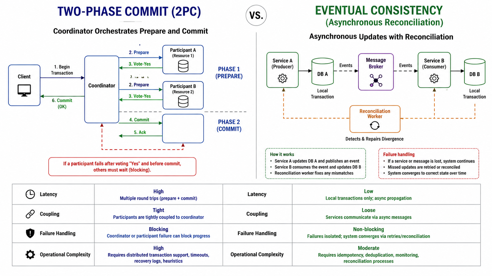

# Two-Phase Commit vs Eventual Consistency

Two-phase commit favors strict atomicity; eventual consistency favors availability and scalability.

*Figure 1: Side-by-side of 2PC coordinator prepare/commit and eventual consistency with async reconciliation.*

## Topic: Why It Matters

### Sub-topic: Motivation

This is not a theoretical choice. It determines whether the system blocks on coordination or accepts temporary divergence and repairs it later.

## Topic: Comparison

### Sub-topic: Decision Criteria

| Dimension | 2PC | Eventual Consistency |
| --- | --- | --- |
| Atomicity | Strong | Weak at the moment of change |
| Availability | Lower under failure | Higher under failure |
| Complexity | Coordinator and locking | Reconciliation and conflict handling |
| Latency | Higher due to coordination | Lower for the write path |

## Topic: Decision Guide

### Sub-topic: Decision Criteria

| Use Case | Better Fit | Why |
| --- | --- | --- |
| Money movement | 2PC or equivalent strict workflow | Strong correctness requirement |
| Catalog updates | Eventual consistency | Temporary mismatch is acceptable |
| Social feeds | Eventual consistency | Scale and freshness matter more than atomicity |

## Topic: Typical Eventual Flow

### Sub-topic: Request Flow

## Topic: Interview Framing

### Sub-topic: Answer Structure

1. Start from business criticality, not database fashion.
2. Identify where temporary inconsistency is acceptable.
3. Mention how conflicts are detected and reconciled.
4. Explain why availability or latency might outweigh strict atomicity.

