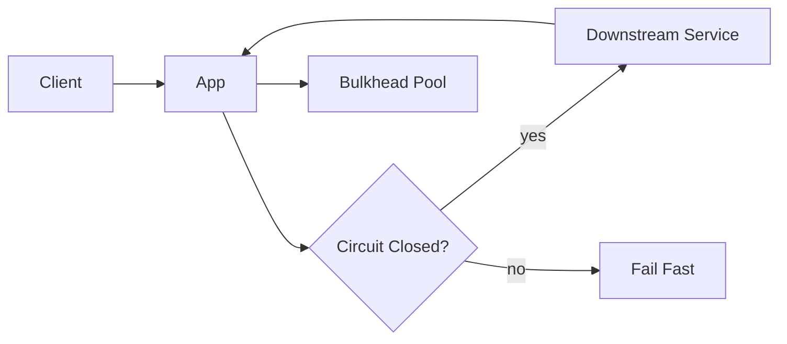

# Circuit Breaker and Bulkhead

Circuit breaker prevents repeated calls to failing dependencies, while bulkhead isolation stops one bad dependency from consuming every shared resource.

*Figure 1: Closed-open-half-open circuit transitions with separate resource pools for bulkhead isolation.*

## Topic: Why It Exists

### Sub-topic: Motivation

When a downstream service becomes slow or unavailable, retries can make the outage worse. A circuit breaker cuts off repeated failures, and a bulkhead keeps one dependency from starving the whole application.

## Topic: Circuit States

### Sub-topic: Key Idea

| State | Meaning | Typical Behavior |
| --- | --- | --- |
| Closed | Calls flow normally | Count failures and latency |
| Open | Calls fail fast | Stop traffic to the dependency |
| Half-open | Probe recovery | Allow a small test volume |

## Topic: Bulkhead Patterns

### Sub-topic: Options and Selection

- Separate thread pools per dependency.
- Separate connection pools per backend class.
- Queue limits per tenant or endpoint.

## Topic: Failure Flow

### Sub-topic: Request Flow

## Topic: Practical Tuning

### Sub-topic: Key Idea

| Control | Purpose |
| --- | --- |
| Failure threshold | Decide when to open the circuit |
| Reset timeout | Decide when to probe again |
| Slow-call threshold | Open on latency before full failure |
| Concurrency cap | Prevent dependency overload |

## Topic: Interview Framing

### Sub-topic: Answer Structure

1. Show where retries stop and circuit breaking begins.
2. Tie bulkheads to user impact, not just infrastructure hygiene.
3. Explain how you observe failures with metrics and traces.
4. Mention that half-open probing should be low volume and controlled.

