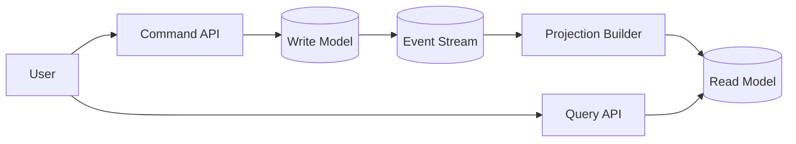

# CQRS

CQRS separates read and write models so each side can be optimized for a different workload.

*Figure 1: Command side writing to source store and event bus, query side serving denormalized read views.*

## Why It Exists

Many systems do not have symmetric read and write behavior. Writes may need validation, deduplication, and durable storage, while reads need low latency and query-friendly shapes. CQRS accepts that asymmetry instead of forcing one model to do both jobs.

## When To Use It

| Situation | Why CQRS Helps | Risk |
| --- | --- | --- |
| Read-heavy product catalogs | Query models can be denormalized for fast lookups | Projection lag |
| Workflow systems | Commands stay strict while reads stay flexible | More moving parts |
| Event-driven domains | Events naturally feed read projections | Rebuild complexity |

## Typical Flow

## Trade-offs

- Reads become faster and easier to shape for UI or reporting.
- Writes stay focused on invariants instead of query shape.
- Consistency becomes eventual between write and read sides.
- Debugging gets harder because you now reason about projections as well as source state.

## Interview Framing

1. Explain the write model as the source of truth.
2. Describe how events or change notifications update the read model.
3. Call out what data is duplicated and why that duplication is acceptable.
4. Mention how you would rebuild projections after failure.

