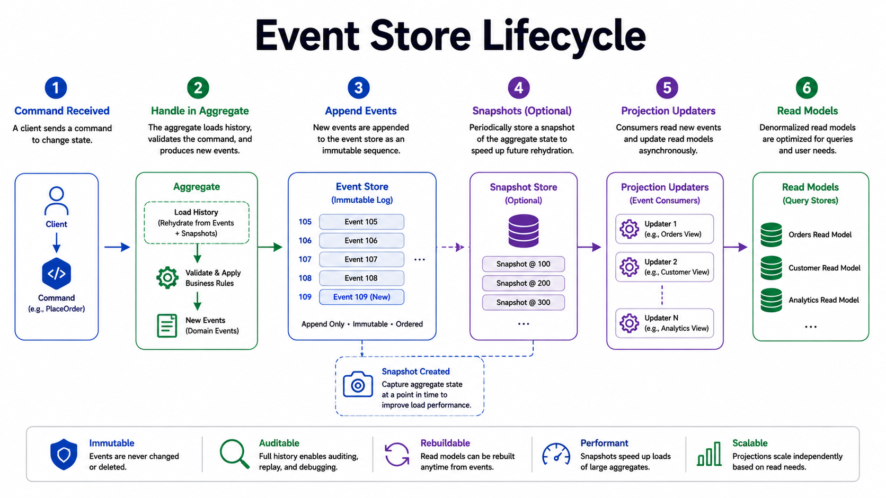
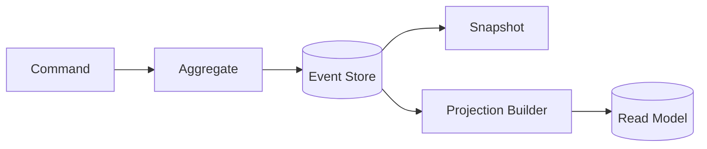

# Event Sourcing

Event sourcing stores state transitions as immutable events and reconstructs current state from the event log.

*Figure 1: Aggregate commands producing ordered events, snapshots, and read projections.*

## Why It Exists

Instead of persisting only the latest state, event sourcing records every meaningful change. That gives you a replayable audit trail and makes the history of the domain visible.

## What You Gain

| Benefit | Why It Matters |
| --- | --- |
| Auditability | Every change has a traceable cause |
| Replay | Rebuild projections after bugs or schema changes |
| Temporal debugging | Reproduce state at any point in time |
| Integration | Events are a natural source for downstream systems |

## Flow

## Operational Costs

- The write model becomes more complex because it must validate state from event history.
- Projections can lag behind the write model.
- Schema evolution needs explicit versioning.
- Replays can be expensive without snapshots.

## Interview Framing

1. Explain why the history matters for the domain.
2. Distinguish the event store from the read model.
3. Mention snapshots, versioning, and rebuild time.
4. Call out cases where event sourcing is overkill.

