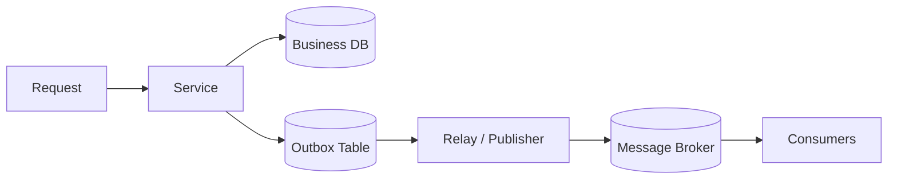

# Outbox Pattern

Outbox ensures database state changes and event publication are reliably linked without a dual-write race.

*Figure 1: Transaction writes business row and outbox row, relay publishes to broker, consumer processes idempotently.*

## Why It Exists

If a service updates its database and then publishes an event separately, a crash between those operations creates inconsistency. The outbox pattern stores the event in the same transaction as the business change and publishes it later.

## Flow

## Delivery Guarantees

| Concern | What Outbox Provides | What You Still Need |
| --- | --- | --- |
| Atomic write + event capture | Stored together in one transaction | A reliable relay process |
| Duplicate publication | Possible on retries | Idempotent consumers |
| Ordering | Preserved per row or partition | Careful partitioning strategy |

## Implementation Notes

- Keep the outbox payload compact and versioned.
- Use a relay that marks rows as published or advances a cursor.
- Make consumers idempotent because at-least-once delivery is common.

## Interview Framing

1. Start from the dual-write problem.
2. Show how the transaction encloses both the business row and the outbox row.
3. Explain how relay retries do not corrupt state.
4. Mention how the pattern supports event-driven integration safely.

