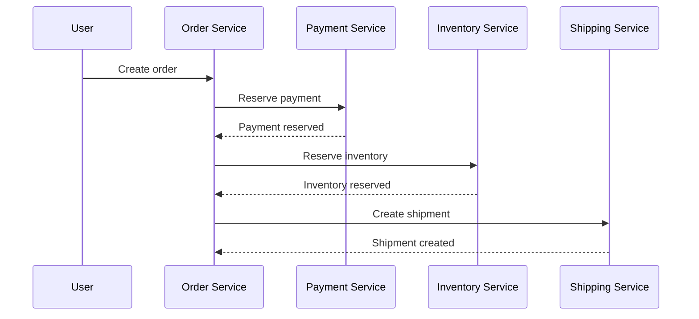

# Saga Pattern

Saga coordinates multi-step distributed workflows and uses compensating actions when a step fails.

*Figure 1: Multi-service transaction steps with rollback compensation when a step fails.*

## Topic: Why It Exists

### Sub-topic: Motivation

Distributed systems rarely share a single database transaction boundary. Saga replaces the idea of one global ACID commit with a sequence of local commits plus compensations that restore business correctness if something goes wrong.

## Topic: Orchestration vs Choreography

### Sub-topic: Key Idea

| Style | Control | Pros | Cons |
| --- | --- | --- | --- |
| Orchestration | Central saga coordinator | Easier to reason about and observe | Coordinator becomes critical path |
| Choreography | Services react to events | Loosely coupled and simple to extend | Harder to trace end-to-end |

## Topic: Example Flow

### Sub-topic: Request Flow

## Topic: Compensation Examples

### Sub-topic: Key Idea

- Refund a payment after downstream failure.
- Release reserved inventory if shipping cannot be created.
- Cancel a booking if a confirmation step times out.

## Topic: Trade-offs

### Sub-topic: Decision Criteria

- Better availability than a single global transaction.
- Easier to scale because each step is local to a service.
- More application complexity because you must design compensations.
- Failure handling must be idempotent and retry-safe.

## Topic: Interview Framing

### Sub-topic: Answer Structure

1. State the business operation that needs distributed coordination.
2. Name each local transaction and its compensation.
3. Explain how retries, timeouts, and duplicate events are handled.
4. Mention observability and how you would replay or audit a failed saga.

