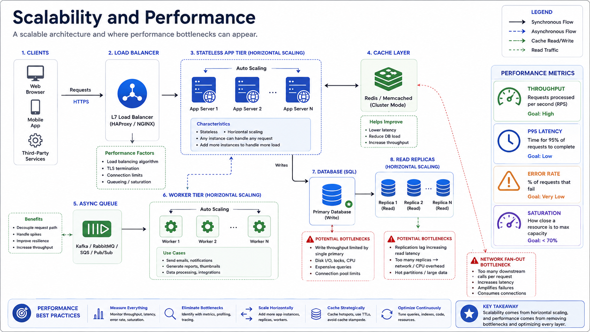
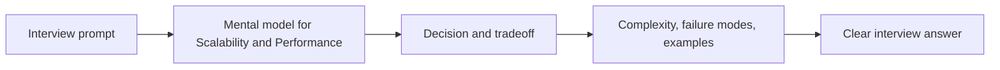

# Scalability and Performance

Scalability is the ability to keep a system useful as traffic, data, users, and feature complexity grow.

  Capacity
  Latency
  Bottlenecks
  Operations

  <strong>Scale the bottleneck, not the diagram.</strong>
  
Good scalability answers start with workload shape, identify the limiting resource, and then scale the tier that is actually under pressure.

*Figure 1: Scalable architecture with traffic distribution, cache, database replicas, and asynchronous workers.*

## Topic: Topic Map

### Sub-topic: Section Directory

- Scaling strategy: decide when to scale up, scale out, cache, shard, or queue.
- Performance signals: track throughput, latency percentiles, errors, and saturation.
- Bottleneck analysis: find the resource that limits the whole request path.
- Scaling patterns: apply common app, data, cache, and async patterns.
- Operational playbook: measure, tune, protect, and degrade safely.

## Topic: Scaling Strategy

### Sub-topic: Vertical vs Horizontal Scaling

| Strategy | Best Fit | Limit |
| --- | --- | --- |
| Vertical scaling | Early systems, simple bottlenecks, single-node resource pressure | Hardware ceiling and single-node blast radius |
| Horizontal scaling | Growing traffic, availability needs, independent stateless workers | Coordination, routing, and data partition complexity |

Start vertically when it buys simplicity. Move horizontally when growth, fault isolation, or deployment safety matters.

### Sub-topic: Read, Write, and Storage Growth

Different growth shapes need different scaling moves:

- Read-heavy systems often benefit from cache and read replicas.
- Write-heavy systems usually need partitioning, batching, or async ingestion.
- Storage-heavy systems eventually need sharding, archival, compaction, or tiered storage.
- Burst-heavy systems need queues, rate limits, and backpressure.

## Topic: Performance Signals

### Sub-topic: Metrics To Track

| Signal | What It Tells You |
| --- | --- |
| Throughput | How much work the system completes per second |
| p95/p99 latency | What real users experience under load |
| Error rate | Whether the system is failing or shedding work |
| Saturation | Which resource is approaching its limit |
| Queue depth | Whether producers are outpacing consumers |

### Sub-topic: Latency Budget

Treat every request as a budget shared across services and dependencies.

| Component | Example Budget |
| --- | ---: |
| API gateway | 15 ms |
| Auth and validation | 20 ms |
| Business logic | 45 ms |
| Cache or database access | 90 ms |
| Serialization and network overhead | 30 ms |

If one dependency regularly exceeds budget, the whole request path becomes slow even when average latency looks healthy.

## Topic: Bottleneck Analysis

### Sub-topic: Common Bottlenecks

- CPU-bound compute hotspots.
- Slow database queries or missing indexes.
- Lock contention in shared resources.
- Cache misses causing thundering herd behavior.
- Synchronous fan-out to many downstream services.
- Large payloads or chatty service-to-service calls.

### Sub-topic: Queueing Intuition

As utilization approaches 100%, latency rises sharply. Keep critical services below full saturation and use admission control before queues grow without bound.

## Topic: Scaling Patterns

### Sub-topic: Application Tier

- Keep application nodes stateless where possible.
- Place instances behind load balancers.
- Autoscale on saturation, queue depth, or p95 latency.
- Use rolling or canary deployments to avoid capacity cliffs.

### Sub-topic: Data and Cache Tier

- Use cache-aside or read-through caching for hot reads.
- Add read replicas for read-heavy database workloads.
- Shard when one data node cannot handle storage, write load, or hot tenants.
- Move slow or bursty work to queues and workers.

### Sub-topic: Edge and Async Tier

- Use CDN for static assets and cacheable public responses.
- Use queues to absorb spikes and isolate slow dependencies.
- Use batch processing for expensive non-interactive work.
- Use backpressure so producers cannot overwhelm consumers.

## Topic: Operational Playbook

### Sub-topic: Tuning Loop

1. Measure baseline p95 and p99 latency.
2. Identify the top bottleneck from traces and metrics.
3. Change one thing at a time.
4. Re-measure under representative load.
5. Keep regression checks for latency-sensitive paths.

### Sub-topic: Overload Controls

- Rate-limit before downstream systems collapse.
- Fail fast when dependency timeout budgets are exceeded.
- Degrade non-critical features before core flows fail.
- Prefer bounded queues and retry budgets over infinite retries.

## Topic: Interview Framing

### Sub-topic: Answer Structure

1. Clarify users, QPS, peak multiplier, read/write ratio, and data growth.
2. Identify the first likely bottleneck.
3. Scale the application, cache, database, and async tiers separately.
4. Explain overload behavior and graceful degradation.
5. Mention metrics that prove the scaling plan is working.

### Sub-topic: Common Pitfalls

- Optimizing average latency while ignoring p99.
- Scaling app servers while the database remains single-node.
- Adding cache without explaining invalidation or stampede control.
- Ignoring backpressure for bursts.

<!-- interview-module:start -->

## Interview Readiness Module

### Quick Summary

| Question | Interview-Ready Answer |
| --- | --- |
| What is it? | Scalability and Performance is a system design concept topic used to make a specific engineering decision explicit. |
| Why interviewers ask | They want to see constraints, tradeoffs, and failure-mode reasoning, not memorized definitions. |
| Core signal | You can explain when it helps, when it hurts, and how it behaves at scale. |
| Production lens | Discuss observability, ownership, rollout, and worst-case behavior. |

### Why This Exists

Scalability and Performance exists because real systems need a reusable way to manage load, coupling, correctness, latency, or change.

### Core Mental Model

Identify the force the pattern controls, the boundary it introduces, and the cost it adds.

### Visual Diagram

### Internal Working

- Name the participants and what each owns.
- Trace the request, event, or state transition through the boundary.
- Explain what fails independently and what remains coupled.

### Decision Table

| Situation | Strong Choice | Watch Out For |
| --- | --- | --- |
| Low complexity and low scale | Keep the design simple | Premature patterns add accidental complexity. |
| High traffic or high fanout | Add partitioning, caching, or async boundaries | Consistency and observability become harder. |
| Frequent change | Encapsulate the unstable part | Too much abstraction hides behavior. |
| Strict correctness | Prefer explicit state and contracts | Latency and coordination cost may rise. |

### Time & Space Complexity

- Runtime cost: extra hops, serialization, coordination, or storage writes.
- Operational cost: monitoring, retries, backfills, and configuration.
- Cognitive cost: more moving parts and more explicit contracts.

### Advantages

- Gives a reusable vocabulary for solving recurring design pressure.
- Improves consistency across implementations.
- Makes tradeoffs easier to compare in interviews and reviews.

### Disadvantages

- Can become ceremony if the design pressure is weak.
- Adds abstractions that future maintainers must understand.
- May trade local simplicity for global coordination.

### Tradeoffs

| Tradeoff | Upside | Cost |
| --- | --- | --- |
| Simplicity vs capability | Simple designs are easier to reason about | May fail when scale or requirements grow. |
| Speed vs correctness | Faster paths improve latency | More caching, approximation, or async behavior can create stale results. |
| Local optimization vs system behavior | Optimizes the hot path | Can move cost to memory, operations, or consistency. |
| Flexibility vs governance | Enables independent change | Requires contracts, testing, and ownership clarity. |

### Real World Usage

- API platforms, event pipelines, and backend services
- Caching, messaging, resilience, and database access
- Release, migration, and integration workflows

### Production Considerations

> [!IMPORTANT]
> Production reality: the interview answer should mention what happens when assumptions break. For Scalability and Performance, discuss hot paths, observability, limits, backpressure, and how teams detect and recover from failures.

- Define the dominant read/write path and protect it with metrics.
- Add guardrails for invalid input, overload, and slow dependencies.
- Document ownership: who changes it, who operates it, and who gets paged.
- Prefer incremental rollout when the change affects correctness or latency.

### Common Mistakes

> [!WARNING]
> Senior signal gotcha: Treating the pattern as a default instead of a response to a concrete force.

- Skipping constraints and jumping directly to implementation.
- Describing the tool without explaining why it fits this prompt.
- Ignoring worst-case behavior, memory overhead, or operational ownership.
- Forgetting to compare at least one simpler alternative.

### Failure Modes

- Hot keys, skewed traffic, or adversarial inputs overload the assumed fast path.
- Hidden coupling makes a local change cause downstream breakage.
- Missing observability turns correctness or latency issues into guesswork.
- Data growth changes an acceptable O(n), storage, or network cost into a bottleneck.

### Interview Perspective

Interviewers are testing whether you can connect Scalability and Performance to constraints, tradeoffs, and failure modes. A strong answer starts simple, states assumptions, chooses the right abstraction, and then explains what would change at larger scale.

### Interview Questions

1. What problem does Scalability and Performance solve better than the simpler alternative?
2. What assumptions make this choice valid?
3. What is the worst-case behavior, and how would you mitigate it?
4. How would you explain this to a junior engineer on your team?
5. What metrics would prove this is working in production?

### Follow-up Questions

1. How does the answer change if traffic increases by 10x?
2. What breaks if data is skewed, stale, or partially unavailable?
3. Which part would you cache, partition, replicate, or simplify?
4. How would you migrate from the naive version to this approach?
5. What would make you reject Scalability and Performance?

### Related Topics

- Scalability
- High Availability
- Caching
- Databases
- Monitoring

### Key Takeaways

- Scalability and Performance is useful only when its core tradeoff matches the prompt.
- The strongest interview answers connect mechanics to constraints and scale.
- Always discuss worst-case behavior, not only average-case or happy-path behavior.
- Production readiness includes observability, ownership, rollout, and recovery.
- Compare it with the simpler alternative and explain the trigger that justifies the added complexity.

### 3-Minute Revision Sheet

1. Define Scalability and Performance in one sentence.
2. State the problem it solves and the simpler alternative it replaces.
3. Draw the core diagram and trace one request, operation, or decision through it.
4. Name the most important complexity, consistency, or operational tradeoff.
5. Close with one real-world use case and one failure mode.

### Decision Framework

| Step | Candidate Action |
| --- | --- |
| 1. Clarify | Ask about constraints, scale, data shape, and correctness needs. |
| 2. Choose | Pick the simplest approach that satisfies the dominant constraint. |
| 3. Justify | Explain time, space, cost, reliability, and team ownership tradeoffs. |
| 4. Stress test | Walk through failure, growth, and migration scenarios. |
| 5. Communicate | Present the answer as a recommendation, not a list of facts. |

### Why Use It

Use Scalability and Performance when it directly improves the dominant constraint: lookup speed, coupling, scalability, reliability, delivery speed, or reasoning clarity.

### Why Not Use It

Avoid Scalability and Performance when the simpler approach already meets the requirements, when operational overhead exceeds the benefit, or when the team cannot own the added complexity.

### Migration Strategy

1. Start with the simplest working design and capture baseline metrics.
2. Introduce Scalability and Performance behind a narrow interface or compatibility layer.
3. Migrate one path, tenant, or use case at a time.
4. Compare correctness, latency, cost, and operational load before expanding.
5. Keep rollback criteria explicit until the new approach is proven.

### Cost Impact

- Engineering cost: design, implementation, test coverage, and documentation.
- Runtime cost: compute, memory, storage, network, and coordination overhead.
- Operational cost: dashboards, alerts, on-call playbooks, and incident response.

### Organizational Impact

Scalability and Performance changes how teams communicate. It may require clearer ownership, better contracts, shared vocabulary, and explicit review of cross-team dependencies.

### Operational Complexity

Operational maturity requires dashboards for the hot path, alerts on saturation and errors, runbooks for known failure modes, and a rollout plan that limits blast radius.

## Quick Revision

- Scalability and Performance solves a specific pressure; name that pressure first.
- The best answer compares it with at least one simpler alternative.
- Discuss average case, worst case, and what changes at scale.
- Mention production guardrails: metrics, limits, retries, ownership, and rollback.
- End with a crisp recommendation and the assumptions behind it.

**Common interview answer:** "I would use Scalability and Performance when the constraints make its tradeoff worthwhile. I would start with the simplest version, validate the bottleneck, then add this structure or pattern where it improves the hot path while keeping failure modes observable."

**Most important tradeoffs:** performance vs complexity, correctness vs latency, flexibility vs ownership, and short-term speed vs long-term operability.

**Most important pitfalls:** unclear assumptions, ignoring worst-case behavior, skipping observability, and failing to explain why the simpler option is insufficient.

## Flashcards

1. **Q:** What is the main purpose of Scalability and Performance? **A:** To solve a specific constraint or reasoning problem more clearly than a naive approach.
2. **Q:** What should you clarify before using it? **A:** Scale, data shape, correctness needs, latency goals, and operational constraints.
3. **Q:** What makes an interview answer senior-level? **A:** It explains tradeoffs, failure modes, migration, and production ownership.
4. **Q:** What is the most common mistake? **A:** Naming the concept without tying it to the prompt's constraints.
5. **Q:** How do you discuss complexity? **A:** Cover time, space, coordination, and operational complexity where relevant.
6. **Q:** What should a diagram show? **A:** Boundaries, data flow, ownership, and the hot path.
7. **Q:** How do you handle follow-ups? **A:** Re-check assumptions and explain how the design changes under new constraints.
8. **Q:** What production signal matters most? **A:** Metrics on the hot path: latency, errors, saturation, and correctness drift.
9. **Q:** When should you avoid it? **A:** When it adds more complexity than the requirements justify.
10. **Q:** How should you conclude? **A:** Give a recommendation, list assumptions, and name the next thing you would validate.

<!-- interview-module:end -->
