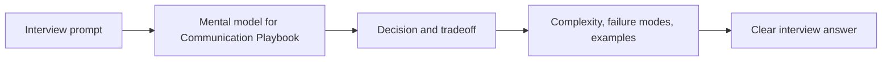

## Topic: Overview

### Sub-topic: Key Idea

Communication is not extra commentary. It is how the interviewer observes your decision-making.

### Sub-topic: What Good Communication Sounds Like

Good interview communication is concise, structured, and decision-oriented. You do not need to narrate every keystroke or every thought. You do need to expose the assumptions that affect correctness, scale, and trade-offs.

### Sub-topic: Communication Contract

- Say what you are doing before doing it.
- Explain why a choice fits the constraints.
- Pause after major decisions so the interviewer can redirect.
- Use examples when an abstraction may be unclear.
- Summarize frequently enough that the answer remains easy to follow.

## Topic: Patterns

### Sub-topic: Speak in Decisions

Prefer: "I am choosing Redis because reads dominate and stale data is acceptable for five minutes."

Avoid: "We can use Redis here."

### Sub-topic: Decision Formula

Use this sentence shape: "Given [constraint], I choose [option] because [benefit], accepting [cost]."

Examples:

- Given read-heavy traffic and tolerable staleness, I choose cache-aside Redis because it lowers read latency, accepting invalidation complexity.
- Given strict ordering requirements, I choose a single partition per entity because it preserves order, accepting limited parallelism.
- Given a small team, I choose a modular monolith first because it preserves boundaries without microservice operational overhead.

## Topic: Trade-offs

### Sub-topic: Decision Table

| Decision | Benefit | Cost |
| --- | --- | --- |
| Cache reads | Lower latency | Stale data risk |
| Async queue | Smooth spikes | Delayed processing |
| Microservice | Independent scaling | More operational overhead |

### Sub-topic: Trade-off Categories

| Category | Questions to Ask |
| --- | --- |
| Latency | Does this affect p95 or p99 user-visible response time? |
| Consistency | Can users tolerate stale or delayed data? |
| Cost | Does this add infrastructure, storage, or operational expense? |
| Complexity | Will this be harder to debug, deploy, or evolve? |
| Reliability | What new failure mode does this introduce? |

### Sub-topic: Anti-pattern

Avoid saying "it depends" as the final answer. It is acceptable as a starting point, but you must finish with a conditional decision: "If the write volume is low and freshness matters, I would use write-through. If reads dominate and brief staleness is acceptable, I would use cache-aside."

## Topic: Practice

### Sub-topic: Drill

Take any previous project and explain it in four sentences: goal, constraints, design, trade-off.

### Sub-topic: Drill Template

1. Goal: What problem did the system solve?
2. Constraint: What made the problem non-trivial?
3. Design: What did you build or choose?
4. Trade-off: What did you accept and why?

### Sub-topic: Evaluation Rubric

| Score | Description |
| --- | --- |
| 1 | Explanation is a list of technologies |
| 2 | Explanation includes components but weak reasoning |
| 3 | Explanation connects choices to constraints |
| 4 | Explanation includes trade-offs and failure modes |
| 5 | Explanation is concise, complete, and easy to challenge |

<!-- interview-module:start -->

## Interview Readiness Module

### Quick Summary

| Question | Interview-Ready Answer |
| --- | --- |
| What is it? | Communication Playbook is a interview strategy topic used to make a specific engineering decision explicit. |
| Why interviewers ask | They want to see constraints, tradeoffs, and failure-mode reasoning, not memorized definitions. |
| Core signal | You can explain when it helps, when it hurts, and how it behaves at scale. |
| Production lens | Discuss observability, ownership, rollout, and worst-case behavior. |

### Why This Exists

Communication Playbook exists because interviewers want to see whether you can turn knowledge into a structured answer under pressure.

### Core Mental Model

Use a repeatable answer frame: define, constrain, compare, trade off, and test with examples.

### Visual Diagram

### Internal Working

- Clarify the signal the interviewer is looking for.
- Answer with a framework instead of scattered facts.
- Close with tradeoffs, edge cases, and follow-ups.

### Decision Table

| Situation | Strong Choice | Watch Out For |
| --- | --- | --- |
| Low complexity and low scale | Keep the design simple | Premature patterns add accidental complexity. |
| High traffic or high fanout | Add partitioning, caching, or async boundaries | Consistency and observability become harder. |
| Frequent change | Encapsulate the unstable part | Too much abstraction hides behavior. |
| Strict correctness | Prefer explicit state and contracts | Latency and coordination cost may rise. |

### Time & Space Complexity

- Preparation cost depends on depth, repetition, and feedback loops.
- Interview cost depends on ambiguity, communication, and time pressure.
- Strong answers reduce cognitive load for both candidate and interviewer.

### Advantages

- Gives a reusable vocabulary for solving recurring design pressure.
- Improves consistency across implementations.
- Makes tradeoffs easier to compare in interviews and reviews.

### Disadvantages

- Can become ceremony if the design pressure is weak.
- Adds abstractions that future maintainers must understand.
- May trade local simplicity for global coordination.

### Tradeoffs

| Tradeoff | Upside | Cost |
| --- | --- | --- |
| Simplicity vs capability | Simple designs are easier to reason about | May fail when scale or requirements grow. |
| Speed vs correctness | Faster paths improve latency | More caching, approximation, or async behavior can create stale results. |
| Local optimization vs system behavior | Optimizes the hot path | Can move cost to memory, operations, or consistency. |
| Flexibility vs governance | Enables independent change | Requires contracts, testing, and ownership clarity. |

### Real World Usage

- Phone screens, onsite loops, and hiring committee packets
- Mock interviews and post-interview retrospectives
- Career ladders where seniority requires tradeoff reasoning

### Production Considerations

> [!IMPORTANT]
> Production reality: the interview answer should mention what happens when assumptions break. For Communication Playbook, discuss hot paths, observability, limits, backpressure, and how teams detect and recover from failures.

- Define the dominant read/write path and protect it with metrics.
- Add guardrails for invalid input, overload, and slow dependencies.
- Document ownership: who changes it, who operates it, and who gets paged.
- Prefer incremental rollout when the change affects correctness or latency.

### Common Mistakes

> [!WARNING]
> Senior signal gotcha: Giving memorized definitions without explaining the decision context.

- Skipping constraints and jumping directly to implementation.
- Describing the tool without explaining why it fits this prompt.
- Ignoring worst-case behavior, memory overhead, or operational ownership.
- Forgetting to compare at least one simpler alternative.

### Failure Modes

- Hot keys, skewed traffic, or adversarial inputs overload the assumed fast path.
- Hidden coupling makes a local change cause downstream breakage.
- Missing observability turns correctness or latency issues into guesswork.
- Data growth changes an acceptable O(n), storage, or network cost into a bottleneck.

### Interview Perspective

Interviewers are testing whether you can connect Communication Playbook to constraints, tradeoffs, and failure modes. A strong answer starts simple, states assumptions, chooses the right abstraction, and then explains what would change at larger scale.

### Interview Questions

1. What problem does Communication Playbook solve better than the simpler alternative?
2. What assumptions make this choice valid?
3. What is the worst-case behavior, and how would you mitigate it?
4. How would you explain this to a junior engineer on your team?
5. What metrics would prove this is working in production?

### Follow-up Questions

1. How does the answer change if traffic increases by 10x?
2. What breaks if data is skewed, stale, or partially unavailable?
3. Which part would you cache, partition, replicate, or simplify?
4. How would you migrate from the naive version to this approach?
5. What would make you reject Communication Playbook?

### Related Topics

- Clarifying Questions
- Thinking Out Loud
- Communicating Tradeoffs
- Mock Interviews
- Common Mistakes

### Key Takeaways

- Communication Playbook is useful only when its core tradeoff matches the prompt.
- The strongest interview answers connect mechanics to constraints and scale.
- Always discuss worst-case behavior, not only average-case or happy-path behavior.
- Production readiness includes observability, ownership, rollout, and recovery.
- Make reasoning explicit: assumptions, alternatives, risks, and recommendation.

### 3-Minute Revision Sheet

1. Define Communication Playbook in one sentence.
2. State the problem it solves and the simpler alternative it replaces.
3. Draw the core diagram and trace one request, operation, or decision through it.
4. Name the most important complexity, consistency, or operational tradeoff.
5. Close with one real-world use case and one failure mode.

### Decision Framework

| Step | Candidate Action |
| --- | --- |
| 1. Clarify | Ask about constraints, scale, data shape, and correctness needs. |
| 2. Choose | Pick the simplest approach that satisfies the dominant constraint. |
| 3. Justify | Explain time, space, cost, reliability, and team ownership tradeoffs. |
| 4. Stress test | Walk through failure, growth, and migration scenarios. |
| 5. Communicate | Present the answer as a recommendation, not a list of facts. |

### Why Use It

Use Communication Playbook when it directly improves the dominant constraint: lookup speed, coupling, scalability, reliability, delivery speed, or reasoning clarity.

### Why Not Use It

Avoid Communication Playbook when the simpler approach already meets the requirements, when operational overhead exceeds the benefit, or when the team cannot own the added complexity.

### Migration Strategy

1. Start with the simplest working design and capture baseline metrics.
2. Introduce Communication Playbook behind a narrow interface or compatibility layer.
3. Migrate one path, tenant, or use case at a time.
4. Compare correctness, latency, cost, and operational load before expanding.
5. Keep rollback criteria explicit until the new approach is proven.

### Cost Impact

- Engineering cost: design, implementation, test coverage, and documentation.
- Runtime cost: compute, memory, storage, network, and coordination overhead.
- Operational cost: dashboards, alerts, on-call playbooks, and incident response.

### Organizational Impact

Communication Playbook changes how teams communicate. It may require clearer ownership, better contracts, shared vocabulary, and explicit review of cross-team dependencies.

### Operational Complexity

Operational maturity requires dashboards for the hot path, alerts on saturation and errors, runbooks for known failure modes, and a rollout plan that limits blast radius.

## Quick Revision

- Communication Playbook solves a specific pressure; name that pressure first.
- The best answer compares it with at least one simpler alternative.
- Discuss average case, worst case, and what changes at scale.
- Mention production guardrails: metrics, limits, retries, ownership, and rollback.
- End with a crisp recommendation and the assumptions behind it.

**Common interview answer:** "I would use Communication Playbook when the constraints make its tradeoff worthwhile. I would start with the simplest version, validate the bottleneck, then add this structure or pattern where it improves the hot path while keeping failure modes observable."

**Most important tradeoffs:** performance vs complexity, correctness vs latency, flexibility vs ownership, and short-term speed vs long-term operability.

**Most important pitfalls:** unclear assumptions, ignoring worst-case behavior, skipping observability, and failing to explain why the simpler option is insufficient.

## Flashcards

1. **Q:** What is the main purpose of Communication Playbook? **A:** To solve a specific constraint or reasoning problem more clearly than a naive approach.
2. **Q:** What should you clarify before using it? **A:** Scale, data shape, correctness needs, latency goals, and operational constraints.
3. **Q:** What makes an interview answer senior-level? **A:** It explains tradeoffs, failure modes, migration, and production ownership.
4. **Q:** What is the most common mistake? **A:** Naming the concept without tying it to the prompt's constraints.
5. **Q:** How do you discuss complexity? **A:** Cover time, space, coordination, and operational complexity where relevant.
6. **Q:** What should a diagram show? **A:** Boundaries, data flow, ownership, and the hot path.
7. **Q:** How do you handle follow-ups? **A:** Re-check assumptions and explain how the design changes under new constraints.
8. **Q:** What production signal matters most? **A:** Metrics on the hot path: latency, errors, saturation, and correctness drift.
9. **Q:** When should you avoid it? **A:** When it adds more complexity than the requirements justify.
10. **Q:** How should you conclude? **A:** Give a recommendation, list assumptions, and name the next thing you would validate.

<!-- interview-module:end -->
