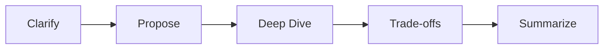

# Interview Readiness

## Topic: Overview

### Sub-topic: Key Idea

Interview performance is a system. The goal is not to know every answer; the goal is to make your reasoning inspectable under time pressure.

### Sub-topic: Core Skills

- Clarify before committing to a solution.
- State assumptions and constraints explicitly.
- Compare options with trade-offs.
- Keep the interviewer aligned while you solve.
- Summarize decisions at the end of each round.

## Topic: Mental Model

### Sub-topic: The Interview Loop

## Topic: Practice

### Sub-topic: Recommended Repetition

- 2 framework drills per week.
- 2 coding walkthroughs per week.
- 1 system or architecture mock per week.
- 1 retrospective after each mock.

## Topic: How to Use This Track

### Sub-topic: Study Order

Start with the framework page if your interviews feel unstructured. Move to the communication playbook if you know the material but struggle to explain it clearly. Use round strategy when you are preparing for a specific interview loop, and use the mock checklist before practice sessions or final onsite rounds.

### Sub-topic: Expected Outcome

After completing this track, you should be able to enter any technical round with a default plan. You should know how to clarify the task, propose a baseline, identify the riskiest part of the problem, discuss alternatives, and summarize your answer without losing control of the conversation.

## Topic: Round Readiness Matrix

### Sub-topic: Signals by Round

| Round | Strong Signal | Weak Signal |
| --- | --- | --- |
| Coding | Explains invariants and tests edge cases | Silently writes code and only tests happy path |
| System Design | Connects choices to scale, latency, and consistency | Lists components without explaining trade-offs |
| LLD | Defines clear responsibilities and extensible APIs | Creates large classes with mixed concerns |
| Architecture | Discusses reliability, operations, and evolution | Optimizes only for initial implementation speed |
| Behavioral | Uses specific situations, actions, and outcomes | Speaks in generic claims without evidence |

### Sub-topic: Preparation Rule

Do not prepare every round the same way. Coding rounds need timed implementation practice. Design and architecture rounds need explanation practice. Behavioral rounds need written stories with concrete impact and conflict resolution.

## Topic: Interview Failure Modes

### Sub-topic: Common Patterns

- Over-solving: adding advanced patterns before proving the simple version works.
- Under-clarifying: assuming scale, user behavior, or constraints without confirming.
- Weak transitions: moving from one section to another without telling the interviewer why.
- No fallback: getting stuck and waiting silently instead of reducing the problem.
- No close: ending the answer without summarizing decisions and trade-offs.

### Sub-topic: Recovery Tactic

When you notice a mistake, state it directly and correct course. Example: "I jumped into storage too early. Let me step back and confirm the access pattern, because that determines whether we need strong consistency or can use asynchronous writes."
