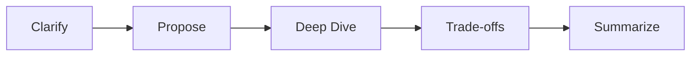

# Interview Readiness

## Topic: Overview

### Sub-topic: Key Idea

Interview performance is a system. The goal is not to know every answer; the goal is to make your reasoning inspectable under time pressure.

### Sub-topic: Core Skills

- Clarify before committing to a solution.
- State assumptions and constraints explicitly.
- Compare options with trade-offs.
- Keep the interviewer aligned while you solve.
- Summarize decisions at the end of each round.

## Topic: Mental Model

### Sub-topic: The Interview Loop

## Topic: Practice

### Sub-topic: Recommended Repetition

- 2 framework drills per week.
- 2 coding walkthroughs per week.
- 1 system or architecture mock per week.
- 1 retrospective after each mock.

## Topic: How to Use This Track

### Sub-topic: Study Order

Start with the framework page if your interviews feel unstructured. Move to the communication playbook if you know the material but struggle to explain it clearly. Use round strategy when you are preparing for a specific interview loop, and use the mock checklist before practice sessions or final onsite rounds.

### Sub-topic: Expected Outcome

After completing this track, you should be able to enter any technical round with a default plan. You should know how to clarify the task, propose a baseline, identify the riskiest part of the problem, discuss alternatives, and summarize your answer without losing control of the conversation.

## Topic: Round Readiness Matrix

### Sub-topic: Signals by Round

| Round | Strong Signal | Weak Signal |
| --- | --- | --- |
| Coding | Explains invariants and tests edge cases | Silently writes code and only tests happy path |
| System Design | Connects choices to scale, latency, and consistency | Lists components without explaining trade-offs |
| LLD | Defines clear responsibilities and extensible APIs | Creates large classes with mixed concerns |
| Architecture | Discusses reliability, operations, and evolution | Optimizes only for initial implementation speed |
| Behavioral | Uses specific situations, actions, and outcomes | Speaks in generic claims without evidence |

### Sub-topic: Preparation Rule

Do not prepare every round the same way. Coding rounds need timed implementation practice. Design and architecture rounds need explanation practice. Behavioral rounds need written stories with concrete impact and conflict resolution.

## Topic: Interview Failure Modes

### Sub-topic: Common Patterns

- Over-solving: adding advanced patterns before proving the simple version works.
- Under-clarifying: assuming scale, user behavior, or constraints without confirming.
- Weak transitions: moving from one section to another without telling the interviewer why.
- No fallback: getting stuck and waiting silently instead of reducing the problem.
- No close: ending the answer without summarizing decisions and trade-offs.

### Sub-topic: Recovery Tactic

When you notice a mistake, state it directly and correct course. Example: "I jumped into storage too early. Let me step back and confirm the access pattern, because that determines whether we need strong consistency or can use asynchronous writes."

<!-- interview-module:start -->

## Quick Summary

| Item | Interview-Ready Answer |
| --- | --- |
| Core idea | Interview Readiness helps candidates discuss communication clarity, evaluation signal, trade-off reasoning, and round strategy with clarity. |
| What to emphasize | Start with the problem it solves, then explain trade-offs, constraints, and production impact. |
| Senior signal | Connect the concept to scale, reliability, operability, cost, and team ownership. |
| Common trap | Giving a definition without explaining when the approach works, when it fails, and how to validate it. |

## Key Takeaways

- Define Interview Readiness in one or two crisp sentences before expanding.
- Anchor the answer in constraints: scale, latency, consistency, correctness, cost, and maintainability.
- Compare at least one alternative and explain why it is weaker or stronger for the given scenario.
- Mention operational concerns such as monitoring, rollback, testing, ownership, and failure handling.
- Close with a practical rule of thumb that helps the interviewer see judgment, not memorization.

## Visual Diagrams

~~~mermaid
flowchart LR
    A["Clarify the prompt"] --> B["Define Interview Readiness"]
    B --> C["Identify constraints"]
    C --> D["Choose an approach"]
    D --> E["Discuss trade-offs"]
    E --> F["Cover production concerns"]
    F --> G["Answer follow-ups"]
~~~

~~~mermaid
flowchart TD
    Problem["Problem or requirement"] --> Concept["Interview Readiness"]
    Concept --> Benefits["Benefits"]
    Concept --> Tradeoffs["Trade-offs"]
    Concept --> FailureModes["Failure modes"]
    Concept --> Operations["Operational checks"]
    Benefits --> Decision["Interview recommendation"]
    Tradeoffs --> Decision
    FailureModes --> Decision
    Operations --> Decision
~~~

## Mental Models

| Mental Model | How To Use It In Interviews |
| --- | --- |
| Problem first | Explain what problem Interview Readiness solves before naming tools or patterns. |
| Constraints shape design | A solution changes when throughput, latency, consistency, team size, or compliance changes. |
| Trade-off triangle | Balance correctness, complexity, and cost rather than claiming one perfect answer. |
| Failure-first thinking | Ask what breaks, how it is detected, and how the system recovers. |
| Evolution path | Describe a simple baseline, then evolve it as scale and requirements increase. |

Treat this topic as a signal amplifier: the goal is to make your reasoning visible, structured, and easy for an interviewer to evaluate.

## Real World Examples

| Scenario | How Interview Readiness Shows Up |
| --- | --- |
| Startup MVP | Choose the simplest implementation that validates the product without hiding future migration paths. |
| High-scale platform | Focus on bottlenecks, partitioning, caching, queues, rate limits, and operational dashboards. |
| Enterprise environment | Discuss compliance, auditability, access control, data retention, and change management. |
| Incident review | Tie the concept to detection, mitigation, rollback, and prevention. |

Use it when explaining a design choice, recovering from ambiguity, summarizing trade-offs, or turning vague prompts into scoped requirements.

## Interview Perspective

| Interviewer Probe | Strong Candidate Response |
| --- | --- |
| Why this approach? | State the requirement that makes it appropriate and name the trade-off it accepts. |
| What can go wrong? | Cover overload, stale data, race conditions, partial failure, poor observability, or unclear ownership. |
| How would you scale it? | Move from single-node assumptions to partitioning, replication, caching, async processing, or sharding. |
| How would you validate it? | Use tests, metrics, load tests, shadow traffic, canaries, and post-launch review. |

A strong answer is structured as: **definition -> constraints -> design choice -> trade-offs -> failure modes -> production plan**.

## Common Mistakes

- Jumping into implementation before clarifying goals and constraints.
- Treating the topic as a memorized definition instead of a decision tool.
- Ignoring edge cases, failure modes, and degraded behavior.
- Over-engineering the first version without explaining why complexity is justified.
- Forgetting security, observability, data retention, cost, or team ownership.
- Failing to compare alternatives when the interviewer asks for trade-offs.

## Follow-up Questions

1. When would you choose this approach over a simpler alternative?
2. What constraints would make this design break down?
3. How would you measure whether the solution is working?
4. What would you change for 10x traffic, 10x data volume, or stricter latency?
5. How would you explain the trade-off to a product manager or engineering leader?
6. What is the rollback plan if the approach causes production issues?
7. Which parts should be automated, monitored, or tested first?

## Production Insights

| Concern | Production Guidance |
| --- | --- |
| Observability | Track golden signals, business metrics, saturation, errors, and user-visible impact. |
| Reliability | Define SLOs, fallback behavior, retry limits, backpressure, and disaster recovery strategy. |
| Security | Validate inputs, enforce least privilege, protect sensitive data, and audit access. |
| Cost | Estimate compute, storage, bandwidth, operational overhead, and migration cost. |
| Maintainability | Keep ownership clear, document assumptions, and design for incremental change. |

The same skill shows up in design reviews, incident updates, roadmap trade-offs, promotion packets, and cross-team alignment.

## Cheat Sheet

| Question | Quick Answer |
| --- | --- |
| What is it? | A concept or technique used to solve a specific engineering or interview problem. |
| Why does it matter? | It gives structure to decisions and helps explain trade-offs under constraints. |
| What should I mention? | Requirements, alternatives, complexity, failure modes, and production readiness. |
| What should I avoid? | Vague definitions, one-size-fits-all claims, and ignoring operational reality. |
| How do I sound senior? | Discuss when the approach should not be used and how it evolves over time. |

## Flashcards

| Front | Back |
| --- | --- |
| What problem does Interview Readiness solve? | It helps structure a decision around requirements, constraints, trade-offs, and production impact. |
| What is the first interview step? | Clarify the prompt, success criteria, scale, and constraints before designing. |
| What makes an answer senior-level? | Clear trade-offs, realistic failure handling, operational awareness, and pragmatic sequencing. |
| What is a common failure mode? | Applying the concept mechanically without checking whether the constraints justify it. |
| How should you conclude? | Summarize the recommendation, key trade-off, and validation plan. |

## Related Topics

- [Interview Readiness]({{ '/interview/' | relative_url }})
- [System Design Patterns]({{ '/50-system-design-patterns/' | relative_url }})
- [Software Architecture]({{ '/architecture/' | relative_url }})
- [Coding Round]({{ '/coding-round/' | relative_url }})
- [Data Structures]({{ '/data-structures/' | relative_url }})

## Practice Questions

1. Explain Interview Readiness to an interviewer in 90 seconds.
2. Draw a diagram showing where this concept fits in a real system.
3. Compare this approach with one alternative and defend your choice.
4. Identify two bottlenecks and two failure modes.
5. Describe how you would test, monitor, and roll out this solution.
6. Re-answer the same question for a small startup and for a large enterprise.

Run a 5-minute spoken walkthrough, then repeat it with tighter structure and fewer assumptions.

## Revision Notes

- Start with the problem, not the terminology.
- Use a diagram to make the flow, ownership, or trade-off visible.
- Name constraints explicitly: scale, latency, consistency, correctness, cost, and operability.
- Discuss at least one alternative and one failure mode.
- End with validation: metrics, tests, rollout plan, and rollback strategy.
- Final interview move: summarize the recommendation in one sentence and state the key trade-off.

<!-- interview-module:end -->
